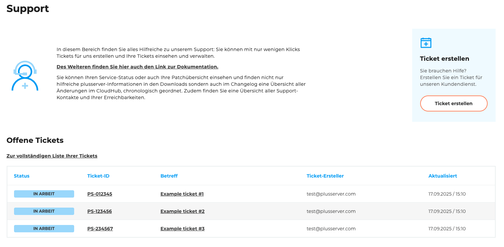
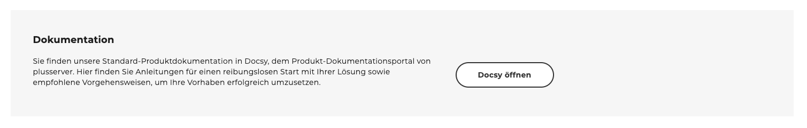
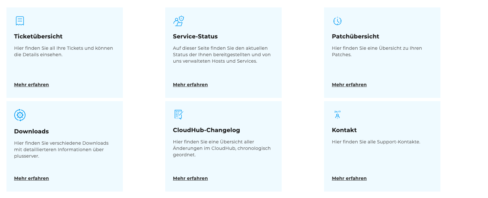

## Support

Auf der Seite [„Support“](https://cloudhub.plusserver.com/support) finden Sie eine zentrale Anlaufstelle für Ihre Support-Anfragen und technische Informationen. Die Seite ist in verschiedene Bereiche gegliedert, die Ihnen einen schnellen Überblick und direkten Zugang zu den wichtigsten Funktionen bieten.

### Offene Tickets

Im oberen Bereich sehen Sie eine Übersicht über **alle offenen Tickets** Ihres Accounts.
Zusätzlich stehen zwei direkte Links zur Verfügung:

- **Ticketübersicht** – führt Sie zur vollständigen Liste aller offenen und geschlossenen Tickets.
- **Ticket erstellen** – öffnet das Formular zur Erstellung eines neuen Support-Tickets.

### Dokumentations-Banner

Unterhalb der Ticketübersicht befindet sich ein Banner, der direkt zur Dokumentation des Kundenportals führt.
Dort finden Sie detaillierte Anleitungen und Erklärungen zu allen Funktionen.

### Kacheln zu Support-Bereichen

Im unteren Bereich der Seite sind Kacheln mit schnellen Zugriffsmöglichkeiten auf die unten gezeigten Unterseiten angeordnet:

