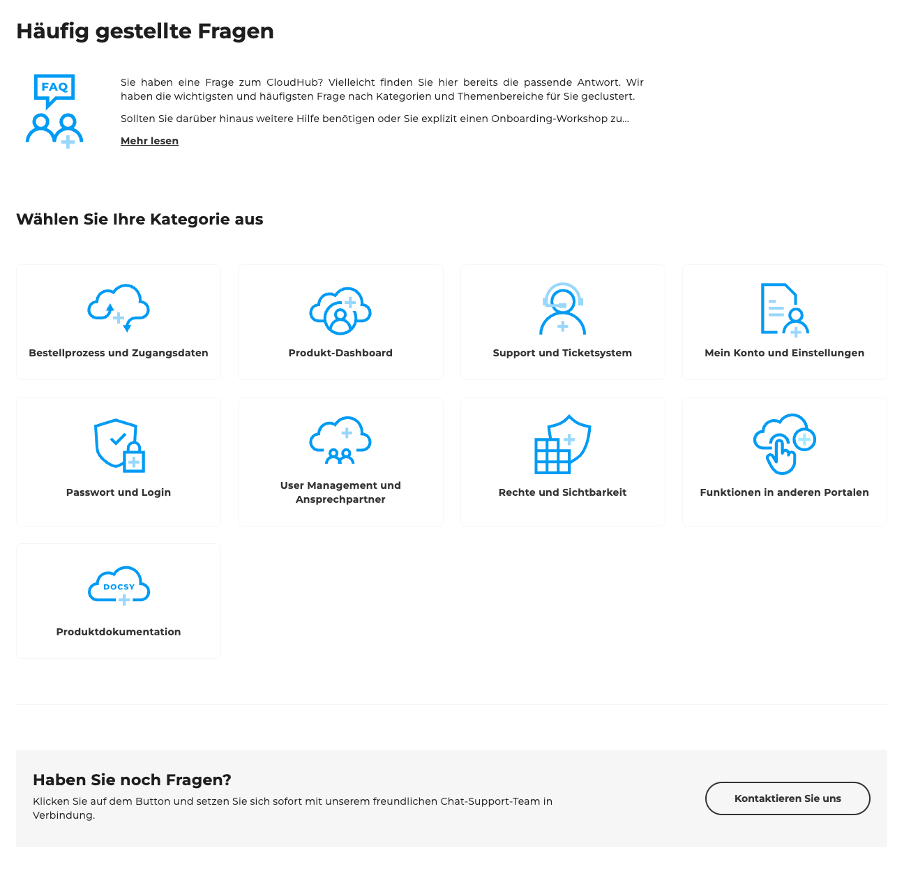
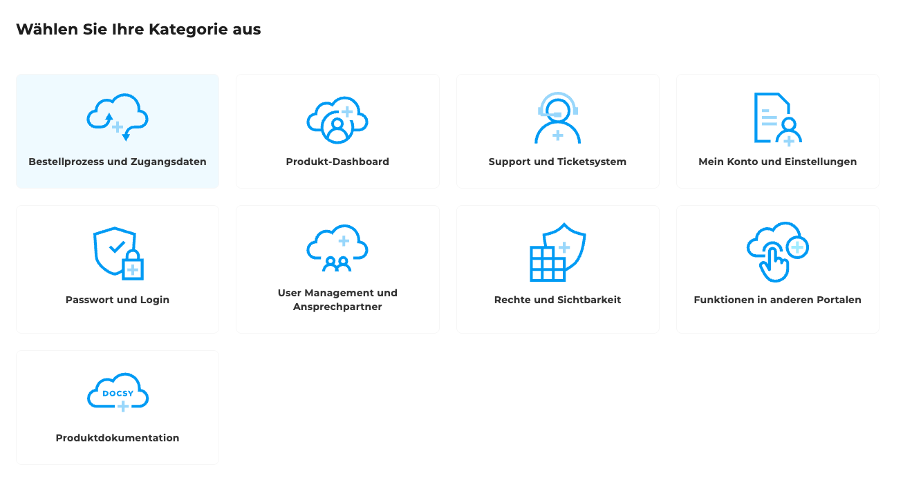
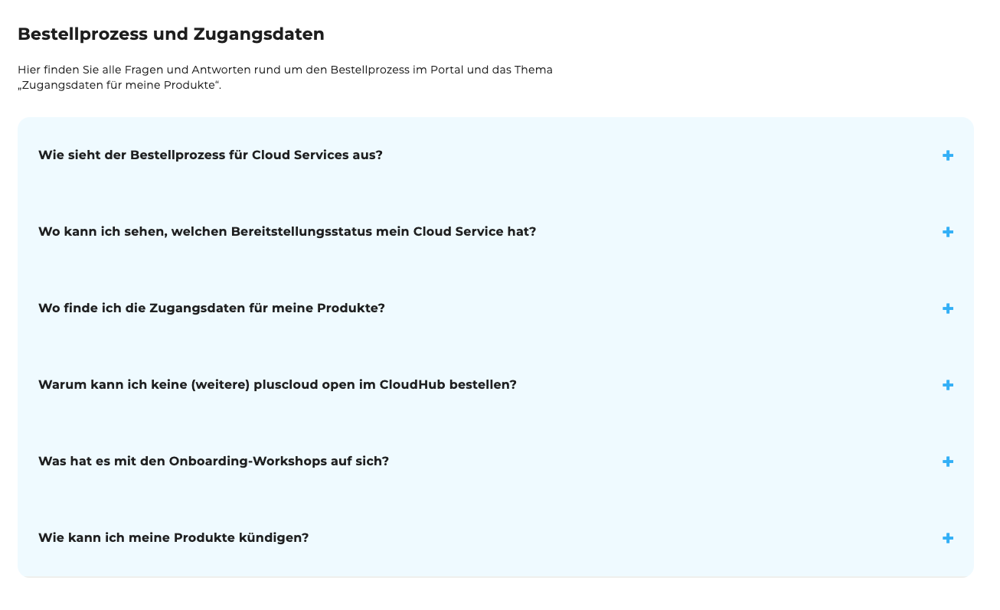
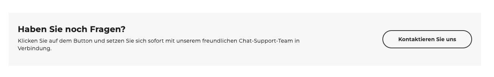

## Einleitung

Die [FAQ-Seite](https://cloudhub.plusserver.com/faq), dient als zentrale Anlaufstelle, um schnell Antworten auf häufig gestellte Fragen zu finden.

## Kategorienübersicht

Auf der FAQ-Seite stehen Ihnen **neun Themenkategorien** zur Auswahl, um gezielt nach Antworten zu suchen.
Die folgenden Kategorien decken die wichtigsten Bereiche ab:

1. Bestellprozess und Zugangsdaten
2. Produkt-Dashboard
3. Support und Ticketssystem
4. Mein Konto und Einstellungen
5. Passwort und Login
6. User Management und Ansprechpartner
7. Rechte und Sichtbarkeit
8. Funktionen in anderen Portalen
9. Produktdokumentation

Nach Auswahl einer Kategorie werden die relevanten Fragen zu diesem Bereich in einer übersichtlichen Akkordeon-Darstellung geöffnet.
Mit einem Klick auf eine Frage öffnet sich der dazugehörige Antwortbereich und liefert die passenden Informationen.
Dieses Funktionsprinzip ist in allen Kategorien identisch.
Das Akkordeon wird nur geöffnet, wenn zuvor eine Kategorie ausgewählt wurde, um die Übersichtlichkeit der Seite zu gewährleisten.

## Kontaktmöglichkeit

Am unteren Ende der Seite befindet sich ein grau hinterlegter Abschnitt mit der Überschrift *„Haben Sie noch Fragen?“*.
Hier kann über einen Kontakt-Button direkt unser Support-Team erreicht werden, falls ein Anliegen nicht über die FAQ beantwortet werden konnte.

