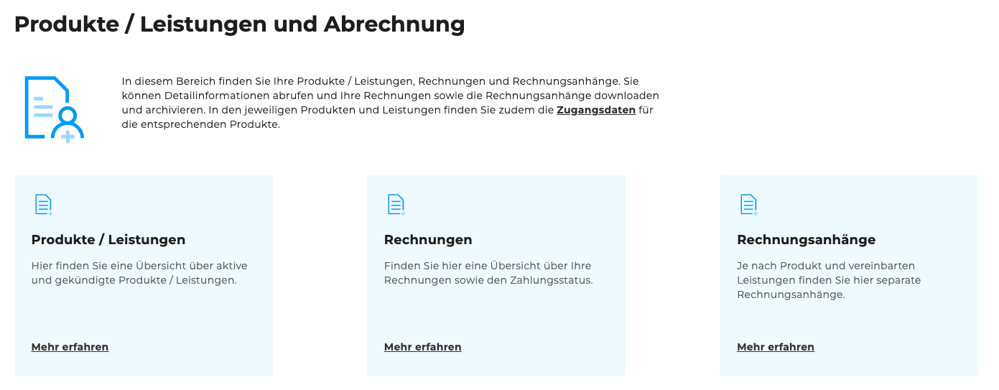
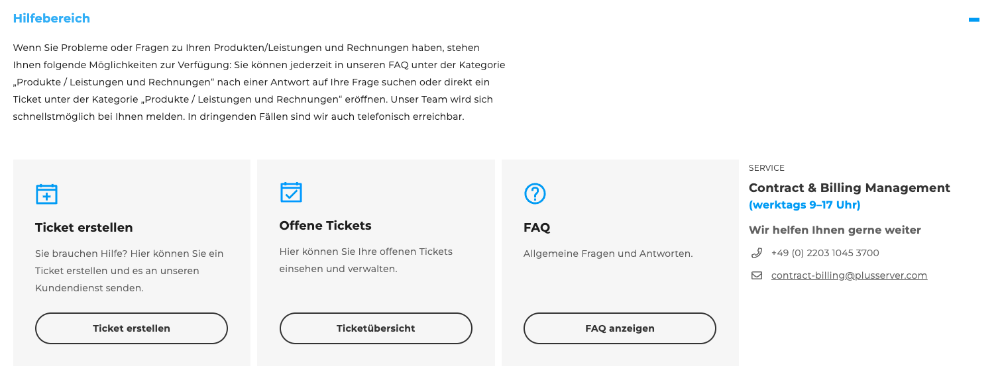

## Produkte / Leistungen und Abrechnung

Auf der Seite [„Produkte / Leistungen und Abrechnung“](https://cloudhub.plusserver.com/billing) finden Sie zentrale Einstiegspunkte zu Ihren gebuchten Leistungen und zu allen Abrechnungsdokumenten. Die Inhalte sind übersichtlich in Kacheln angeordnet und mit einem Hilfe-Bereich ergänzt.

### Hauptbereich

Der obere Bereich der Seite enthält drei Kacheln mit direkten Links zu:

- **Produkte / Leistungen** – Übersicht aller von Ihnen gebuchten Produkte und Services
- **Rechnungen** – Zugriff auf alle Rechnungen im Kundenportal
- **Rechnungsanhänge** – Direkter Zugriff auf den Tab *Rechnungsanhänge* innerhalb der Rechnungsseite

### Hilfe-Bereich

Unterhalb der Hauptkacheln befindet sich ein **Hilfe-Bereich** mit weiteren Unterstützungsmöglichkeiten:

- **Ticket erstellen** – führt direkt zur Ticketerstellung für Support-Anfragen
- **Ticketübersicht** – zeigt alle von Ihnen erstellten Tickets im Überblick
- **FAQ** – schnelle Antworten auf häufig gestellte Fragen

Daneben befindet sich eine separate **Kontakt-Kachel** für das **Contract & Billing Management**, über die Sie Ansprechpartner für Fragen zu Verträgen und Abrechnung erreichen können.

