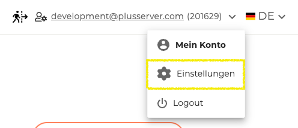
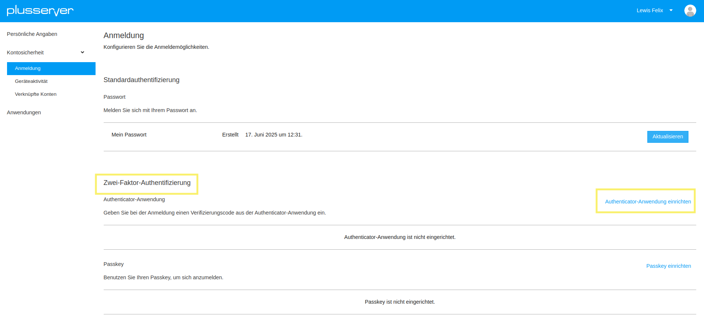
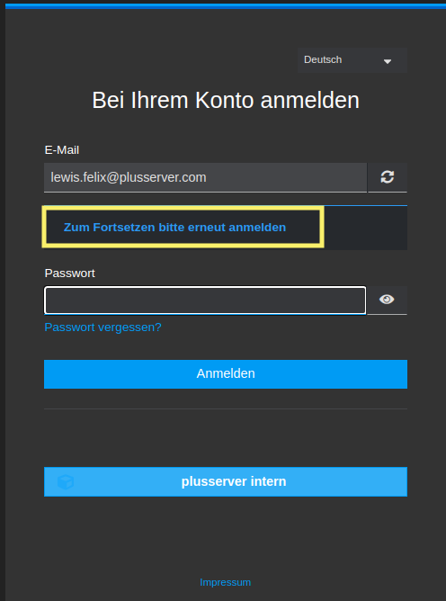

## Wo ist es zu finden?

Die Zwei-Faktor-Authentifizierung (2FA) ist im CloudHub unter Einstellungen verfügbar. Diese erreicht man, indem man oben rechts auf die eigene E-Mail-Adresse in der Topbar klickt und anschließend den Menüpunkt Einstellungen auswählt. Unter dem Abschnitt Passwort & Sicherheit befindet sich die Option Zwei-Faktor-Authentifizierung (2FA).

## 2-Faktor-Authentifizierung Schritt für Schritt

### Schritt 1: Einstellungen

Unter den Einstellungen gibt es ab sofort die Funktion sich seine 2-Faktor-Authentifizierung einzurichten.

### Schritt 2: Über den Link zu Keycloak

Über den Link "2-FA einrichten" gelangt man zur [Keycloak-Seite](https://idm.psmanaged.com/realms/plusIDM/account/#/security/signingin)

Auf der [Keycloak-Seite](https://idm.psmanaged.com/realms/plusIDM/account/#/security/signingin) findet sich die 2-Faktor-Authentifizierung als zweiter Abschnitt unter "Standardauthentifizierung" im Bereich "Anmeldung".

Rechts befindet sich der Link zu "Authenticator Anwendung einrichten", dort geht es zur weiteren Schritt-für-Schritt-Anleitung sowie der eigentlichen Einrichtung der 2FA.

### Schritt 3: Erneut einloggen

Nach dem Klick auf "Authentificator Anwendung einrichten" muss man sich erneut einzuloggen.

### Schritt 4: 2-FA einrichten

Nach dem erfolgreichen Einloggen gelangt man auf eine Schritt-für-Schritt Anleitung von Keycloak zur Einrichtung der 2-FA.

**Folgende drei Schritte sind durchzuführen:**

1. Installieren Sie eine der folgenden Applikationen auf Ihrem Smartphone:
    - Microsoft Authenticator
    - Google Authenticator
    - FreeOTP
2. Öffnen Sie die Applikation und scannen Sie den QR-Code.
3. Geben Sie den von der Applikation generierten One-time Code ein und klicken Sie auf Absenden. Geben Sie einen Gerätenamen an, um die Verwaltung Ihrer OTP-Geräte zu erleichtern.
