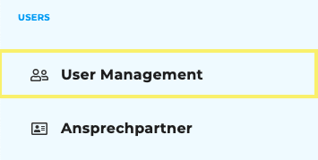
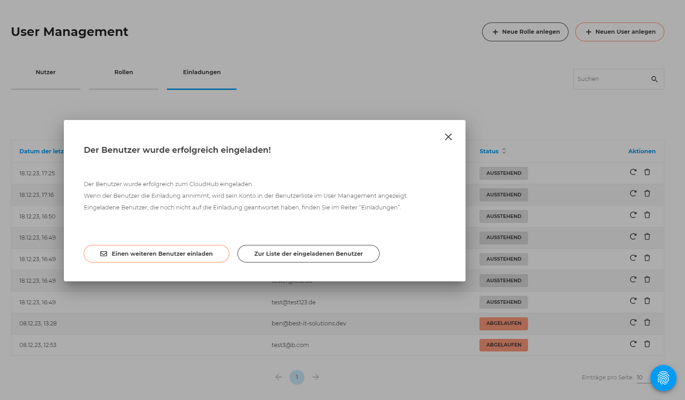
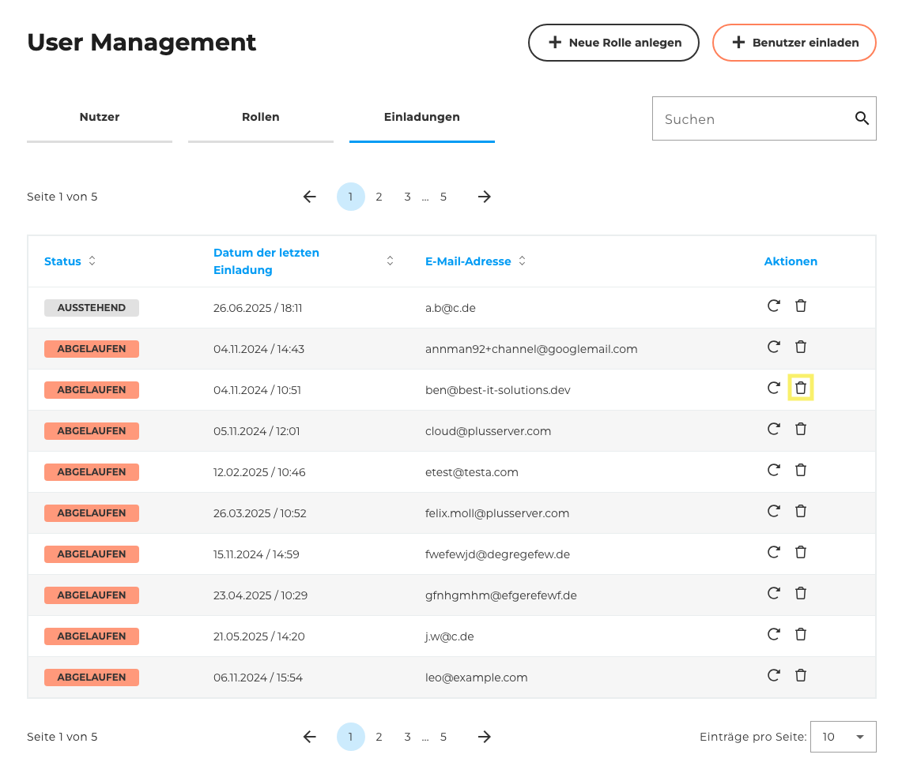
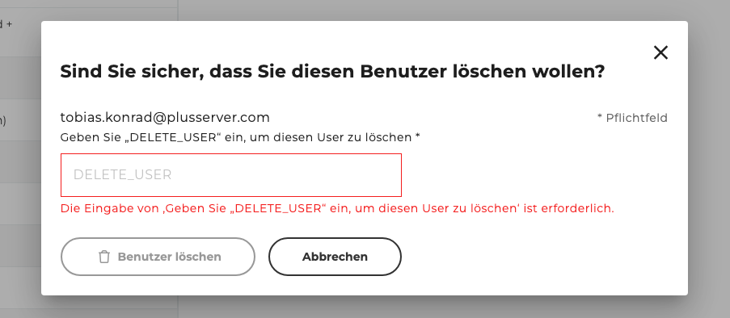
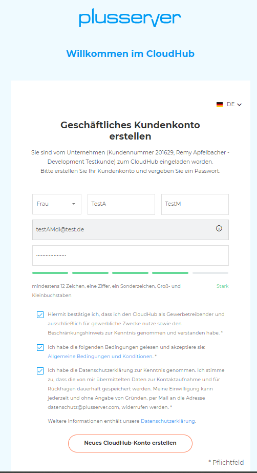
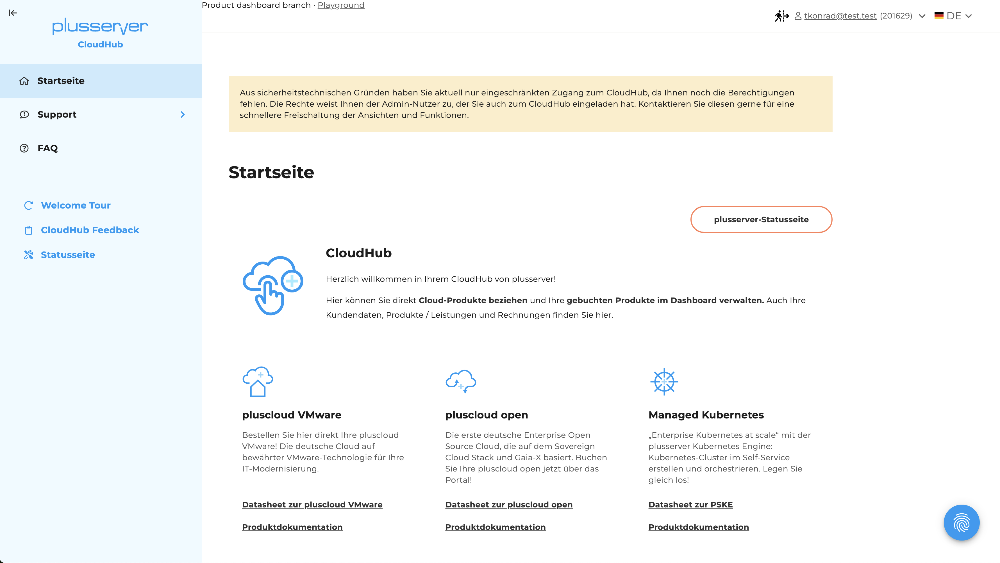
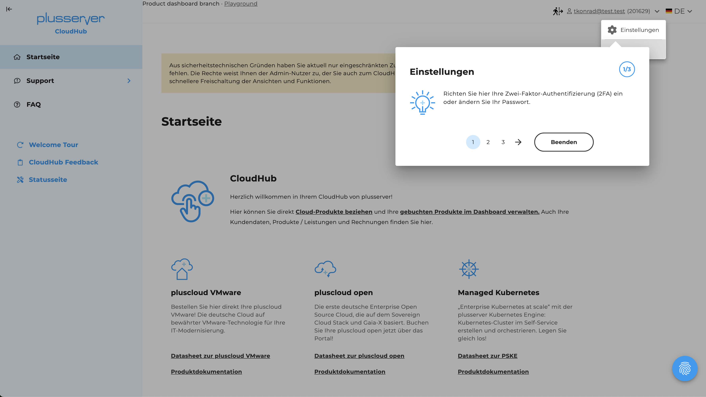
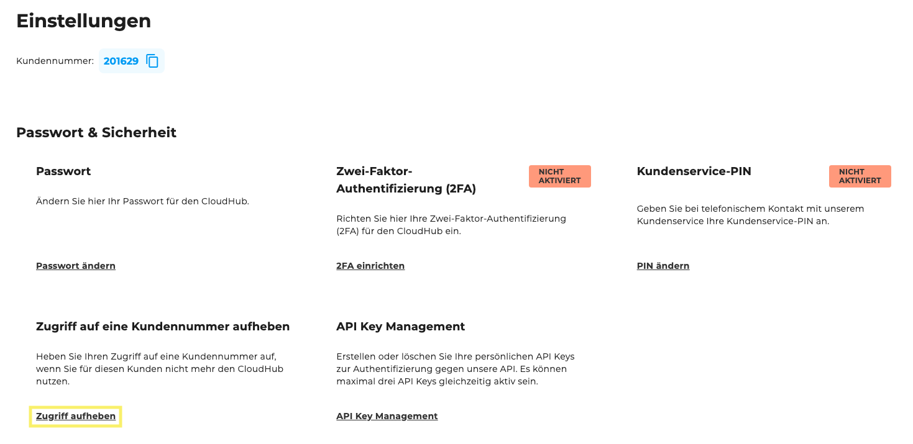
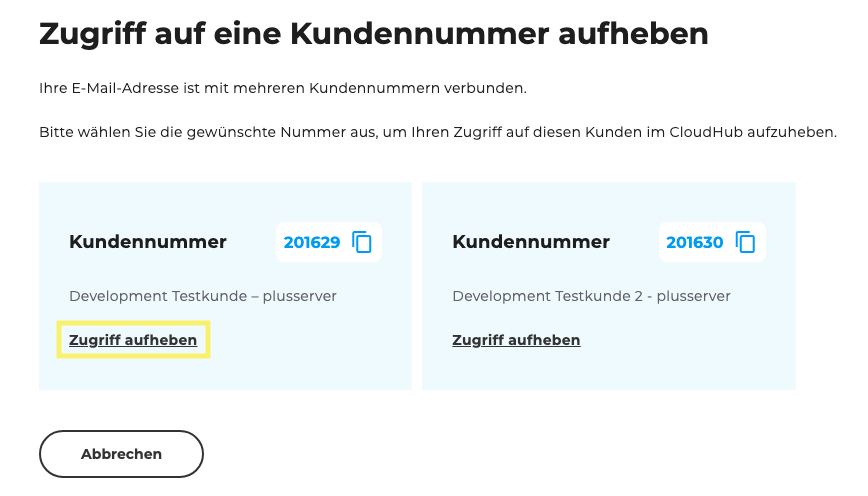

## Wo ist es zu finden?
Die Funktion zum Einladen weiterer Nutzer per E-Mail ist in der Sidebar des CloudHubs unter Usermanagement zu finden. Dort kann ein Admin-Nutzer über die Schaltfläche Benutzer einladen neue Nutzer per E-Mail hinzufügen.

## Einladung aus der Perspektive des Admins

### Einladungsprozess

1. Admin geht auf die Seite "User Management"
2. Admin klickt dort auf den Knopf "Benutzer einladen"

3. Admin sieht einen Pop-up Fenster, wo er die E-Mail-Adresse des Nutzers eingeben kann, den er einladen will. (E-Mail-Adresse = Pflichtfeld).
4. In diesem Pop-up Fenster können jetzt auch direkt die Rollen vergeben werden (eine und mehrere).
    1. Die Rollen müssen jedoch vorher angelegt werden.
    2. Ebenfalls haben wir Hinweise bei "Rolle löschen" und "Rolle editieren" eingebaut, dass dies Auswirkungen auf offene Einladungen haben kann.
5. Über den Knopf "Einladung senden" bestätigt der Admin den Versand der E-Mail Einladung (ein Ladebildschirm erscheint)

6. Nach erfolgreich versendeter Einladung kann der Nutzer von hier aus entweder direkt einen weiteren Nutzer einladen, auf die Liste mit allen Einladungen gehen oder einfach das Fenster schließen.

Sicherheitsvorkehrungen:

- Die Einladungn sind limitiert auf 50 Einladungen pro Admin pro Tag
- Der Link in der Einladungsmail ist nur 1 Tag gültig

Sobald die Einladung erfolgreich angenomen wurde, taucht der hinzugefügt Nutzer in der User Management-Tabelle auf.

### Weitere Funktionen für den Admin im Einladungs-Kontext

1. In der Tabelle "Einladungen" innerhalb des Bereiches "User Management" erhält der Admin einen Überblick über alle versendeten Einladungen und deren Status ("Ausstehend"/"Abgelaufen") und kann diese dort verwalten.

2. Admin kann über die Einladungs-Tabelle Einladungen erneut versenden (Symbol Kreis-Pfeil)

3. Admin kann über die Einladungs-Tabelle EInladungen löschen (Symbol Mülltonne). Die Löschung muss immer bestätigt werden.

## Einladung aus der Perspeltive des eingeladenen Nutzers

### Einladungsprozess

1. Nutzer erhält eine E-Mail Einladung (via Hubspot) und bekommt in dieser Mail einen Einladungslink und weitere Infos. Absender (Customer ID, Firmenname) und wofür die Einladung ist (Zugang zum CloudHub) sind klar in der E-Mail erkennbar.
2. Nutzer klickt in der Mail auf einen Knopf mit dem Einladungs-Link und wird dann entsprechend weitergeleitet.
    1. Nutzer die bereits ein CloudHub Konto haben, können sich weiterhin mit ihren gewohnten Login-Daten einloggen.
    2. Nutzer, die noch kein CloudHub Konto haben, werden im Prozess aufgefordert ihr Passwort zu vergeben und so den Account zu erstellen.

3. Nach erfolgreicher Eingabe der Daten / erfolgreichem Login kommen die Nutzer ins CloudHub.
4. Sollte der jeweilige Nutzer noch keine Rechte vom Admin erhalten haben, dann haben die Nutzer aus Sicherheitsgründen einen eingeschränkten Zugriff auf das CloudHub
    1. Der Nutzer hat in diesem Fall nur Zugang zu folgenden Funktionen / Seiten: Startseite, FAQs, Einstellungen, ggf. "Kunden wechseln" (wenn sie mehreren Kundennummern zugeordnet sind), Rückmeldung/Feedback und den Links auf der Startseite die zur Webseite führen oder PDFs zu den Produkten erhalten
    2. Dem Nutzer wird so lange ein Info-Banner zu diesem Status angezeigt, bis die Rechte vergeben worden sind. Dann verschwindet das Banner automatisch

    

    3. Sobald der Nutzer seine Rechte erhält, wird ihm auch beim nächsten Login ins CloudHub entsprechend die Schritte in der Welcome-Tour angezeigt, für die Bereiche wo der Nutzer dann Zugriff hat.

    

5. Der Nutzer bekommt aber wie alle neu registrierten Nutzer eine Welcome-Mail mit allen wichtigen Informationen zum CloudHub im Überblick.

### Weitere Funktionen für den Nutzer

1. Über "Einstellungen" kann der User nun die Funktion erreichen, selbstständig den Zugriff auf eine Kundennummer aufzuheben, wenn er für diese nicht mehr im CloudHub tätig ist. Da die Aufhebung von einer Kundennummer ein kritischer Schritt ist, haben wir uns dazu entschlossen dem Nutzer zwei Fenster zur Bestätigung dieser Aufhebung vorzulegen, damit er die sichere Möglichkeit hat den Schritt für sich zu prüfen und ggf. rechtzeitig abzubrechen.

Auswirkungen für den Nutzer für das Aufheben des Zugriffs auf eine Kundennummer:

1. Dieser CloudHub-Zugang für die abgemeldete Kundennummer wird dann automatisch gesperrt
2. Sollte ein Nutzer dann immer noch mehreren Kundennummern zugeordnet sein, wird er zu einem Fenster weitergeleitet, wo er zwischen den noch aktiven Kundennummern wieder auswählen kann.
3. Sollte ein Nutzer dann nur noch einer Kundennummer zugeordnet sein, wird er zur Startseite im CloudHub weitergeleitet, innerhalb der verbliebenen Kundennummer.
4. Sollte ein Nutzer dann gar keiner Kundennummer mehr zugeordnet sein wird der Zugriff komplett eingeschränkt. Der Nutzer sieht dann nur noch ein Fenster im CloudHub und wir geben ihm den Hinweis sich beim Admin oder Support zu melden, sollte er eine Löschung des Accounts wollen. (Noch können wir die Löschung nicht automatisiert anbieten). Der User kann hier nur noch die Sprache einstellen und sich ausloggen.

Der Admin-Nutzer erhält per Mail die Information wenn sich ein Nutzer von einer Kundennummer abgemeldet hat.
