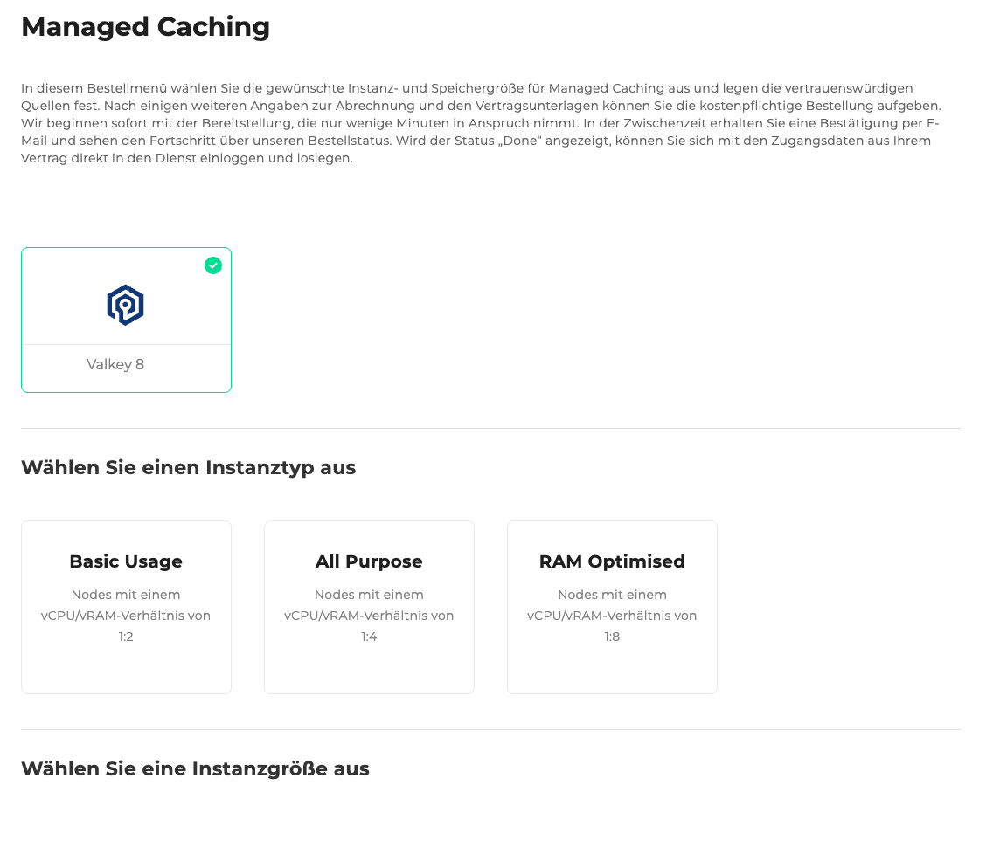
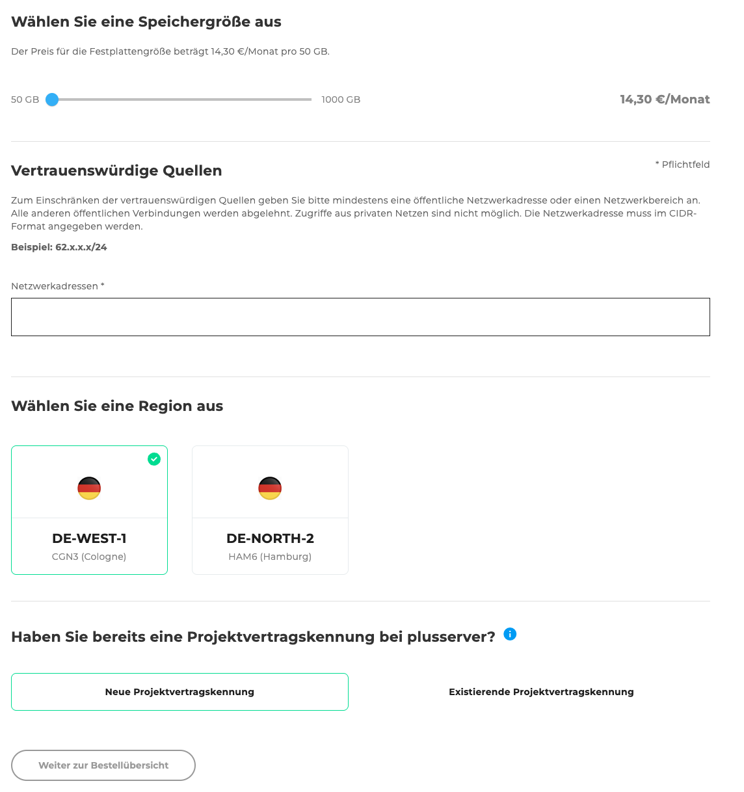
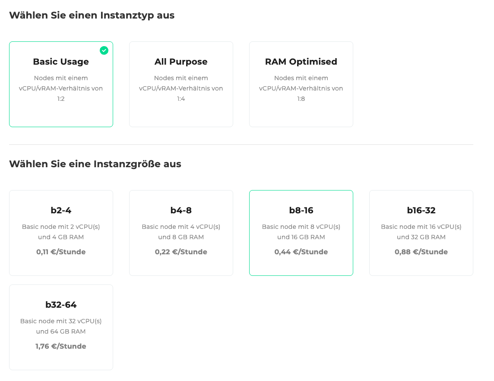
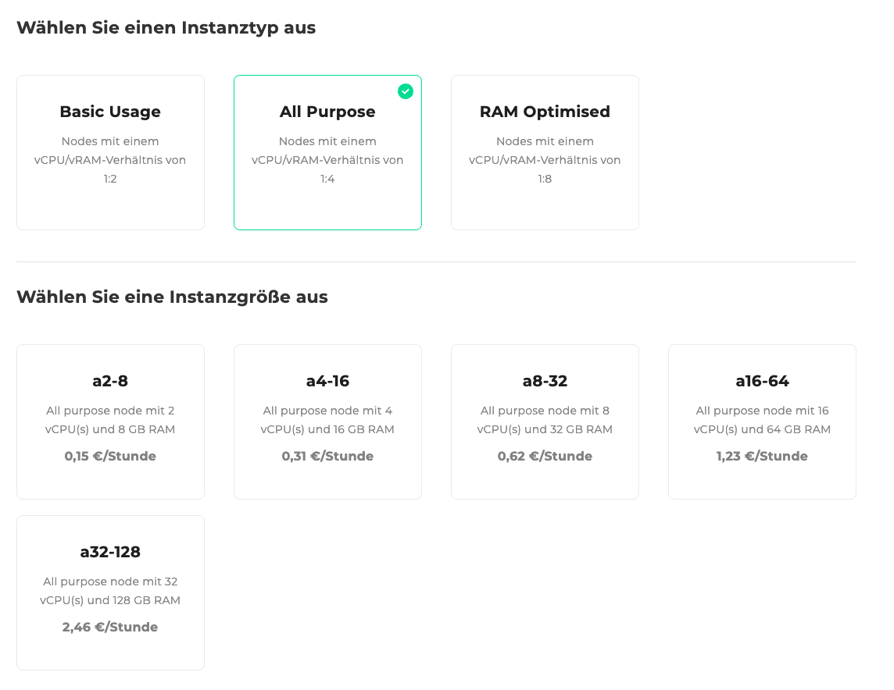
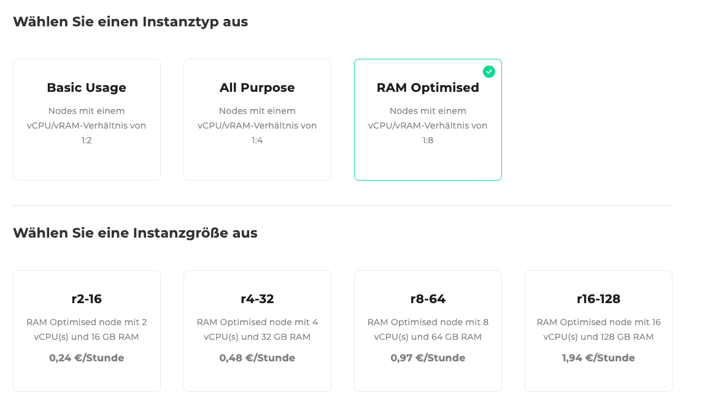
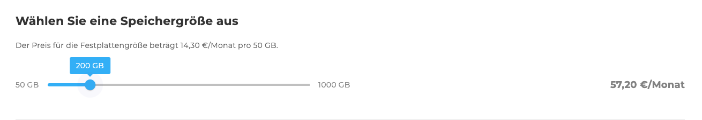
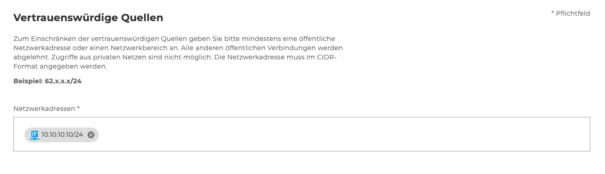
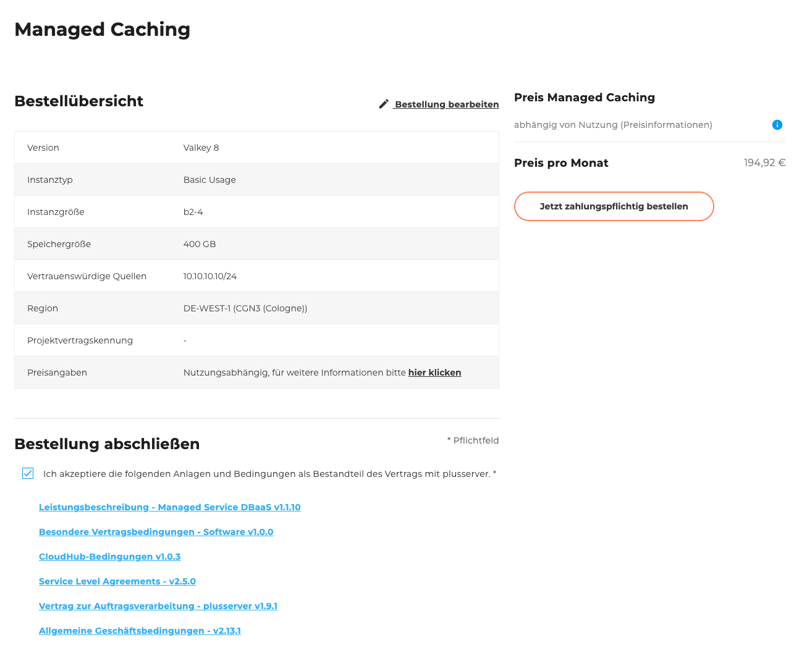

## Einleitung

Willkommen zum Bestellformular des Managed Cachings. Hier wird beschrieben, welche Konfigurationsmöglichkeiten es gibt und wie ein neues Managed Cachings bestellt werden kann.

Im Folgenden führen wir Sie Schritt für Schritt durch den Bestellprozess und erläutern die einzelnen Auswahlmöglichkeiten und Eingabefelder.

Das Managed Caching basiert auf Valkey, einer skalierbaren und leistungsstarken In-Memory-Datenbank, die für schnelle Datenverarbeitung und Caching-Lösungen optimiert ist.

## Schritt 1: Instanztyp auswählen

Wählen Sie das gewünschte Verhältnis von vCPU zu vRAM:

#### Basic Usage
- Nodes mit einem vCPU/vRAM-Verhältnis von 1:2

#### All Purpose
- Nodes mit einem vCPU/vRAM-Verhältnis von 1:4

#### RAM Optimised
- Nodes mit einem vCPU/vRAM-Verhältnis von 1:8

## Schritt 2: Instanzgröße auswählen

Je nach gewähltem Instanztyp stehen verschiedene Größen zur Auswahl:

#### Basic Usage:

Instanzgrößen:
- b2-4 – 2 vCPU, 4 GB RAM – 0,11 €/Stunde
- b4-8 – 4 vCPU, 8 GB RAM – 0,22 €/Stunde
- b8-16 – 8 vCPU, 16 GB RAM – 0,44 €/Stunde
- b16-32 – 16 vCPU, 32 GB RAM – 0,88 €/Stunde
- b32-64 – 32 vCPU, 64 GB RAM – 1,76 €/Stunde

#### All Purpose:

Instanzgrößen:
- a2-8 – 2 vCPU, 8 GB RAM – 0,15 €/Stunde
- a4-16 – 4 vCPU, 16 GB RAM – 0,31 €/Stunde
- a8-32 – 8 vCPU, 32 GB RAM – 0,62 €/Stunde
- a16-64 – 16 vCPU, 64 GB RAM – 1,23 €/Stunde
- a32-128 – 32 vCPU, 128 GB RAM – 2,46 €/Stunde

#### RAM Optimised:

Instanzgrößen:
- r2-16 – 2 vCPU, 16 GB RAM – 0,24 €/Stunde
- r4-32 – 4 vCPU, 32 GB RAM – 0,48 €/Stunde
- r8-64 – 8 vCPU, 64 GB RAM – 0,97 €/Stunde
- r16-128 – 16 vCPU, 128 GB RAM – 1,94 €/Stunde

## Schritt 3: Speichergröße

Wählen Sie die gewünschte Speichergröße über einen Schieberegler:

- Min.: 50 GB
- Max.: 1000 GB
- Kosten: 14,30 €/Monat pro 50 GB

## Schritt 4: Vertrauenswürdige Quellen

Geben Sie die erlaubten Netzwerkadressen im CIDR-Format an.

Beispiel:
`10.10.10.10/24`

## Schritt 5: Region auswählen

Wählen Sie die gewünschte Region für die Bereitstellung Ihrer Datenbank:

- DE-WEST-1 CGN3 (Köln)
- DE-NORTH-2 HAM6 (Hamburg)

## Schritt 6: Projektvertragskennung

Wählen Sie, ob bereits eine Projektvertragskennung besteht:

- Neue Projektvertragskennung
- Existierende Projektvertragskennung (Auswahl aus einer Liste)

## Schritt 7: Bestellübersicht

Die Bestellübersicht zeigt eine Tabelle mit allen von Ihnen gewählten Konfigurationen.
Unterhalb der Tabelle befindet sich eine Checkbox, mit der Sie die folgenden Anlagen und Bedingungen akzeptieren können.
Zu den Anlagen gehören verschiedene herunterladbare PDF-Dokumente, wie z. B. die Allgemeinen Geschäftsbedingungen und weitere relevante Vertragsunterlagen.\
Rechts neben der Tabelle werden der Gesamtpreis sowie der Bestellen-Button angezeigt.
Dieser Button ist standardmäßig deaktiviert und wird erst aktiviert, wenn die Anlagen und Bedingungen akzeptieren wurden.

