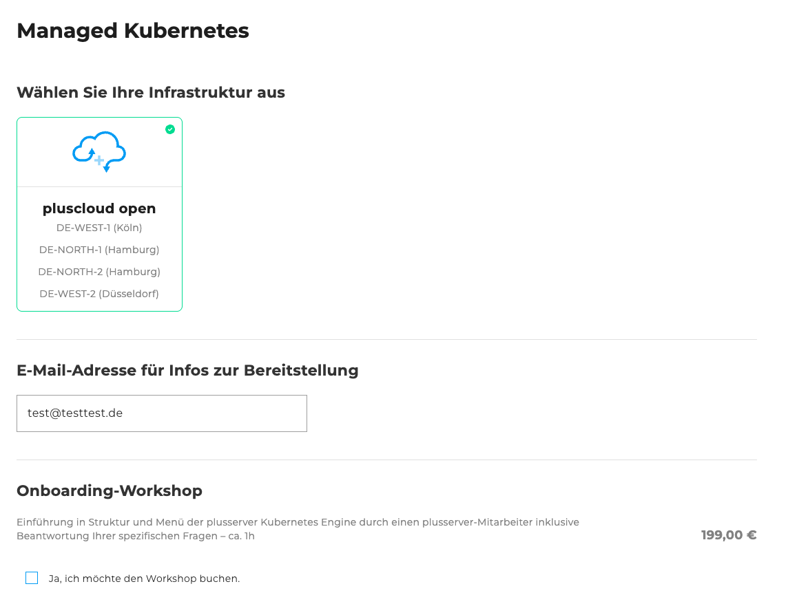
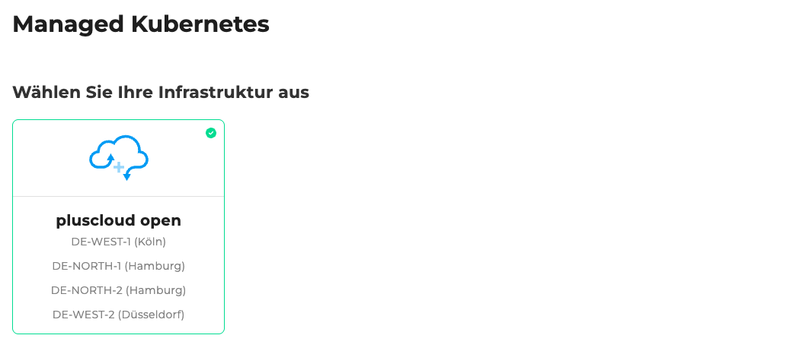
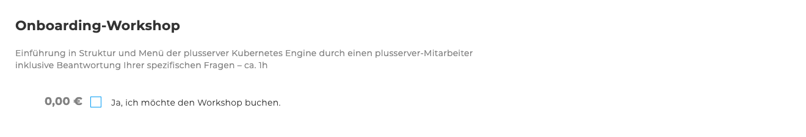
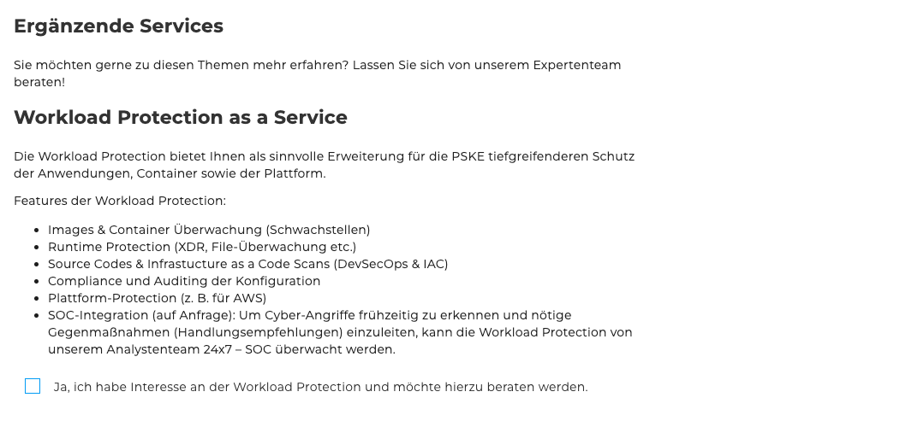
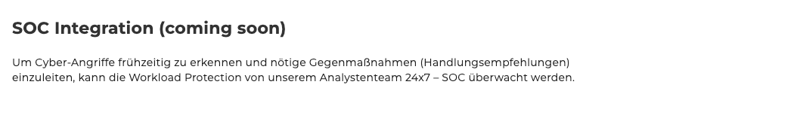
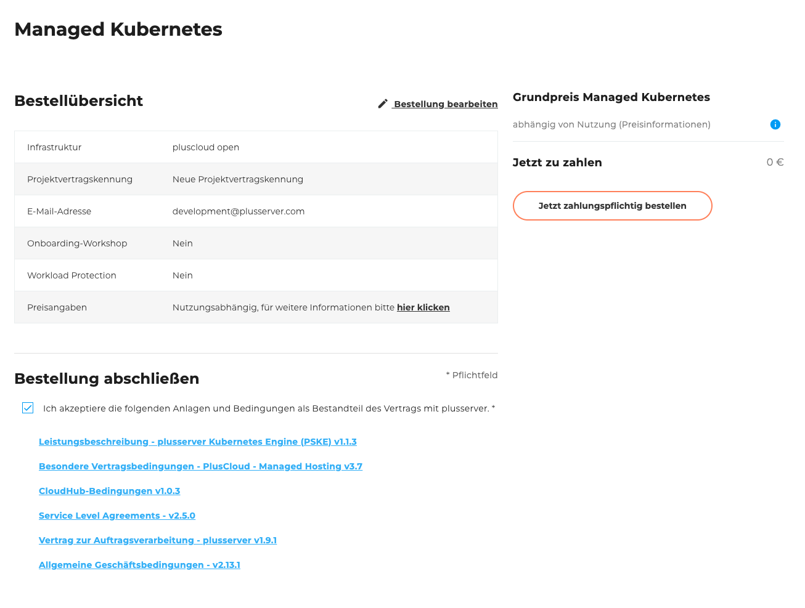

## Einleitung

Willkommen zum [Bestellformular des Managed Kubernetes](https://cloudhub.plusserver.com/cloud-services/managed-kubernetes/order). Hier wird beschrieben, welche Konfigurationsmöglichkeiten es gibt und wie eine neues Managed Kubernetes bestellt werden kann.

Im Folgenden führen wir Sie Schritt für Schritt durch den Bestellprozess und erläutern die einzelnen Auswahlmöglichkeiten und Eingabefelder.

## Schritt 1: Auswahl der Infrastruktur

In diesem Schritt wird die Infrastruktur ausgewählt.
Aktuell steht nur eine Option zur Verfügung, die bereits vorausgewählt ist:

- pluscloud open:
  - DE‑WEST-1 (Köln)
  - DE‑NORTH-1 (Hamburg)
  - DE‑NORTH-2 (Hamburg)
  - DE‑WEST-2 (Düsseldorf)

## Schritt 2: E-Mail für Bereitstellungsinformationen

- E-Mail-Adresse:
  Dieses Feld ist vorausgefüllt mit der E-Mail-Adresse, mit der Sie aktuell angemeldet sind.
  Die Adresse kann jedoch bei Bedarf angepasst werden.

## Schritt 3: Onboarding Workshop

Optional kann ein Onboarding Workshop für 199 € gebucht werden, um Sie bei der Inbetriebnahme der Umgebung zu unterstützen.

## Workload Protection as a Service

Ein Sicherheitsdienst zur Erweiterung Ihrer **PSKE-Plattform** mit umfassendem Schutz für Anwendungen, Container und Infrastruktur, was mit einem Hacken in der Checkbox ausgewählt werden kann.

Leistungsmerkmale:

- Überwachung von Images & Containern (Schwachstellenanalyse)
- Runtime Protection (z. B. XDR, Dateiüberwachung)
- Scans von Quellcode & Infrastructure as Code (DevSecOps, IaC)
- Compliance & Auditing von Konfigurationen
- Plattformschutz (z. B. AWS)
- SOC-Integration *(auf Anfrage)*: 24x7-Überwachung durch ein Analystenteam mit Handlungsempfehlungen bei Cyberangriffen

## Schritt 5: SOC Integration *(Coming Soon)*

Die 24x7 SOC-Integration ist derzeit noch nicht verfügbar.
Zukünftig wird sie eine Überwachung durch unser Analystenteam ermöglichen, um Angriffe frühzeitig zu erkennen und zu reagieren.

## Schritt 6: Projektvertragskennung

Wählen Sie, ob bereits eine Projektvertragskennung besteht:

- Neue Projektvertragskennung
- Existierende Projektvertragskennung (Auswahl aus einer Liste)

## Schritt 7: Bestellübersicht

Die Bestellübersicht zeigt eine Tabelle mit allen von Ihnen gewählten Konfigurationen.
Unterhalb der Tabelle befindet sich eine Checkbox, mit der Sie die folgenden Anlagen und Bedingungen akzeptieren können.
Zu den Anlagen gehören verschiedene herunterladbare PDF-Dokumente, wie z. B. die **Allgemeinen Geschäftsbedingungen** und **weitere relevante Vertragsunterlagen**.\
Rechts neben der Tabelle werden der Gesamtpreis sowie der Bestellen-Button angezeigt.
Dieser Button ist standardmäßig deaktiviert und wird erst aktiviert, wenn die Anlagen und Bedingungen akzeptieren wurden.

