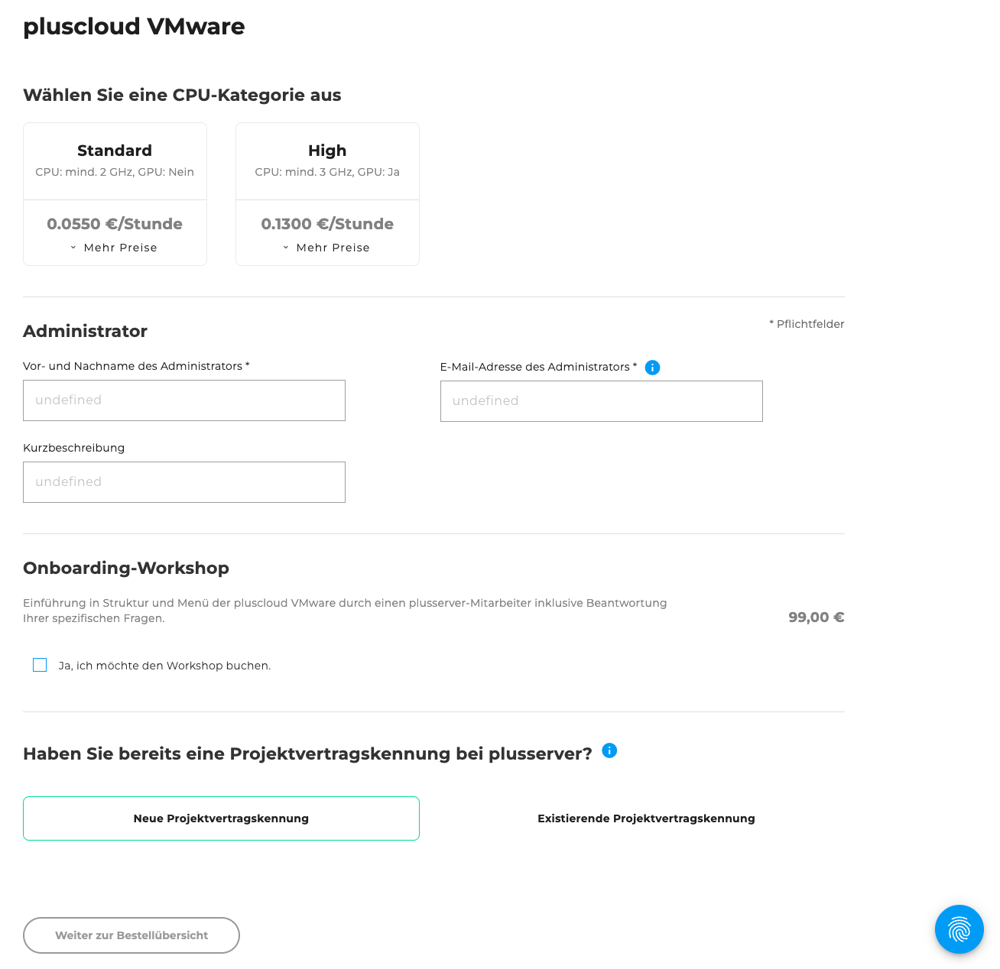
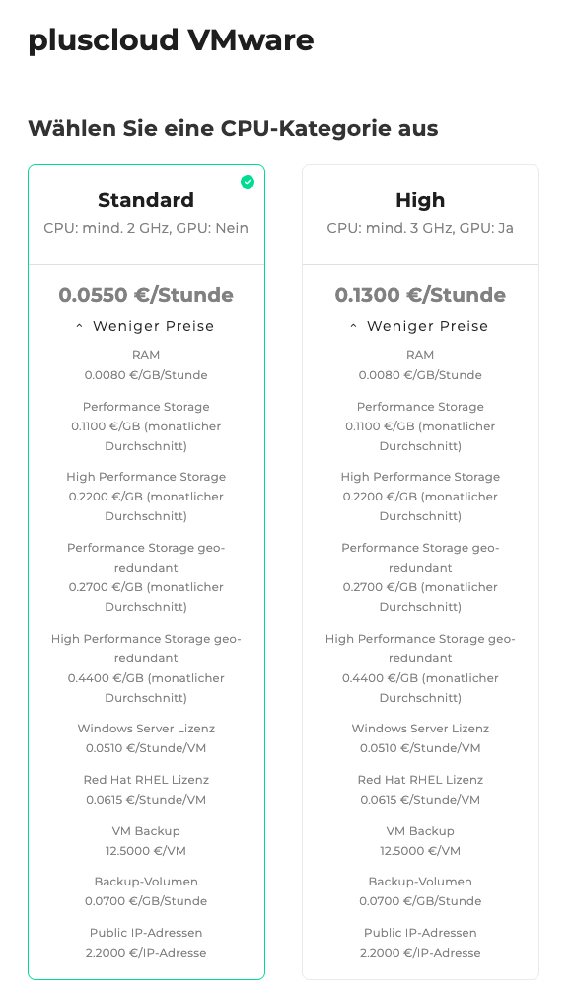
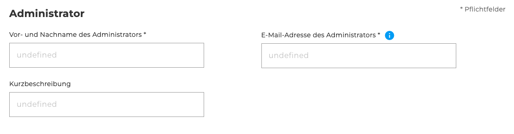
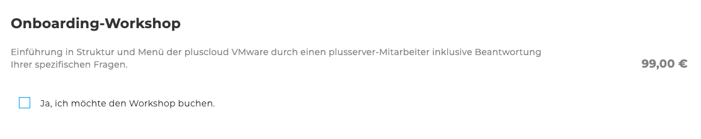
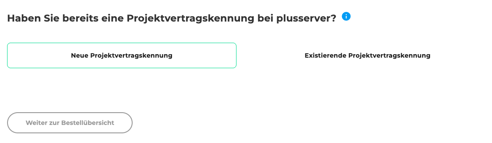
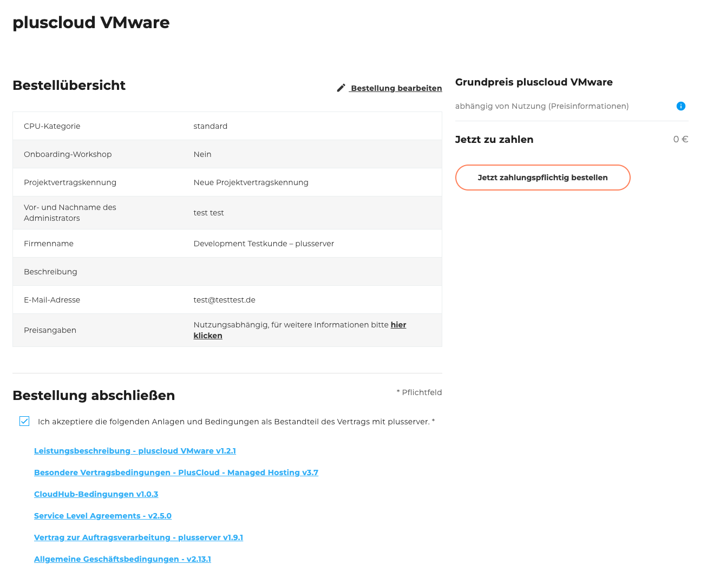

## Einleitung

Willkommen zum [Bestellformular der pluscloud VMware](https://cloudhub.plusserver.com/cloud-services/pluscloud-v/order). Hier wird beschrieben, welche Konfigurationsmöglichkeiten es gibt und wie eine neue pluscloud VMware bestellt werden kann.

Im Folgenden führen wir Sie Schritt für Schritt durch den Bestellprozess und erläutern die einzelnen Auswahlmöglichkeiten und Eingabefelder.

## Schritt 1: Auswahl der CPU-Kategorie

Im ersten Schritt wählen Sie die CPU-Kategorie für Ihre VMware aus:

- Standard CPU
  - Mindestens 2 GHz
  - Keine GPU-Unterstützung
- High CPU
  - Mindestens 3 GHz
  - GPU-Unterstützung vorhanden

Zusätzlich können über ein Dropdown-Menü weitere Optionen und Preise eingesehen werden zu:

- RAM
- Performance Storage
- High Performance Storage
- Performance Storage (georedundant)
- High Performance Storage (georedundant)
- Windows Server Lizenz
- Red Hat RHEL Lizenz
- VM Backup
- Backup-Volumen
- Public IP-Adressen

## Schritt 2: Angaben für den Administrator

Hier tragen Sie die Daten der verantwortlichen Ansprechperson ein:

- Vor- und Nachname (*Pflichtfeld*)
- E-Mail-Adresse (*Pflichtfeld*)
- Kurzbeschreibung (*optional*)

## Schritt 3: Onboarding Workshop

Optional kann ein Onboarding Workshop für 99 € hinzugebucht werden.
Dieser Workshop unterstützt Sie bei der Einführung und Nutzung der pluscloud VMware.

## Schritt 4: Projektvertragskennung

Wählen Sie, ob bereits eine Projektvertragskennung besteht:

- Neue Projektvertragskennung
- Existierende Projektvertragskennung (Auswahl aus einer Liste)

## Schritt 5: Bestellübersicht

Die Bestellübersicht zeigt eine Tabelle mit allen von Ihnen gewählten Konfigurationen.
Unterhalb der Tabelle befindet sich eine Checkbox, mit der Sie die folgenden Anlagen und Bedingungen akzeptieren können.
Zu den Anlagen gehören verschiedene herunterladbare PDF-Dokumente, wie z. B. die **Allgemeinen Geschäftsbedingungen** und **weitere relevante Vertragsunterlagen**.\
Rechts neben der Tabelle werden der Gesamtpreis sowie der Bestellen-Button angezeigt.
Dieser Button ist standardmäßig deaktiviert und wird erst aktiviert, wenn die Anlagen und Bedingungen akzeptieren wurden.

