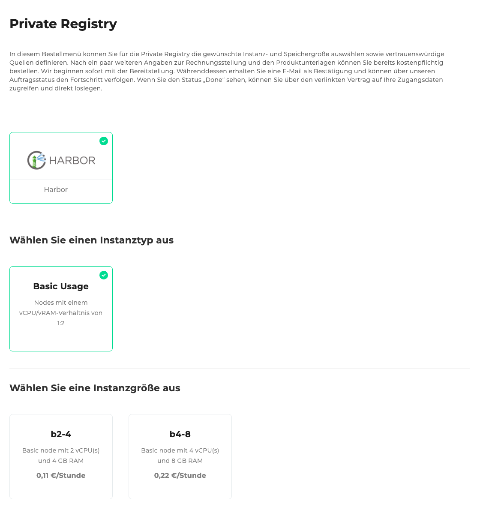
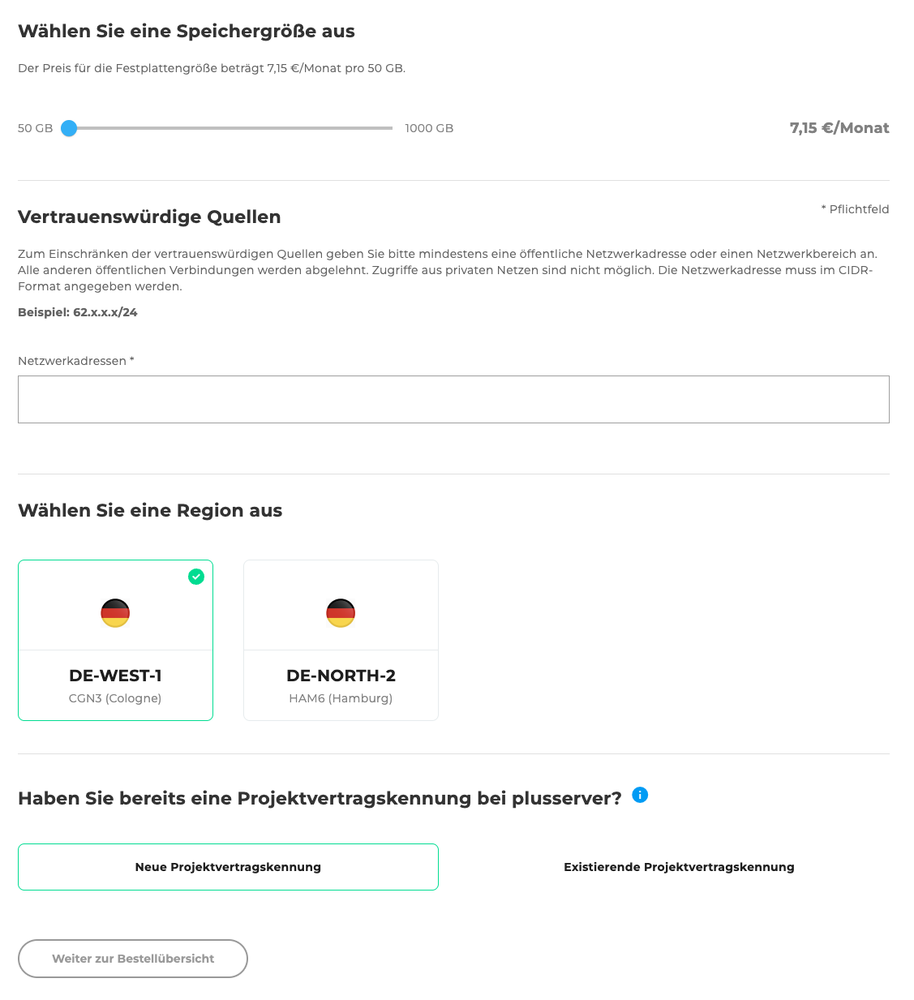
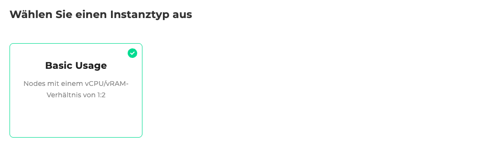
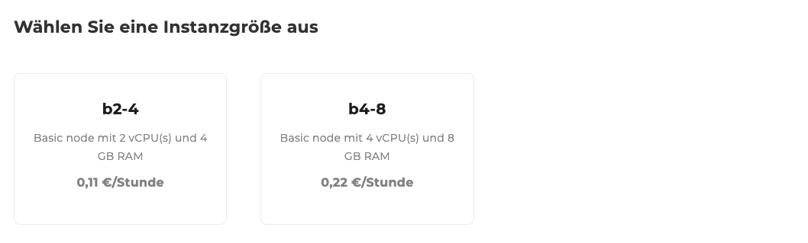
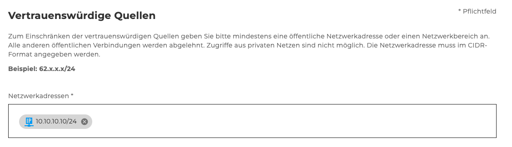
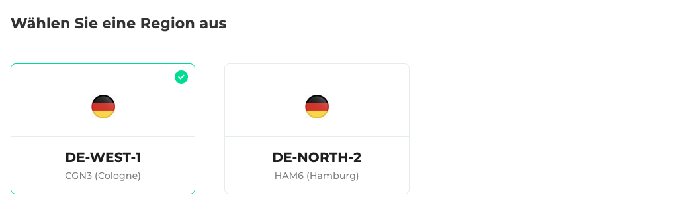
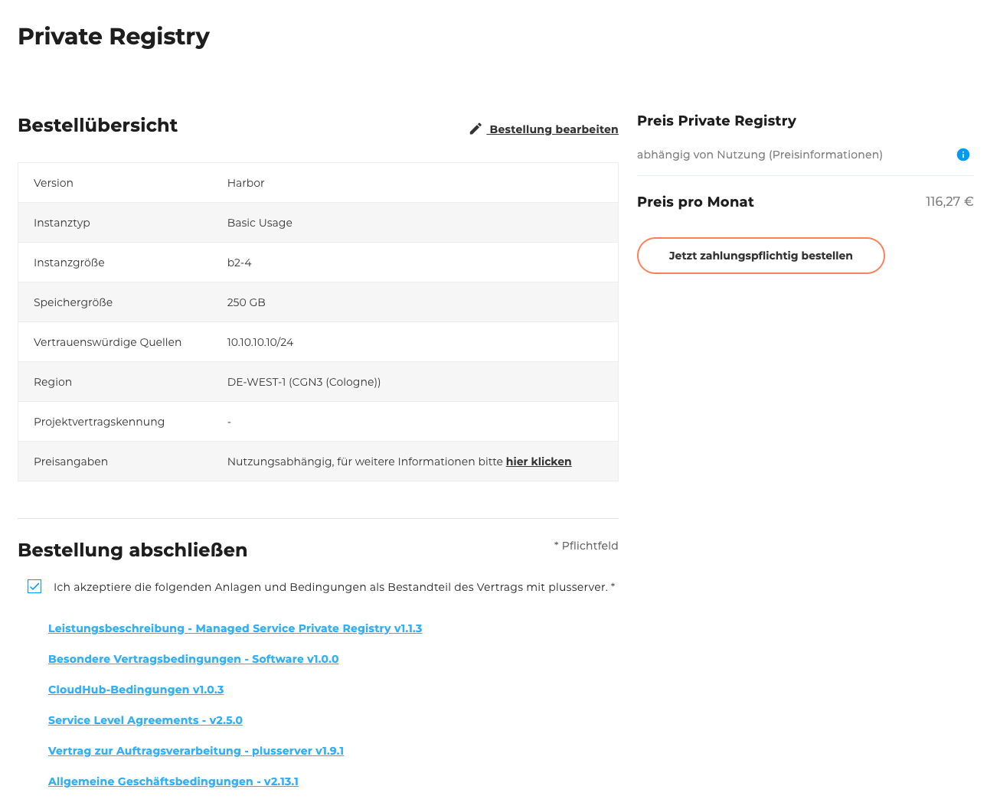

## Einleitung

Willkommen zum [Bestellformular der Private Registry](https://cloudhub.plusserver.com/cloud-services/private-registry/order). Hier wird beschrieben, welche Konfigurationsmöglichkeiten es gibt und wie eine neue Private Registry bestellt werden kann.

Im Folgenden führen wir Sie Schritt für Schritt durch den Bestellprozess und erläutern die einzelnen Auswahlmöglichkeiten und Eingabefelder.

Die Private Registry basiert auf Harbor, einer cloudnativen Open-Source-Registry für Container-Images.

## Schritt 1: Instanztyp

Aktuell steht nur ein Instanztyp zur Verfügung:

- Basic Usage
  - Nodes mit einem vCPU/vRAM-Verhältnis von 1:2

## Schritt 2: Instanzgröße

Wählen Sie eine der folgenden Instanzgrößen:

#### b2-4

- 2 vCPU(s) und 4 GB RAM
- 0,11 €/Stunde

#### b4-8

- 4 vCPU(s) und 8 GB RAM
- 0,22 €/Stunde

## Schritt 3: Speichergröße

Wählen Sie die gewünschte Speichergröße über einen Schieberegler:

- Min.: 50 GB
- Max.: 1000 GB
- Kosten: 7,15 €/Monat pro 50 GB

## Schritt 4: Vertrauenswürdige Quellen

Geben Sie die erlaubten Netzwerkadressen im CIDR-Format an.

Beispiel:
`10.10.10.10/24`

## Schritt 5: Region auswählen

Wählen Sie die gewünschte Region für die Bereitstellung der Registry:

- DE-WEST-1 CGN3 (Köln)
- DE-NORTH-2 HAM6 (Hamburg)

## Schritt 6: Projektvertragskennung

Wählen Sie, ob bereits eine Projektvertragskennung besteht:

- Neue Projektvertragskennung
- Existierende Projektvertragskennung (Auswahl aus einer Liste)

## Schritt 7: Bestellübersicht

Die Bestellübersicht zeigt eine Tabelle mit allen von Ihnen gewählten Konfigurationen.
Unterhalb der Tabelle befindet sich eine Checkbox, mit der Sie die folgenden Anlagen und Bedingungen akzeptieren können.
Zu den Anlagen gehören verschiedene herunterladbare PDF-Dokumente, wie z. B. die **Allgemeinen Geschäftsbedingungen** und **weitere relevante Vertragsunterlagen**.\
Rechts neben der Tabelle werden der Gesamtpreis sowie der Bestellen-Button angezeigt.
Dieser Button ist standardmäßig deaktiviert und wird erst aktiviert, wenn die Anlagen und Bedingungen akzeptiert wurden.

