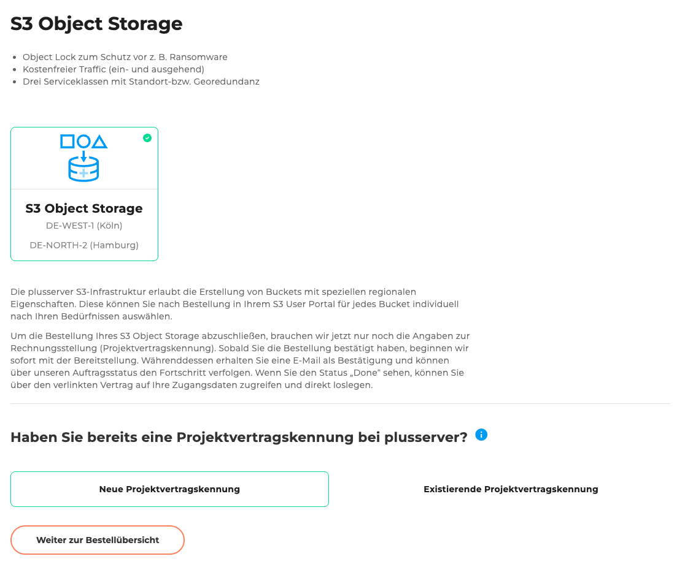
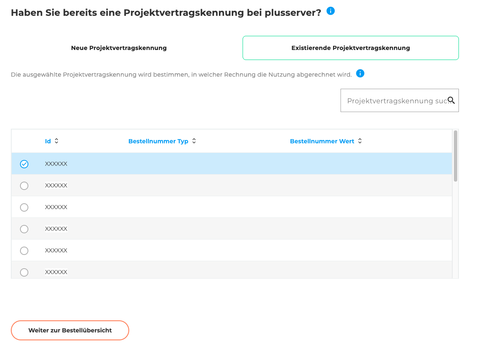
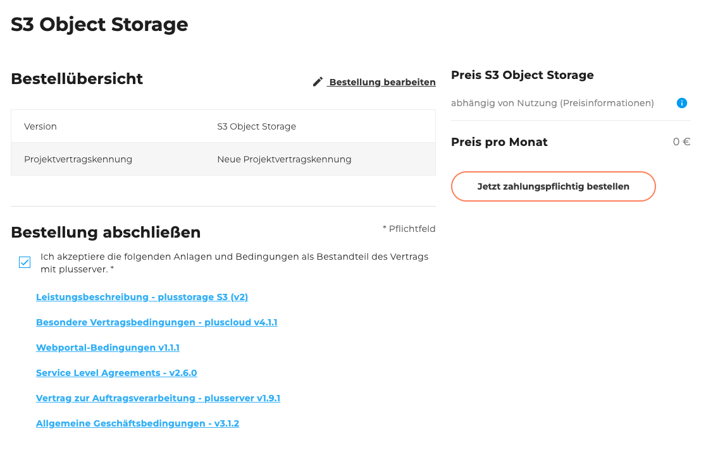

## Einleitung

Willkommen zum [Bestellformular von S3](https://cloudhub.plusserver.com/cloud-services/plusstorage-s3/order). Hier wird beschrieben, welche Konfigurationsmöglichkeiten es gibt und wie ein neuer S3 Object Storage bestellt werden kann.

Im Folgenden führen wir Sie Schritt für Schritt durch den Bestellprozess und erläutern die einzelnen Auswahlmöglichkeiten und Eingabefelder.

Aktuell bietet der S3 Object Storage einen sicheren, georedundanten Speicher mit optionalem Object Lock zum Schutz vor Ransomware sowie kostenfreiem Datenverkehr.

## Schritt 1: Projektvertragskennung

Wählen Sie, ob bereits eine Projektvertragskennung besteht:

- Neue Projektvertragskennung
- Existierende Projektvertragskennung (Auswahl aus einer Liste)

## Schritt 2: Bestellübersicht

Die Bestellübersicht zeigt eine Tabelle mit allen von Ihnen gewählten Konfigurationen.
Unterhalb der Tabelle befindet sich eine Checkbox, mit der Sie die folgenden Anlagen und Bedingungen akzeptieren können.
Zu den Anlagen gehören verschiedene herunterladbare PDF-Dokumente, wie z. B. die **Allgemeinen Geschäftsbedingungen** und **weitere relevante Vertragsunterlagen**.\
Rechts neben der Tabelle werden der Gesamtpreis sowie der Bestellen-Button angezeigt.
Dieser Button ist standardmäßig deaktiviert und wird erst aktiviert, wenn die Anlagen und Bedingungen akzeptieren wurden.

