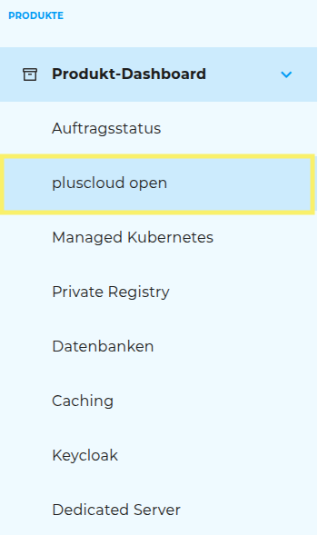
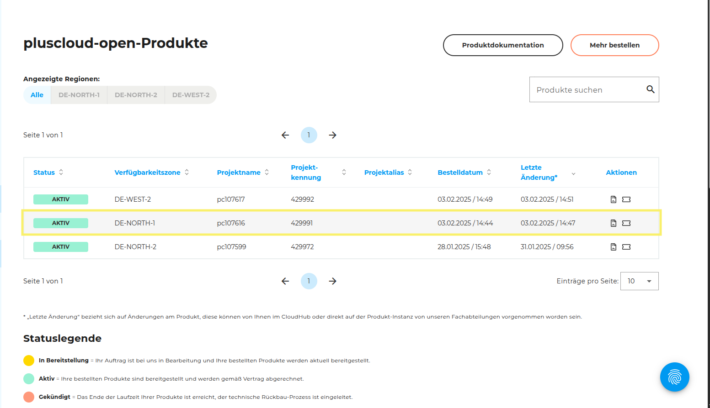

## Produkte kündigen Schritt für Schritt

### Schritt 1: Produkt-Dashboard öffnen

Wähle in der linken Seitenleiste den Button **„Produkt Dashboard“** aus.

### Schritt 2: Produktart auswählen

Wähle die Produktart, die gekündigt werden soll (z. B. Pluscloud Open, Datenbanken etc.).

### Schritt 3: Vertrag auswählen

### Schritt 4: Kündigung einleiten

Klicke auf den Button „Produkt kündigen“.

### Schritt 5: Kündigung bestätigen

Ein Pop-up-Fenster öffnet sich – validiere die Kündigung, um den Vorgang abzuschließen

