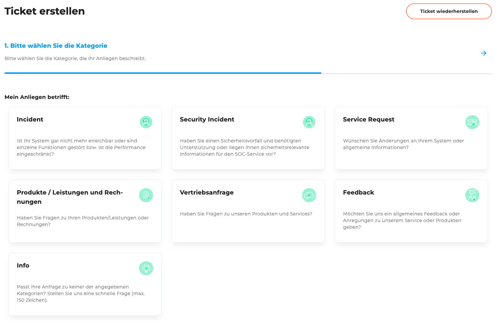
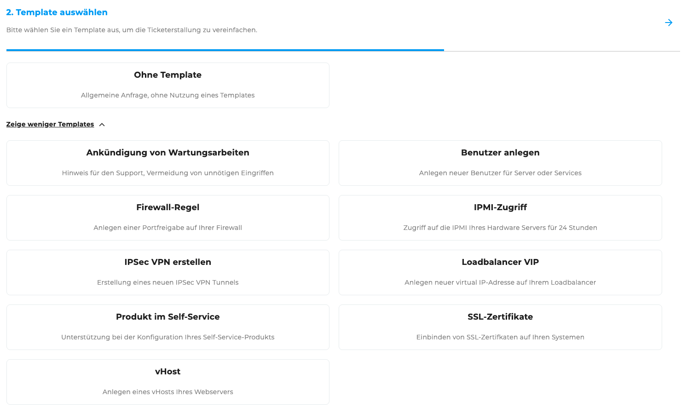
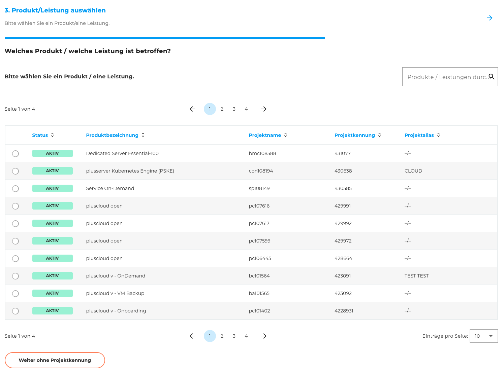
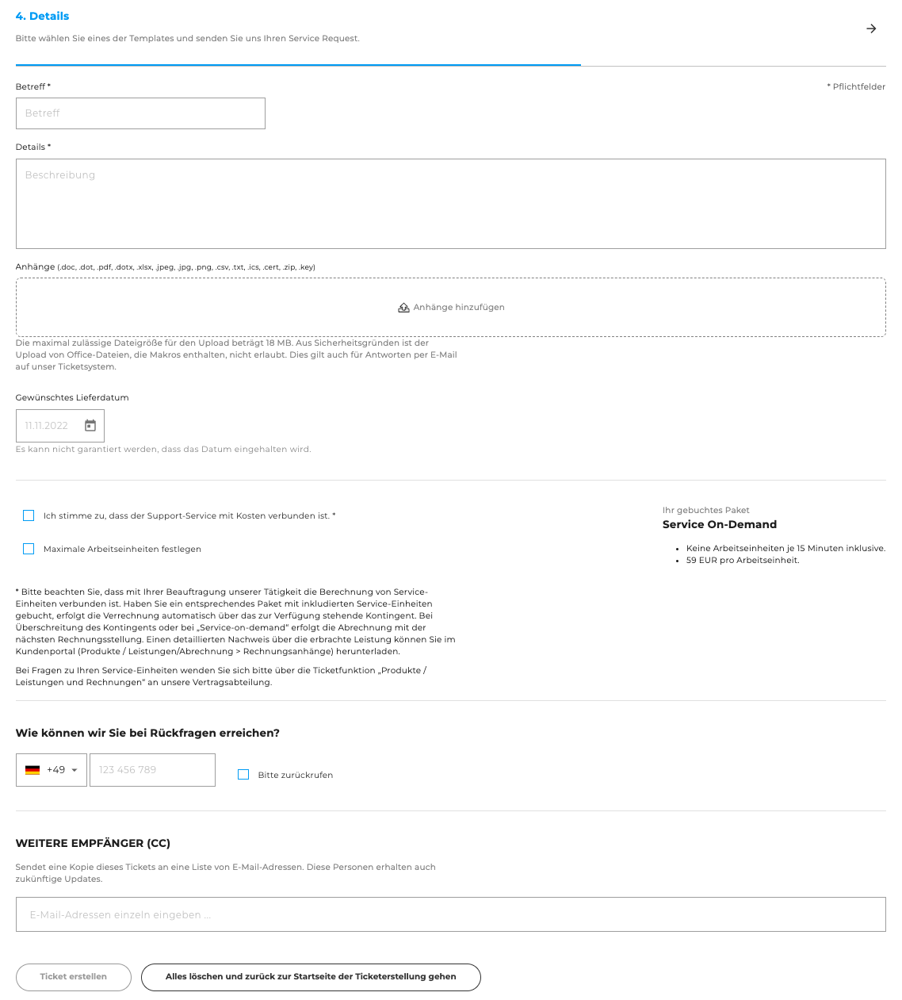

## Ticket erstellen

Auf der Seite **„Ticket erstellen“** können Sie ein neues Support-Ticket anlegen. Das Formular führt Sie Schritt für Schritt durch den Erstellungsprozess und passt sich abhängig von der gewählten Kategorie und ggf. Vorlage an.

### Schritte zur Ticketerstellung

1. **Kategorie auswählen:**
   Wählen Sie zunächst die passende Kategorie für Ihr Anliegen (z. B. Technischer Support, Abrechnung, Vertragsfragen).
   Diese Auswahl bestimmt, welche Informationen im weiteren Verlauf abgefragt werden.
   

2. **Vorlage auswählen (optional):**
   Falls für die gewählte Kategorie Vorlagen verfügbar sind, haben Sie die Möglichkeit eine passende Vorlage auszuwählen.
   

3. **Produkt oder Dienstleistung auswählen (optional):**
   Sie können das Ticket einem bestimmten Produkt oder einer Dienstleistung zuordnen.
   

4. **Details eingeben:**
   Abhängig von der gewählten Kategorie und Vorlage werden spezifische Informationen abgefragt.
   Geben Sie hier bitte alle relevanten Details zu Ihrem Anliegen ein, damit unser Support-Team Ihr Ticket effizient bearbeiten kann.
   

### Ticket wiederherstellen

Sollten Sie das Formular zur Ticketerstellung bereits teilweise ausgefüllt haben und die Seite verlassen haben, können Sie Ihre Eingaben wiederherstellen.
Dafür nutzen Sie den Button **„Ticket wiederherstellen“**, der sich oben rechts auf der Seite befindet.

