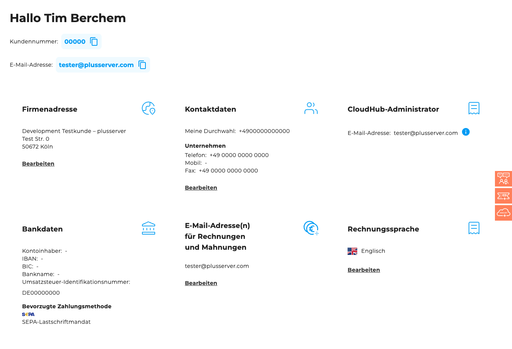

## Wo ist es zu finden?

Mein Konto ist im CloudHub unter ["Mein Konto"](https://cloudhub.plusserver.com/my-account) verfügbar. Diese erreicht man, indem man oben rechts auf die eigene E-Mail-Adresse in der Topbar klickt und anschließend den Menüpunkt "Mein Konto" auswählt.

## Übersicht

### Kontodaten

Zeigt Informationen zum aktuell angemeldeten Nutzer, einschließlich Name und zugehörigem Unternehmen.

### Firmenadresse

Darstellung des Firmennamens sowie der hinterlegten Unternehmensadresse.

### Kontaktdaten

- **Meine Durchwahl**: Persönliche Telefonnummer des aktuell eingeloggten Nutzers.
- **Unternehmen**: Allgemeine Kontaktnummern für vertrags- und abrechnungsbezogene Kommunikation.

### CloudHub-Administrator

- **E-Mail-Adresse**: E-Mail des zugewiesenen CloudHub-Administrators.
- Änderungen des Administrators erfolgen über ein Support-Ticket mit der Kategorie *Produkte / Leistungen und Rechnungen*.

### Bankdaten

- **Kontoinhaber**: Name des hinterlegten Kontoinhabers.
- **IBAN**: Hinterlegte IBAN des Kunden.
- **BIC**: Bank Identifier Code der hinterlegten Bankverbindung.
- **Bankname**: Name der hinterlegten Bank.
- **Umsatzsteuer-Identifikationsnummer**: Vom Nutzer hinterlegte USt-ID.
- **Bevorzugte Zahlungsmethode**: Rechnungsstellung oder SEPA-Lastschrift. Die SEPA-Option ist für neue Kunden in der Regel nicht mehr verfügbar, bleibt aber bei bestehenden Kunden ggf. bestehen.

### E-Mail-Adresse(n) für Rechnungen und Mahnungen

An diese Adresse wird die digitale Rechnung versendet. Eine gültige E-Mail-Adresse ist verpflichtend anzugeben.

### Rechnungssprache

Hier kann eingestellt werden, ob Rechnungen auf Deutsch oder Englisch versendet werden sollen – je nach Kundenwunsch.
