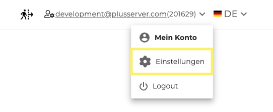
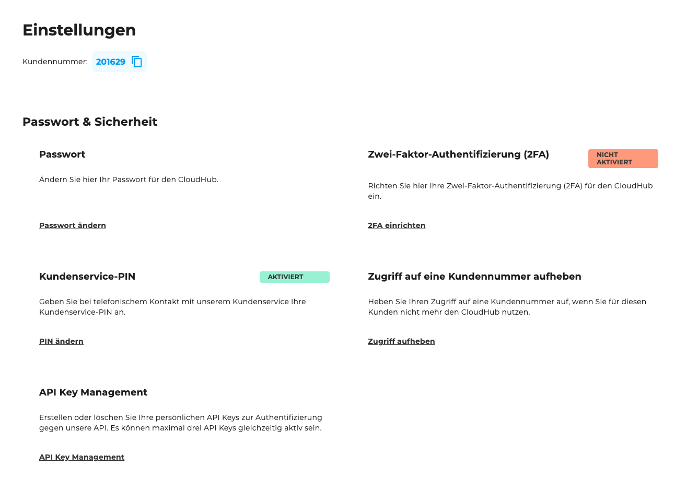

## Wo ist es zu finden?

Mein Konto ist im CloudHub unter ["Einstellungen"](https://cloudhub.plusserver.com/settings) verfügbar. Diese erreicht man, indem man oben rechts auf die eigene E-Mail-Adresse in der Topbar klickt und anschließend den Menüpunkt "Einstellungen" auswählt.

## Übersicht

Willkommen in den Einstellungen des CloudHubs. Hier können Sie verschiedene Einstellungen rund um das CloudHub vornehmen, von Sicherheitsoptionen bis hin zur Verwaltung von Zugriffsrechten.

## Passwort und Sicherheit

Im Bereich Passwort und Sicherheit können Sie die Sicherheit Ihres Kontos verwalten und verbessern. Folgende Optionen stehen zur Verfügung:

- **Passwort ändern** – Über den bereitgestellten Link können Sie Ihr Passwort aktualisieren, um Ihr Konto zu schützen.
- **Zwei-Faktor-Authentifizierung (2FA) einrichten** – Fügen Sie Ihrem Login eine zusätzliche Sicherheitsebene hinzu.
- **Kundenservice-PIN ändern** – Passen Sie den PIN für die Identitätsprüfung im Support an. Eine detaillierte Anleitung dafür finden Sie [hier](../../step-by-step-guide/customer-support-pin).
- **Zugriff auf eine Kundennummer aufheben** – Entfernen Sie eine Verknüpfung, falls diese nicht mehr benötigt wird.
- **API-Key-Management** – Verwalten Sie API-Schlüssel, um den programmgesteuerten Zugriff auf Ihre Dienste zu steuern.
