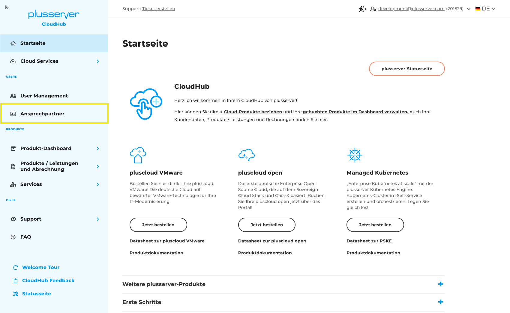
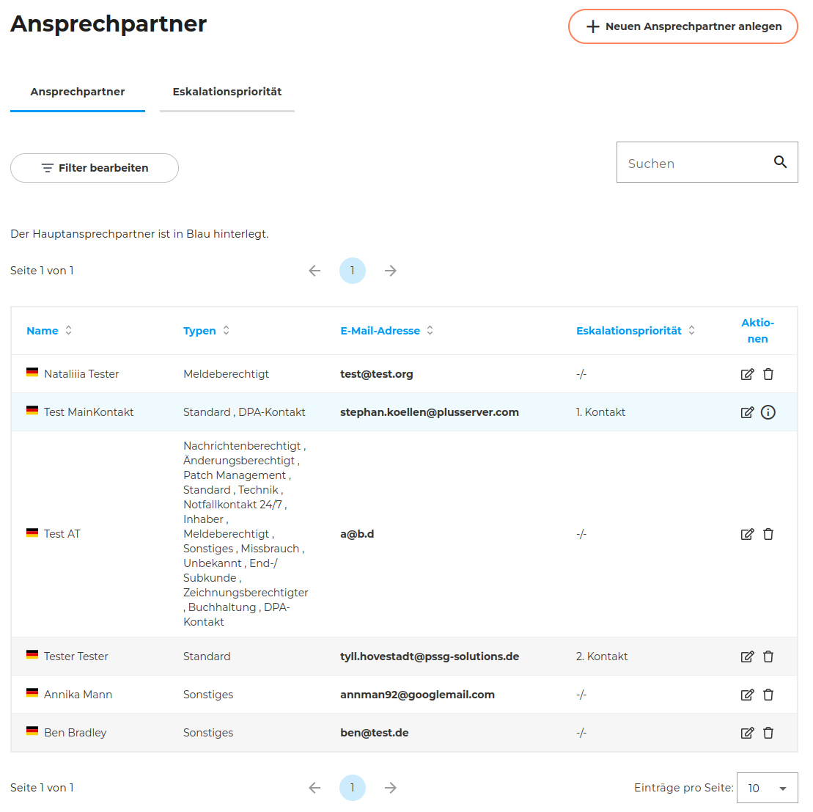
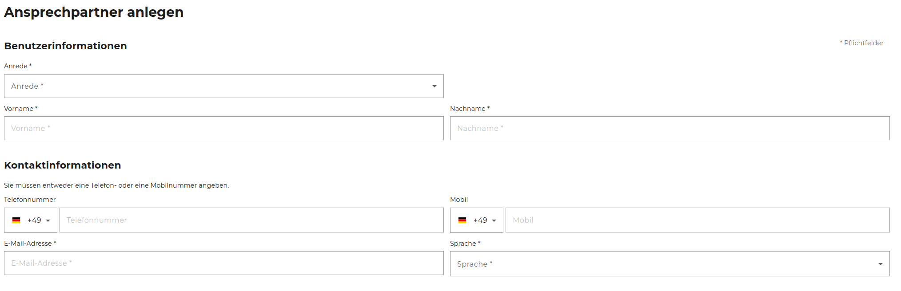
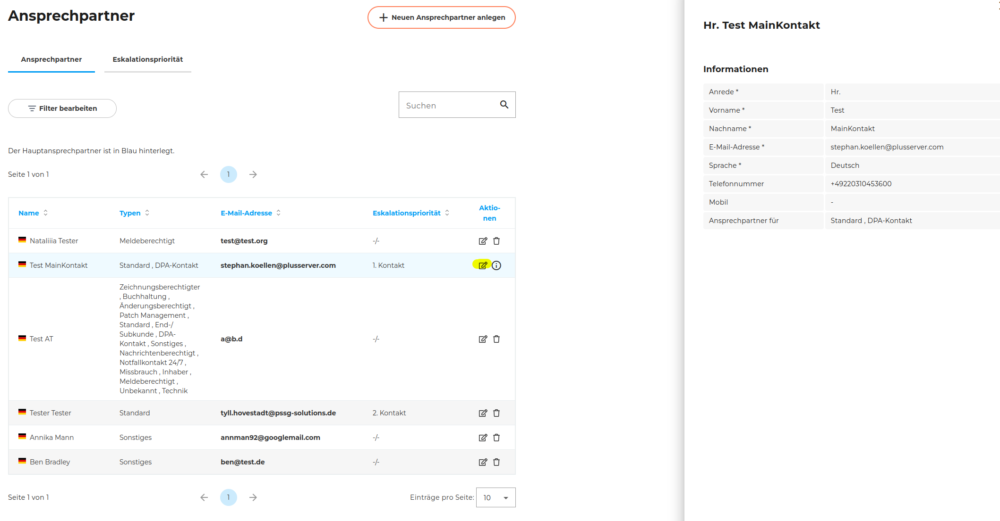
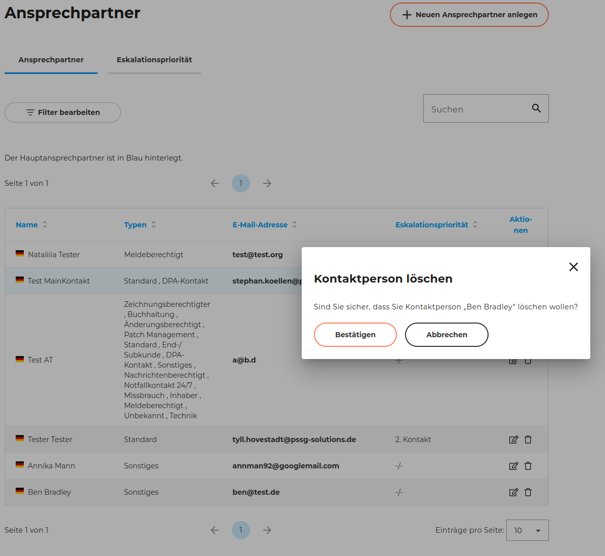
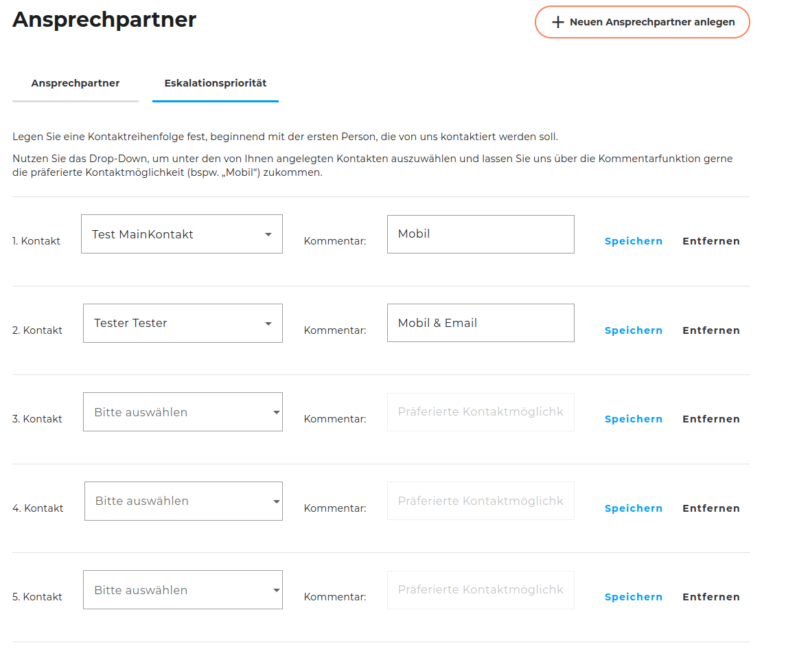

## Wo ist es zu finden?

Die Ansprechpartner sind in der Sidebar des CloudHubs unter **"Ansprechpartner"** zu finden.

## Ansprechpartner Überblick

Allgemein gibt es hier zwei Bereiche:

- die Verwaltung der Kontakte selbst
- die Sortierung der angegebenen Kontakte in eine Reihenfolge, die bei Eskalationen oder anderen Notfällen kontaktiert werden soll

## Hauptkontakt

Dieser Kontakt ist unabhängig von den anderen Ansprechpartner.

Er ist der Hauptkontakt in all unseren Systemen, meist die Person, die sich registriert hat oder die den Vertrag mit uns geschlossen hat.

Es darf nur **einen Hauptkontakt** geben und dieser Hauptkontakt darf nicht gelöscht werden. Im CloudHub können die Angaben aktualisiert werden. Es muss jedoch immer dieser Hauptkontakt hinterlegt sein.

Er ist immer blau markiert in der Tabelle.

## Ansprechpartner hinzufügen, editieren und löschen

### Neuen Ansprechpartner anlegen

Zunächst werden ein paar grundlegende Kontaktinformationen abgefragt

Danach kann man auswählen, für welche Belange diese Person kontaktiert werden soll/darf. In der zweiten Spalte sieht man bequemerweise auch, ob und welche andere Ansprechpartner bereits für dieses Thema informiert werden.

| Name | Bedeutung |
| ---- | --------- |
| Standard | Unser Erst-Kontakt bei allen Fällen, die keine Sonderfälle sind bzw. die andern Kontaktdaten betreffend |
| DPA-Kontakt | Ansprechpartner in Belangen des Auftragsverarbeitungsvertrag. (Data Processing Agreement) |
| Änderungsberechtigt |  |
| Buchhaltung | Ansprechpartner für Verträge, Rechnungen, Kontakt zu Preiserhöhungen etc. |
| End-/Subkunde |  |
| Inhaber | Inhaber des Unternehmens |
| Meldeberechtigt |  |
| Missbrauch | Unser Ansprechpartner bei Themen rund um „Abuse“ |
| Nachrichtenberechtigt | Berechtigt Ticket-Notifications zu erhalten |
| Notfallkontakt 24/7 | (Technischer) Notfallkontakt, Information zu Wartungsankündigungen |
| Patch-Management | Technischer Ansprechpartner für alle Patch-Themen (Die Devs beim Kunden, die sich nur um die Patches kümmern) |
| Technik | Ansprechpartner für technische Fragen |
| Unbekannt |  |
| Zeichnungsberechtigter | Ansprechpartner, der für Anforderungen, die eine Unterschrift benötigen, unser Ansprechpartner ist |
| Sicherheitsvorfall | Ansprechpartner bei Incident |
| Sonstiges | Wenn keiner der Typen passt, kann dieser ausgewählt werden und dan im Kommentarfeld weitere Infos hinterlegt werden, für welche Themen dieser Kontakt der Ansprechpartner ist. |

### Ansprechpartner editieren

Wenn man bei der Übersicht auf das Stift-Symbol klickt, wird von der rechten Seite ein Menü eingeblendet, wo man die angegebenen Informationen sichten kann. Möchte man diese bearbeiten, ist rechts oben ein Button mit "Bearbeiten". Das sieht dann so aus:

### Ansprechpartner löschen

Wenn ein Kontakt nicht mehr benötigt wird, kann er ganz leicht gelöscht werden mit dem Mülleimer-Button. Dann wird man noch gefragt, ob man sich sicher ist.

### Eskalationsmatrix

Die Ansprechpersonen, die bereits angelegt sind, kann man hier in eine sinnvolle Reihenfolge bringen für Situationen, wo es zeitkritisch ist die korrekten Entscheidungsträger beim Kunden zu fassen zu bekommen. Zusätzlich kann man noch Informationen für jedes Eskalationslevel hinzufügen, z.B. zur zeitlichen Verfügbarkeit dieser Person oder anderen Hinweisen, die uns helfen schnell handlungsfähig zu werden.

