## Übersicht

### Wo ist es zu finden?

Zu finden ist die Funktionalität in der Seitenleiste des Cloudhubs, im Bereich "User Management".

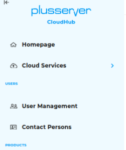

## Rollen

### Rollenübersicht

Hier sieht man eine Übersicht über alle angelegten Rollen und ob sie regeln, welche Seiten jemand sehen kann ("Seitenverwaltung"), auf welche Verträge sie Zugriff haben ("Vertragsverwaltung") oder welche Aktionen sie im Produkt-Dashboard tätigen können.

Unter Aktionen kann man Rollen löschen oder in die Bearbeitungsmaske gehen.

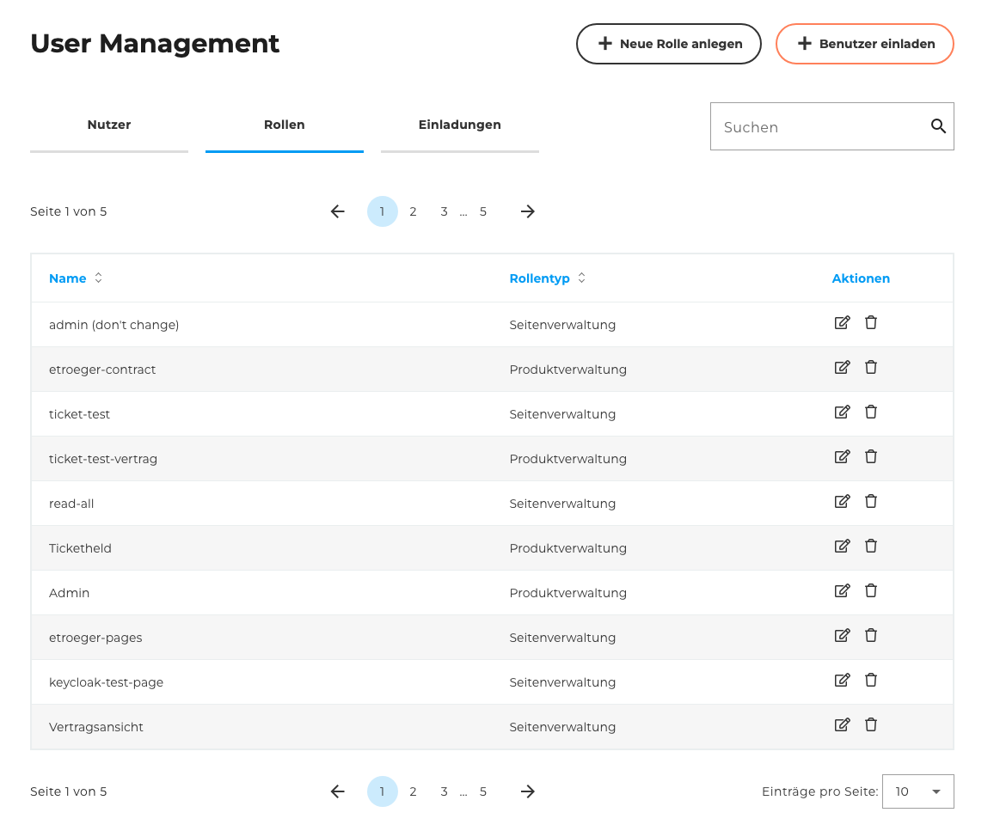

### Rollen hinzufügen

Nach Klick auf "Neue Rolle anlegen" öffnet sich ein Formular. Hier können Einstellungen zu der entsprechenden Rolle vorgenommen werden.

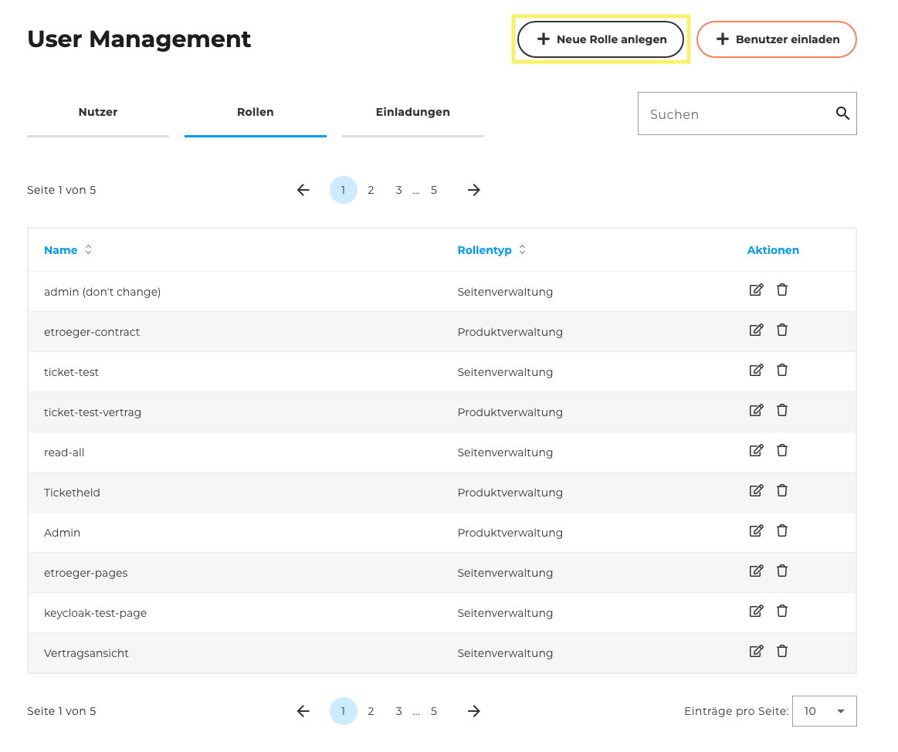

Wichtig sind drei Bereiche:

- **Rollenname:** unter dieser Bezeichnung taucht die Rolle auch in der Übersicht auf
- Die Radiobuttons: "Seitenverwaltung", "Produktverwaltung" und "Produkt-Dashboard-Verwaltung"

- Dann jeweils die Auswahlmöglichkeiten zwischen der Rolle
  - **Seitenverwaltung:** Hier sieht man entsprechend der Struktur der Sidebar eine Übersicht der Seiten und dazugehörigen Unterseiten (nach dem Aufklappen). Die durchgestrichenen Kategorien signalisieren, dass eine Option nicht möglich ist.\
  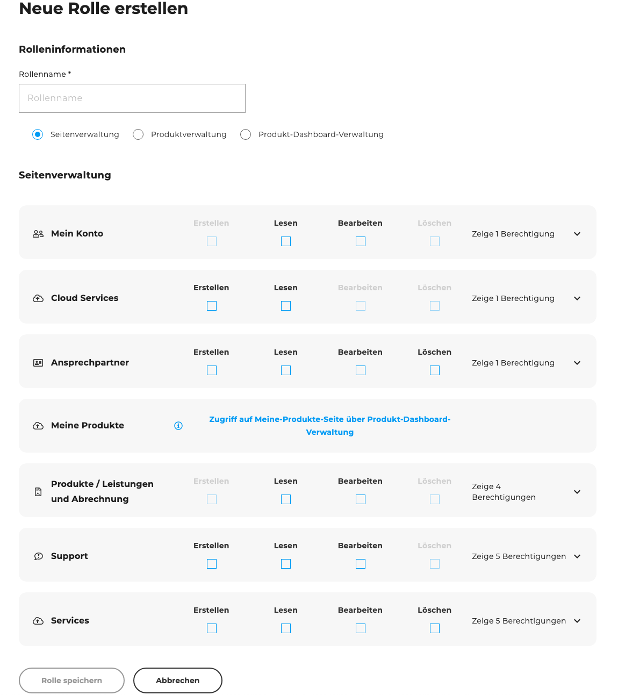

  - **Produktverwaltung:** Hier sieht man ein paar Grundinformationen zu den vorhandenen Verträgen und kann dann auswählen, welche für die Rolle sichtbar sind.\
  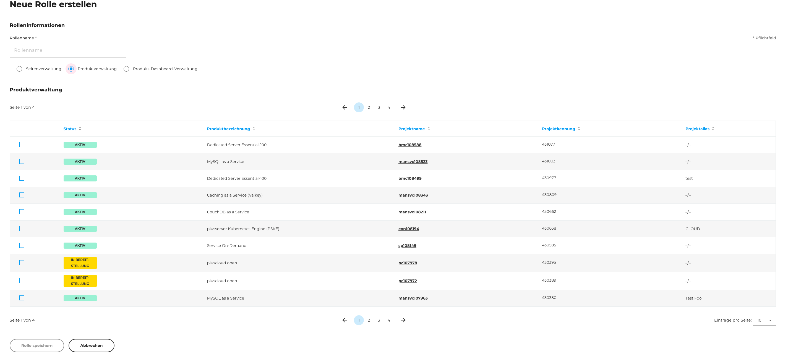

  - **Produkt-Dashboard-Verwaltung:** Hier sieht man ein paar Grundaktionen, die man zu den Produkten tätigen kann, und kann auswählen, welche für die Rolle verfügbar sind.\
  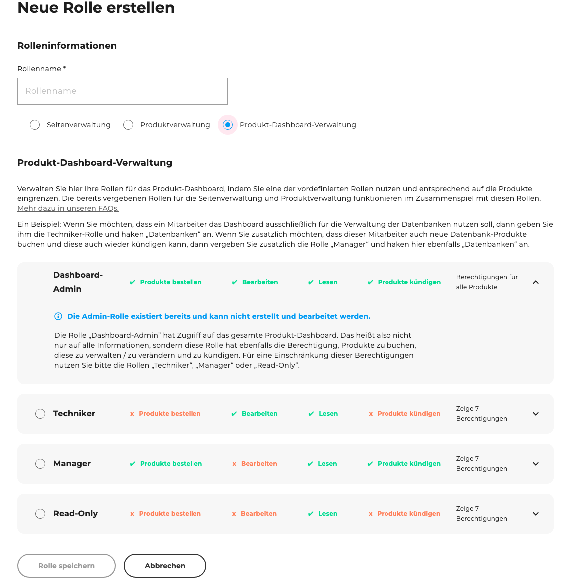

Nachdem man auf "Rolle speichern" geklickt hat, kommt man wieder auf die Übersichtsseite und findet die eben angelegte Rolle wieder.

### Rollen editieren

Eine bereits existierende Rolle kann man natürlich auch editieren.

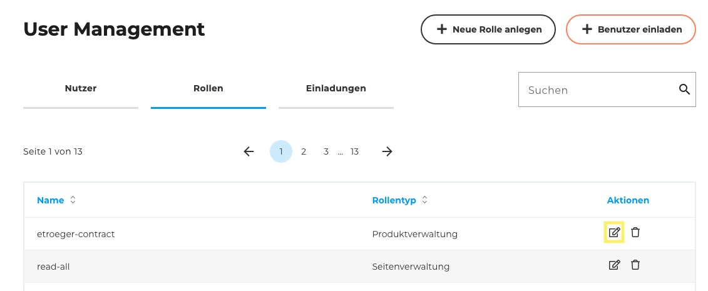

Je nachdem, für welchen Bereich die Rolle ist, kann man dort wieder die jeweiligen Optionen auswählen. Den Rollennamen kann man auch ändern.

Die Auswahl, welche Verwaltung die Rolle betrifft, kann man an dieser Stelle nicht ändern. Wenn dies gewünscht ist, muss eine neue Rolle mit dem gewünschten Namen angelegt werden.

### Rollen löschen

Wenn man auf das Mülleimer-Symbol auf der Übersichtsseite klickt, taucht ein kleines Fenster auf, wo man bestätigt, dass die Rolle wirklich gelöscht werden soll.

## Nutzer

### Nutzerübersicht

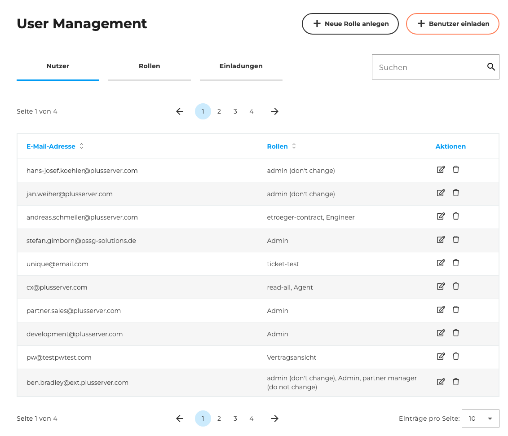

Hier sieht man, welche Nutzer angelegt sind. Neben der eindeutigen E-Mail-Adresse wird aufgelistet, welche Rollen diesem Nutzer zugeordnet sind.

Analog zu der Rollenverwaltung kann man hier auch die Aktionen "Editieren" und "Löschen" und "Aktionen" starten.

### Nutzer hinzufügen

Wenn man auf "Benutzer einladen" klickt, öffnet sich eine Oberfläche, welche die E-Mail-Adresse und die gewünschten Rollen (die ja im vorherigen Schritt angelegt wurden) für diesen Nutzer abfragt.

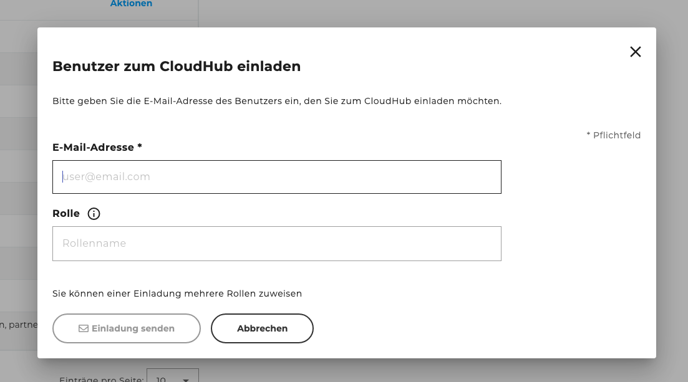

### Nutzer editieren

Wenn man über die Nutzerübersichtsseite das Editieren-Symbol gefunden hat, kommt man auf eine Übersicht, die die Anpassung der vergebenen Rollen ermöglicht

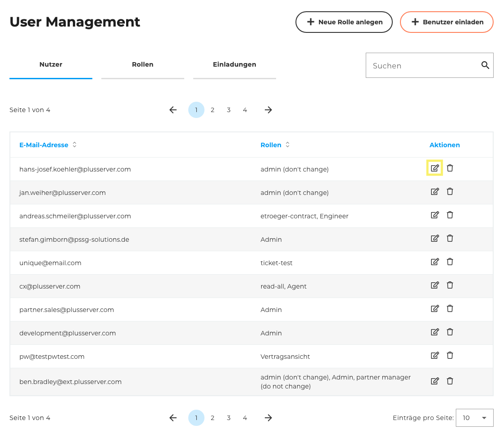

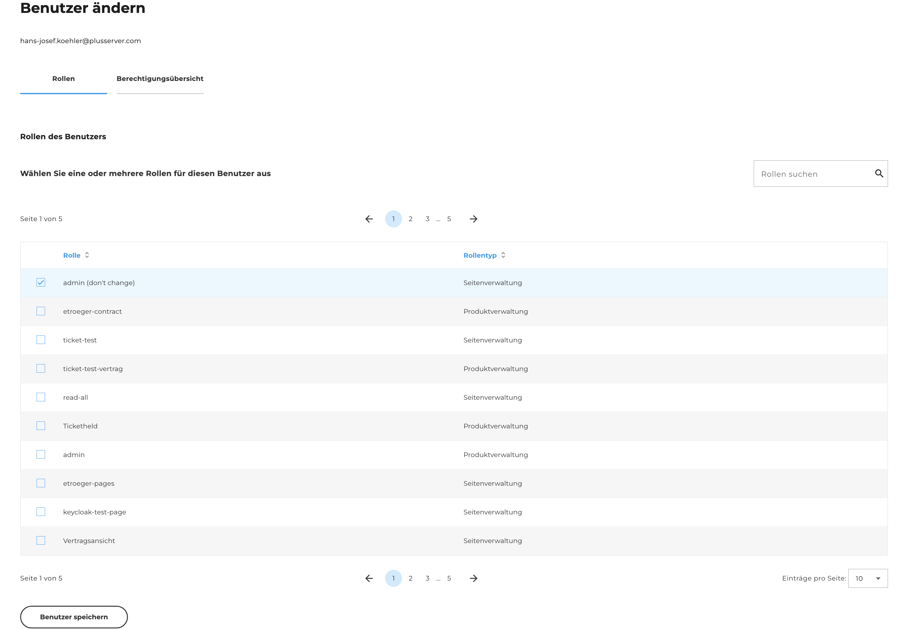

Um nachvollziehen zu können, welche Summe an Berechtigungen die ausgewählten Rollen ergeben, kann man in dem zweiten Tab eine read-only-Ansicht aufmachen und sehen, welche Seiten sichtbar sein werden.

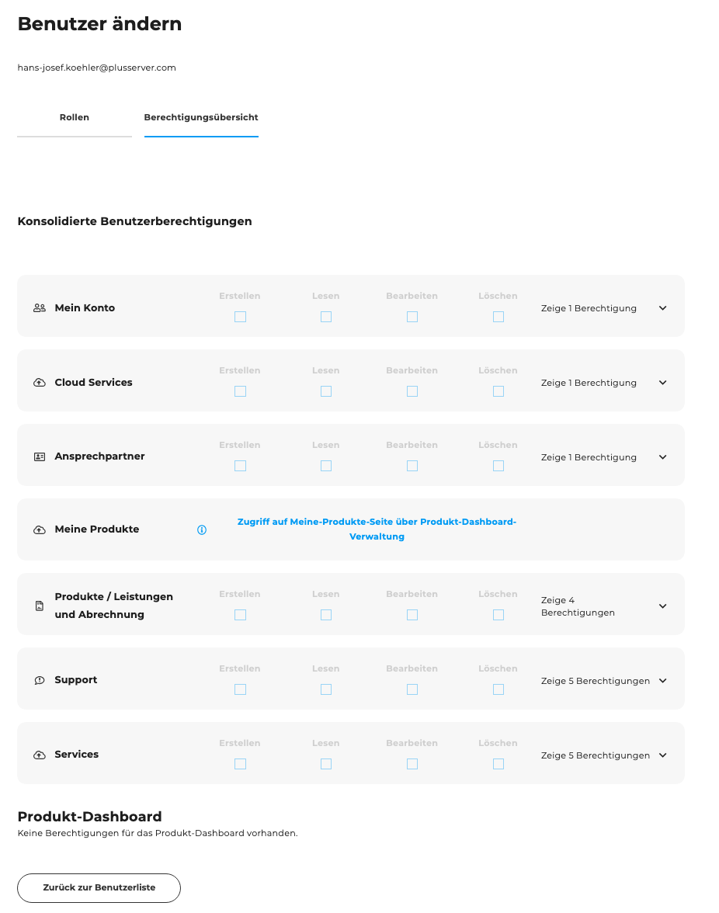

### Nutzer löschen

Analog zum Löschen von Rollen können auch Nutzer gelöscht werden. Damit das nicht aus Versehen passiert, wird zur Sicherheit darum gebeten, dass man ein Wort abtippt.

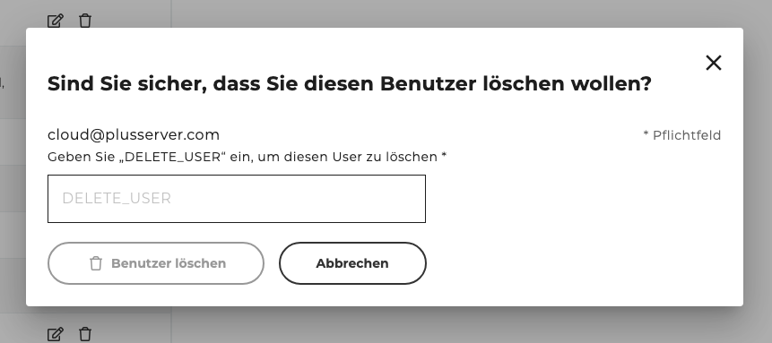
