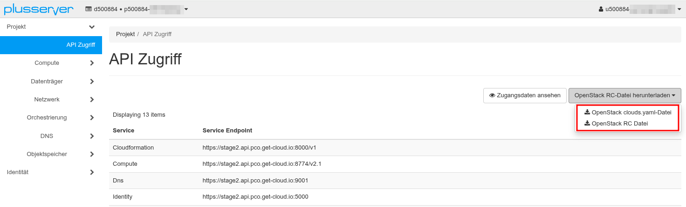

## Was ist eine pluscloud-open-Umgebung?

Jede pluscloud-open-Umgebung ist als "shared nothing" Infrastruktur konzipiert, das heißt jede Umgebung ist völlig unabhängig und teilt keine zugrundeliegenden Ressourcen oder Managementfähigkeiten mit anderen Umgebungen der pluscloud open.

## Umgebungen der pluscloud open

| Region   | Availability Zone | Interner Name | Horizon/UI Endpunkt                   | Keystone Endpunkt                           | Lebenszyklus |
|----------|-------------------|---------------|---------------------------------------|---------------------------------------------|--------------|
| DE-WEST  | DE-WEST-1         | prod1         | <https://prod1.api.pco.get-cloud.io>  | <https://prod1.api.pco.get-cloud.io:5000>   | Aktiv        |
| DE-NORTH | DE-NORTH-1        | prod2         | <https://prod2.api.pco.get-cloud.io>  | <https://prod2.api.pco.get-cloud.io:5000>   | Aktiv        |
| DE-NORTH | DE-NORTH-2        | prod3         | <https://prod3.api.pco.get-cloud.io>  | <https://prod3.api.pco.get-cloud.io:5000>   | Aktiv        |
| DE-WEST  | DE-WEST-2         | prod4         | <https://prod4.api.pco.get-cloud.io>  | <https://prod4.api.pco.get-cloud.io:5000>   | Aktiv        |
| DE-WEST  | DE-WEST-2         | scs1          | <https://ui.gx-scs.sovereignit.cloud> | <https://api.gx-scs.sovereignit.cloud:5000> | Abgekündigt  |
| DE-WEST  | DE-WEST-1         | scs2          | <https://scs2.api.pco.get-cloud.io>   | <https://scs2.api.pco.get-cloud.io:5000>    | Aktiv        |

{}
scs1 (Abgekündigt) und scs2 sind Entwicklungsumgebungen, die ausschließlich im Kontext von [Sovereign Cloud Stack](https://scs.community) & [Gaia-X](https://gaia-x.eu) bereitgestellt wird.
{}

## Zugriff

Es gibt verschiedene Möglichkeiten, mit pluscloud-open-Umgebungen zu arbeiten. Sie können mit dem Webinterface (Horizon) oder mit der API interagieren.

### Anmeldeinformationen

Um sich über Horizon anzumelden, benötigen Sie die von uns zur Verfügung gestellten Anmeldedaten:

* Benutzername
* Kennwort
* Domäne

### Anmeldeinformationen für CLI Tools

Die Anmeldedaten für diverse CLI Tools wie die Openstack CLI, Terraform, OpenTofu oder Ansible stehen im Horizon als Download bereit.



#### clouds.yaml

Die meisten Tools präferieren mittlerweile die clouds.yaml, diese Datei kann je nach Vorlieben noch aufgeteilt werden.

Die Dateien `clouds.yml`, `clouds-public.yml` und `secure.yml` werden verwendet, um die Anmeldedaten und Authentifizierungsendpunkte einer oder mehrerer OpenStack-Clouds (oder pluscloud-open-Umgebungen) zu sammeln, mit denen Sie sich verbinden möchten.

Die meisten Tools erwarten diese Dateien in bestimmten Verzeichnisen

1. Aktuelles Arbeitsverzeichnis
2. ${HOME}/.config/openstack/
3. /etc/openstack/

Das Repository des Sovereign Cloud Stack (SCS) enthält zwei Vorlagen für [clouds-public.yml](https://github.com/SovereignCloudStack/docs/blob/main/community/cloud-resources/clouds-public.yaml) und [clouds.yml](https://github.com/SovereignCloudStack/docs/blob/main/community/cloud-resources/clouds.yaml.sample).

Die Verwendung von `clouds.yml` und `clouds-public.yml` ermöglicht es Ihnen, mehr als eine Cloud zur Anmeldung anzugeben und die gewünschte Cloud mit dem Parameter `--os-cloud=` oder der Umgebungsvariablen `OS_CLOUD` auszuwählen, wenn Sie den OpenStack-Client verwenden.

#### RC File

Eine weitere Möglichkeit besteht darin, eine OpenRC-Umgebungsdatei von der Horizon-Weboberfläche herunterzuladen. Wenn Sie in Horizon angemeldet sind, klicken Sie auf "`<Ihr Anmeldename>`" in der oberen rechten Ecke und wählen Sie "OpenStack RC File" aus dem Dropdown-Menü und laden es herunter.
Danach setzen Sie die in der Datei enthaltenen Umgebungsvariablen wie folgt:

```bash
source ./<Ihre openstack rc Datei>-openrc.sh
Bitte geben Sie Ihr OpenStack-Passwort für das Projekt <IhrProjekt> als Benutzer <Ihr Anmeldename> ein
```

## Tools

### OpenStack CLI

Es gibt mehrere Möglichkeiten, den OpenStackClient in Ihrer Umgebung zu installieren. Die meisten Linux-Distributionen bieten die Installation aus ihrem Paket-Repository an (bei Distributionen, die auf dem Debian-Paketsystem basieren, können Sie das Paket über `apt install python-openstackclient` installieren).

Da der OpenStackClient in der Programmiersprache Python geschrieben ist, kann er auch über das Python Packaging System installiert werden (`pip install python-openstackclient`). Wir empfehlen, dies in einer virtuellen Python-Umgebung (venv) zu tun, um diese Installation von dem Python zu trennen, das möglicherweise von Ihrer Linux-Distribution installiert wird.

Eine Python-venv kann durch Ausführen von `python -m venv openstackclient` erstellt werden. Wechseln Sie in das Unterverzeichnis und "aktivieren" Sie die virtuelle Umgebung `cd openstackclient ; . ./bin/activate`. Alle Installationen von Python-Paketen mit `pip install` finden nun in der neuen venv statt. Sie können die venv mit `deactivate` deaktivieren.

Die dritte Möglichkeit ist die Verwendung eines Docker-Containers, der alle benötigten OpenStack-Client-Bits enthält. Wir empfehlen, das openstackclient-Image von [OSISM](https://osism.tech/de) zu verwenden. Sie können diesen Container verwenden, wenn Sie eine lokale Docker- oder Podman-Installation auf Ihrer Workstation haben, indem Sie `docker pull quay.io/osism/openstackclient` bzw. `podman pull quay.io/osism/openstackclient` ausführen.

Für Informationen zur Nutzung des OpenStackClients und seine [Installation](https://docs.openstack.org/newton/user-guide/common/cli-install-openstack-command-line-clients.html) verweisen wir auf die [upstream documentation](https://docs.openstack.org/python-openstackclient/latest/index.html).

### Terraform-Provider und Packer-Builder

Der Terraform-Provider für OpenStack ist auf der Terraform-Registry Website unter <https://registry.terraform.io/providers/terraform-provider-openstack/openstack/latest/docs> zu finden.

Dieser Provider ermöglicht es Usern, mit vielen OpenStack-Ressourcen zu interagieren. Mit dem Terraform-Provider für OpenStack können User pluscloud-open-Ressourcen über Terraform-Konfigurationsdateien erstellen, ändern und löschen, was ein effektives Infrastrukturmanagement ermöglicht.

Darüber hinaus gibt es einen [OpenStack Builder für Packer](https://developer.hashicorp.com/packer/plugins/builders/openstack), mit dem User benutzerdefinierte Images auf OpenStack erstellen können.

### Ansible Collections

Ansible ist ein beliebtes Automatisierungswerkzeug, das für die Konfiguration und Verwaltung von Infrastrukturen verwendet werden kann. Ansible bietet eine Sammlung namens `openstack.cloud`, die eine Reihe von Ansible-Modulen für die Interaktion mit offenen pluscloud-open-Ressourcen enthält. Diese Module können zum Erstellen, Aktualisieren, Löschen und Abfragen von Ressourcen wie virtuellen Maschinen, Netzwerken, Sicherheitsgruppen und mehr verwendet werden.

Die Sammlung "openstack.cloud" ist auf der offiziellen Ansible-Website unter <https://docs.ansible.com/ansible/latest/collections/openstack/index.html> verfügbar.

## Maintenance

### Platform Maintenance

Eine Aktualisierung/Wartung der Plattform wird immer im Voraus angekündigt und umfasst alle Openstack-Komponenten. Dies hat normalerweise keine Auswirkungen auf Ihre Workload (VMs, Kubernetes-Cluster, ...). Es sind „nur“ die APIs betroffen, da die zugrundeliegenden Dienste neu gestartet werden müssen. Diese Wartungsarbeiten finden in der Regel einmal alle sechs Monate statt.

### Hypervisor Maintenance

Jeder Hypervisor muss in regelmäßigen Abständen aktualisiert und neu gestartet werden. Dies ist in der Regel einmal im Monat der Fall.

Geplante Wartungsfenster finden in der Regel jeden Tag nach 22:00 Uhr MESZ statt.
Ein gewöhnlicher Neustart des Hypervisors dauert ca. 15 Minuten, kann in Ausnahmefällen aber auch länger dauern.

Bevor ein Hypervisor neu gestartet wird, versuchen wir, alle VMs live auf einen anderen zu migrieren, damit es keine Auswirkungen auf die VMs gibt. Es gibt jedoch einen Metadatenschlüssel namens **ps_automatic_maintenance**, der Sie darüber informiert, wann die Migration stattfinden wird, und Sie können entscheiden, ob Sie vor der Migration Maßnahmen ergreifen wollen oder nicht. Die meisten Anwendungen haben jedoch keine Probleme mit der Live-Migration.

{}
Für [einige Flavors](../../reference/local-storage/) und [Server Groups](../../reference/instances-and-images/server-groups/) können wir die VMs nicht live migrieren. In diesem Fall werden wir die VMs für die Dauer des Hypervisor-Neustarts herunterfahren.

Für mehr Informationen zu den Ausnahmen schauen sie in die [Details zu den Wartungsarbeiten](../../reference/maintenance).
{}
