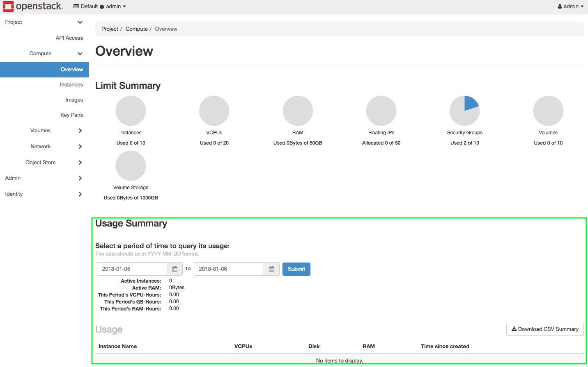

---
#https://gohugo.io/content-management/page-bundles/
title: "Inakurate Anzeige der Verbrauchsdaten im Horizon"
type: "docs"
date: 2023-08-13
description: >
  Die Anzeige der Verbrauchsdaten im Horizon Dashboard stimmern nicht mit den Rechnungsdaten überein.
---

Wenn Sie die Verbrauchsdaten im Horizon Dashboard mit denen auf Ihrer Rechnung vergleichen, werden Sie feststellen, dass die Anzeige im Horizon von den Daten in der Rechnung abweicht. Der Grund dafür ist, dass die Anzeige im Horizon sehr ungenau ist und wir diese nicht als Rohdatenquelle für die Rechnungsstellung verwenden. Bitte betrachten Sie diese Werte also eher als Information (Näherungswert) Ihres Verbrauchs. Eine genaue Übersicht über laufende Kosten wird demnächst in unser Cloud Hub integriert.
