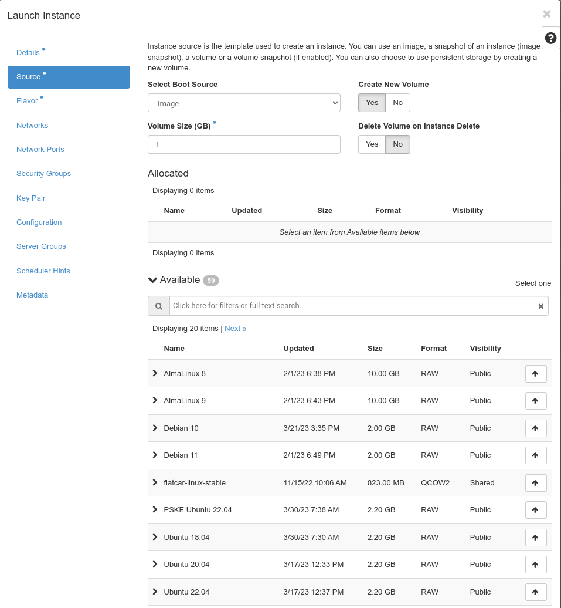
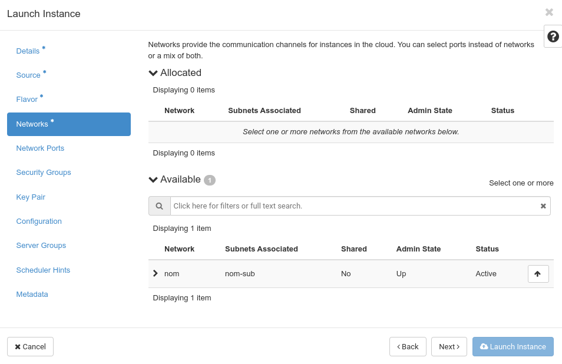
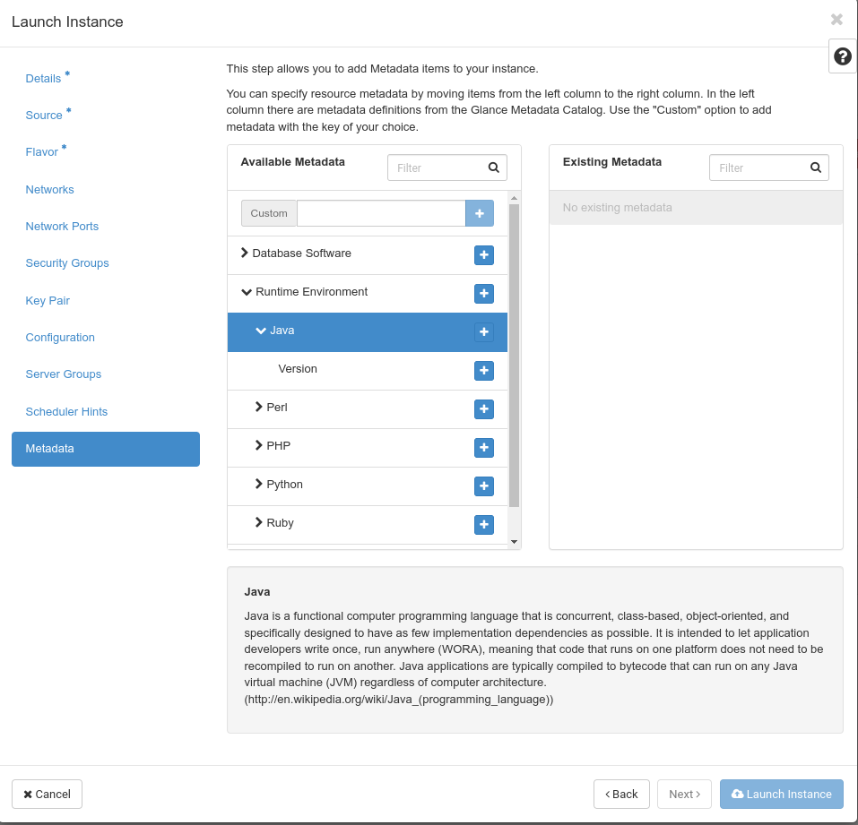

## Instanz starten
Über die Schaltfläche "**Launch Instance**" können Sie eine oder mehrere neue Instanzen erstellen und starten. Ein geführter Dialog hilft Ihnen dabei, alle notwendigen Schritte zu durchlaufen. Sobald Sie genügend Informationen zum Starten einer Instanz eingegeben haben, wird die Schaltfläche "**Instanz erstellen**" verfügbar und Sie können Ihre neue(n) Instanz(en) starten. Sternchen (*) markieren erforderliche Informationen.

Beachten Sie, dass der Shell-Zugriff auf die neue Instanz nur über eine SSH-Schlüsselauthentifizierung möglich ist. Daher müssen Sie entweder ein SSH-Schlüsselpaar während der Instanzerstellung erstellen oder Ihr Schlüsselpaar vorher hochladen.
Wenn Sie auf "**Instanz starten**" klicken, öffnet sich ein Dialog, der Sie durch verschiedene Schritte führt, die zum Starten einer Instanz ausgeführt werden müssen:

Sobald Sie genügend Informationen eingegeben haben, wird die Schaltfläche "**Instanz starten**" aktiviert.

Im Feld "**Instanzname**" müssen Sie Ihrer neuen Instanz einen Namen geben. Die Beschreibung ist optional. Es gibt nur eine "**Verfügbarkeitszone**", die Sie auswählen können. Sie können das Feld "**Anzahl**" verwenden, um mehrere Instanzen desselben Typs gleichzeitig zu erzeugen.

Als nächstes sollten Sie die "**Quelle**" Ihrer Instanz definieren. Im Grunde genommen wählen Sie aus, auf welchem Bild Ihre Instanz basieren soll.

Zunächst wählen Sie aus, ob Ihre neue Instanz von einem Image (unter "**Verfügbar**" sehen Sie eine Liste der verfügbaren Elemente), einem Instanz-Snapshot, einem Datenträger oder einem Volume-Snapshot gebootet werden soll. Wenn Sie einen vorhandenen Datenträger auswählen, können Sie nur eine Instanz von diesem booten. Wenn Sie ein Image oder einen Snapshot wählen, können Sie mehr als eine Instanz davon booten. Sie wählen das gewünschte Element aus, indem Sie auf den kleinen Pfeil nach oben auf der rechten Seite klicken.

Als nächstes legen Sie die "**Volumengröße**" des Root-Volumes Ihrer neuen Instanz fest. Wenn Sie hier keinen Wert festlegen (oder einen zu kleinen Wert), wird die Größe automatisch an die Größe des von Ihnen gewählten Images angepasst.

Die Optionen auf der rechten Seite ("**Neues Volume erstellen**" und "**Volume beim Löschen der Instanz löschen**") bestimmen den Lebenszyklus des Root-Volumes Ihrer Instanz. Wenn Sie möchten, dass Ihre Instanz und ihr Root-Volume gelöscht werden, wenn die Instanz gelöscht wird, wählen Sie, dass kein neues Volume erstellt werden soll (die Option, das Volume zu löschen, wenn die Instanz gelöscht wird, wird deaktiviert). Wenn Sie sich entschieden haben, ein Volume zu erstellen, können Sie festlegen, dass das Volume beim Löschen der Instanz gelöscht wird. Wenn Sie diese Option nicht wählen, wird das Root-Volume der Instanz die Löschung der Instanz "überleben" (und Speicherplatz verbrauchen und in Rechnung gestellt werden).

Nun müssen Sie - indem Sie auf "**Weiter**" klicken - den [**Flavor**](../flavors/) Ihrer neuen Instanz auswählen. [**Flavors**](../flavors/) bestimmen die Dimensionen Ihrer neuen Instanz hinsichtlich der Anzahl der virtuellen CPUs, der Menge des virtuellen Speichers und der Größe der Root-Disk.

Wenn Sie auf den kleinen Pfeil auf der linken Seite - vor jedem Flavor - klicken, sehen Sie, welche Auswirkungen die Wahl dieses Flavors auf Ihren Verbrauch hat. Wenn Sie auf den Pfeil nach oben klicken, wählen Sie den entsprechenden Flavor für die Instanzerstellung aus. Wenn die Wahl eines Flavors mehr Ressourcen verbrauchen würde, als in Ihrem Kontingent verfügbar sind, wird dies mit einem gelben "Warn"-Ausrufezeichen markiert.

Die pluscloud open ist für die Erstellung und Verwaltung der Flavors zuständig.

Als nächstes müssen Sie die "**Netzwerke**" auswählen, mit denen Ihre neue Instanz verbunden werden soll.

Abhängig von der gewünschten Netzwerktopologie wählen Sie ein oder mehrere Netzwerke aus der Liste unter "**Verfügbar**".

Unter "**Sicherheitsgruppen**" können Sie auswählen, welche Sicherheitsgruppen für Ihre neue Instanz angewendet werden sollen.

Die "Standard"-Sicherheitsgruppe ermöglicht den grundlegenden Zugriff auf Ihre Instanz. Zusätzliche Sicherheitsgruppen können den Verkehr zu und von bestimmten Netzwerken oder bestimmten Ports (nich) zulassen. Wenn Sie die Standard-Sicherheitsgruppe entfernen, können Sie nur über die VNC-Konsole auf Ihre neue Instanz zugreifen.

Im Menü "**Schlüsselpaar**" können Sie über "**Schlüsselpaar erstellen**" ein neues SSH-Schlüsselpaar (öffentlich/privat) erzeugen oder über "**Schlüsselpaar importieren**" ein bereits bestehendes Schlüsselpaar importieren, um sich über Secure Shell (SSH) an Ihrer neuen Instanz anzumelden.

Wenn Sie ein Schlüsselpaar erzeugen, erhalten Sie den _privaten_ Schlüssel, den Sie auf Ihrer lokalen Workstation speichern und vor dem Zugriff Dritter schützen sollten. Die öffentliche Hälfte des Schlüsselpaares wird in Ihrem OpenStack-Projekt gespeichert. Wenn Sie sich für den Import eines "Schlüsselpaares" entscheiden, importieren Sie eigentlich nur den _öffentlichen_ Teil Ihres Schlüsselpaares. Der private Schlüssel bleibt in Ihrem Besitz.

Sie können auch schnell ein neues öffentliches/privates Schlüsselpaar auf der Kommandozeile mit ``ssh-keygen -t rsa -f cloud.key`` erzeugen und dann den öffentlichen Schlüssel ``cloud.key.pub`` in Ihr OpenStack-Projekt importieren.
Wenn Sie Windows benutzen, können Sie PuTTYgen verwenden, um dasselbe zu tun - stellen Sie nur sicher, dass Sie ``openSSH`` als Schlüsselformat wählen.

"**Konfiguration**" ist ein Menü, das es Ihnen ermöglicht, ein Skript hochzuladen und auszuführen, mit dem Sie Ihre Instanz nach dem Start anpassen können.

Da viele Cloud-Images heutzutage [cloud-init](https://cloudinit.readthedocs.io/en/latest/) zur Anpassung verwenden, wird diese Option vielleicht etwas seltener genutzt als sonst.
Eine weitere Option hier ist "**Disk Partition**", die "**Automatisch**" und "**Manuell**" durchgeführt werden kann. Bei "**Automatisch**" wird grundsätzlich eine Partition pro Datenträger erstellt. Mit "**Manuell**" können Sie mehrere Partitionen pro Volume erstellen.

Mit ["**Server-Gruppen**"](../server-groups/) können Sie Ihre neue Instanz einer bestehenden Server-Gruppe zuordnen, sodass Ihre neue Instanz entweder neben anderen Instanzen in dieser Server-Gruppe angelegt wird oder explizit nicht neben anderen Instanzen dieser Gruppe (Affinität - Anti-Affinität).

Wenn Sie einige "**Scheduler-Hinweise**" hinzufügen möchten, um die Platzierung Ihrer neuen Instanz zu beeinflussen, können Sie entweder aus dem vorhandenen Metadatenkatalog wählen oder Ihre eigenen Schlüssel in der ersten Zeile der linken Seite erstellen.

Klicken Sie einfach auf das "+" auf einer Schaltfläche von links, um sie nach rechts zu verschieben und sie der neuen Instanz zuzuweisen. Zusätzliche Informationen werden in der Box am unteren Rand des Menüs angezeigt.

Auf ähnliche Weise können Sie im Menü "**Metadaten**" (weitere) Metadaten zu Ihrer neuen Instanz hinzufügen.

Es steht ein Katalog mit bereits vorhandenen Metadaten zur Verfügung. Sie können aber auch Ihre eigenen Schlüssel im Feld "Benutzerdefiniert" erstellen.
Klicken Sie einfach auf das "+" auf dem gewünschten Element auf der linken Seite, um es nach rechts zu verschieben.
