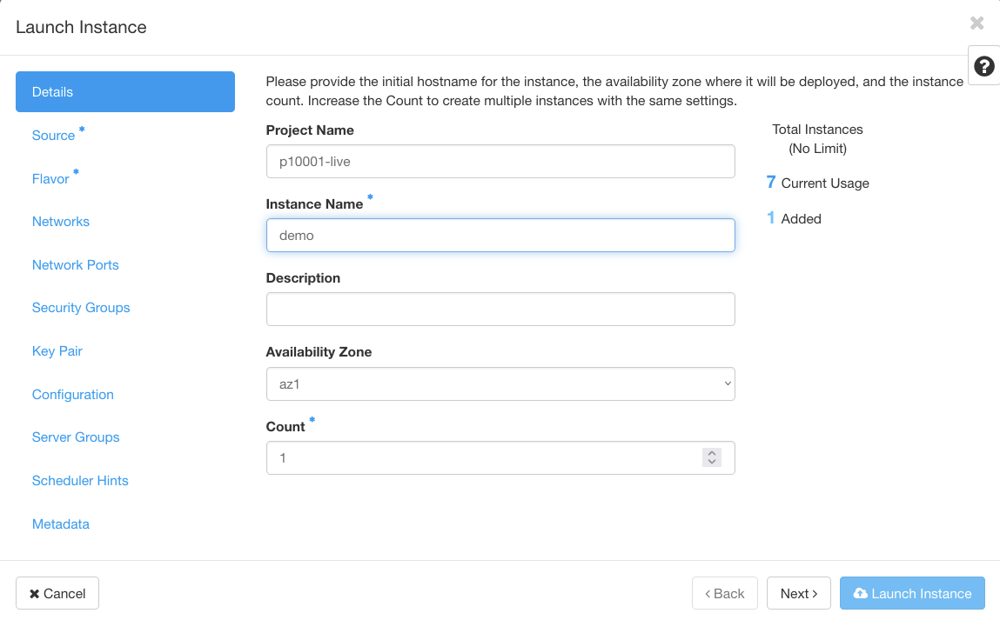

## Übersicht

{}
pluscloud open wird bald die Option Lokaler SSD-Speicher anbieten.
{}

Standard Shared Storage auf Basis von Ceph hat ein ausgewogenes Leistungsprofil, das nicht für alle Anwendungsfälle geeignet ist. Insbesondere Etcd und transaktionale Datenbanken wie Postgres sind dafür bekannt, dass es hier zu Performance-Problemen kommt.

pluscloud open bietet Local SSD Storage als Option für die Speicherung von Daten auf Instanzen an. Local SSD Storage ist ein nicht gemeinsam genutzter Speicher, der physisch mit der Instanz verbunden ist und hohe Input/Output-Operationen pro Sekunde (IOPS) und geringe Latenzzeiten bietet. Er ist ideal für Anwendungen, die eine hohe Leistung und eine geringe Latenzzeit erfordern.

Lokaler SSD-Speicher ist ideal für flüchtige oder temporäre Arbeitslasten wie Caches. Ebenfalls gute Kandidaten für Local SSD Storage sind hochautomatisierte replizierte Datenbanken oder Key-Value-Stores wie Patroni oder Etcd, bei denen automatische Replikation und Failover in den Software-Stack integriert sind.

{}
Der lokale SSD-Speicher hat die gleiche Lebensdauer wie die VM-Instanz. Wenn die VM gelöscht wird oder abstürzt, gehen auch die Daten des lokalen SSD-Speichers verloren. Darüber hinaus können Ihre VMs im Falle einer Hypervisor-Wartung weder in der Größe verändert noch live auf einen anderen Hypervisor migriert werden. Im Falle eines Hardwareausfalls können Ihre lokalen SSD-Daten vollständig verloren gehen. Selbst wenn es keinen Festplattenausfall gibt, kommt es zu regelmäßigen Ausfallzeiten.
{}

### Vergleich der Eigenschaften von Ceph-Volumes mit denen von lokalem SSD-Speicher

Es gibt grundlegende Unterschiede zwischen Ceph-Volumes und lokalem SSD-Speicher.

Wie bei Shared Storage sorgt das zugrunde liegende Speichersystem für Redundanz und Verfügbarkeit. Ihre Anwendung kann sich auf den dreifach replizierten hochverfügbaren Speicher verlassen.

Wie bei lokalem SSD-Speicher können Sie auf die lokale Festplatte im Rohzustand zugreifen und nahezu 1:1-Leistung erzielen. Allerdings ist Ihr Software-Stack für die Handhabung der Redundanz und Verfügbarkeit verantwortlich.

**Verwendungsfälle für lokalen SSD-Speicher:**

* Kubernetes
* Etcd-Cluster mit 3 oder 5 Instanzen
* Postgres-Patroni-Cluster

**Anti-Patterns für lokalen SSD-Speicher:**

* Traditionelle Einzelserver-Einrichtung
* VMs werden wie Haustiere behandelt
* VMs ohne Snapshots

In der folgenden Tabelle werden die Merkmale von Ceph-Volumes mit denen von Local SSD Storage verglichen:

| Eigenschaften | Ceph-Boot-Volumen | Boot-Volumen des lokalen SSD-Speichers |
|------------------|-------------------|--------------------------------|
| Speicheranbieter | Cinder | Nova |
| Durchsatz | <span style="color: red;">Niedrig</span> | <span style="color: green;">Hoch</span> |
| Latenzzeit | <span style="color: red;">HIGH</span> | <span style="color: green;">LOW</span> |
| Live-Migration | <span style="color: green;">YES</span> | <span style="color: red;">NO</span> |
| Verfügbarkeit | <span style="color: green;">HIGH</span> | <span style="color: red;">LOW</span> |
| Ephemeral | NO | YES |

### Verfügbarkeit

Es gibt zwei Fälle, in denen bei VMs, die auf lokalem SSD-Speicher laufen, Ausfallzeiten auftreten können

#### Regelmäßige Reboots

Jeder Hypervisor mit lokalem SSD-Speicher muss **periodisch** neu gebootet werden.  Normalerweise geschieht dies **einmal im Monat**. Sie sollten daher damit rechnen, dass Ihre VMs regelmäßig ausfallen.

Die durchschnittliche Ausfallzeit beträgt **ca. eine halbe Stunde**, kann aber variieren. Alle VMs erhalten vor der Wartung ein ACPI-Shutdown-Signal. Die VMs haben **eine Minute Zeit, um ordnungsgemäß herunterzufahren**.

Nach dieser Zeit werden sie einfach heruntergefahren.

Sie sollten davon ausgehen, dass Ihre VMs nach dem Neustart des Hypervisors **ausgeschaltet bleiben**. Wir planen derzeit eine Funktion, mit der Sie die VM so konfigurieren können, dass sie bei Bedarf automatisch neu gestartet wird.

Zwischen den Neustarts des Hypervisors wird es eine **30-minütige Pause** geben. Dies gibt Ihrem Software-Stack Zeit, sich neu zu konfigurieren.

Allerdings sind alle VMs auf demselben Hypervisor davon betroffen. Sie müssen **Anti-Affinität** [Servergruppen] (../instances-and-images/server-groups/) aktivieren.

#### Hardware-Ausfall

Im Falle eines vollständigen Hardwareausfalls oder einer Neukonfiguration müssen Sie mit **Datenverlust** rechnen.

In diesen Fällen gehen die Boot-Disketten verloren. Das bedeutet, dass beim Wiederanlauf des Hypervisors beschädigte VMs vorhanden sind.

Es wird von Ihnen erwartet, dass Sie diese VMs selbst **wischen**. Wir sind der Meinung, dass es besser ist, defekte VM-Definitionen aufzubewahren, damit Sie diese Instanzen zuverlässiger aus einer Sicherung oder einem Snapshot wiederherstellen können. Sie müssen für defekte VMs bezahlen.

Apropos Backups: Sie sollten regelmäßig Snapshots erstellen, um im Falle eines Hardwareausfalls des zugrunde liegenden Hypervisors eine ausgefallene VM wiederherstellen zu können.

#### Verwenden Sie Servergruppen und Anti-Affinität zur Erzielung von Fehlertoleranz

Wenn Sie lokalen SSD-Speicher verwenden, **sollten Sie unbedingt Fehlertoleranz** gegen Hypervisor-Ausfälle schaffen.

Eine Möglichkeit ist die Verwendung von [Servergruppen](../instances-and-images/server-groups/), um Ihre VMs auf mehrere Hypervisoren zu verteilen.

## Lokalen SSD-Speicher verwenden

Um lokalen SSD-Speicher zu verwenden, erstellen Sie einfach eine VM mit einem bestimmten Flavor für lokalen SSD-Speicher. Alle Flavors, die mit einem "**s**" enden, stehen für lokalen SSD-Speicher. Konfigurieren Sie die VM so, dass sie ohne Volume bootet. Dies ist wichtig, wenn Sie möchten, dass die VM von einem lokalen Datenträger und nicht von einem Remote-Volume bootet.

Nachdem Sie die VM erstellt haben, bootet sie mit einer lokalen Festplatte vom Blockgerät **/dev/sda1**. Sie können zusätzliche Datenträger an Ihre VM anhängen. Diese Volumes stammen jedoch aus dem gemeinsam genutzten Ceph-Speicher.

Beispiele für lokale SSD-Speichervarianten:

| Name | VCPUs | RAM (MB) | Festplatte (GB) |
|----------------|-------|-------|------|
| SCS-2V-4-20s | 2 | 4096 | 20 |
| SCS-4V-16-100s | 4 | 16384 | 100 |

{}
Erstellen Sie kein Boot-Volume! Wenn Sie ein Boot-Volume erstellen würden, würde Ihre VM von einem Cinder-Volume auf einem gemeinsamen Speicher booten.
{}

### Erstellen einer VM mit Horizon

Gehen Sie folgendermaßen vor, um eine VM zu erstellen, die lokalen SSD-Speicher verwendet:

Navigieren Sie zum Dialogfeld "Launch Instance" (Instanz starten). Stellen Sie unter "**Details**" "**Instanzname**" ein.

<center>

<br/><br/>
</center>

Wählen Sie unter "**Quelle**" Ihr bevorzugtes Cloud-Image aus. Belassen Sie die Voreinstellung, von einem Image zu booten und kein Volume zu erstellen.

<center>

<br/><br/>
</center>

Wählen Sie unter "**Geschmack**" einen der Geschmacksrichtungen aus, die auf "**s**" enden.
<center>

<br/><br/>
</center>

Konfigurieren Sie den Rest nach Belieben. Zum Schluss starten Sie die Instanz.


### Erstellen einer VM mit der CLI

Um eine identische VM mit der Openstack CLI zu erstellen, verwenden Sie den folgenden Befehl:

```bash
openstack server create --flavor SCS-2V-4-20s --image "Ubuntu 22.04" demo-cli
```

Die Ausgabe sollte wie folgt aussehen:

```

+-----------------------------+-----------------------------------------------------+
| Field                       | Value                                               |
+-----------------------------+-----------------------------------------------------+
| OS-DCF:diskConfig           | MANUAL                                              |
| OS-EXT-AZ:availability_zone |                                                     |
| OS-EXT-STS:power_state      | NOSTATE                                             |
| OS-EXT-STS:task_state       | scheduling                                          |
| OS-EXT-STS:vm_state         | building                                            |
| OS-SRV-USG:launched_at      | None                                                |
| OS-SRV-USG:terminated_at    | None                                                |
| accessIPv4                  |                                                     |
| accessIPv6                  |                                                     |
| addresses                   |                                                     |
| adminPass                   |                                                     |
| config_drive                |                                                     |
| created                     | 2024-02-09T13:21:50Z                                |
| flavor                      | SCS-2V-4-20s                                        | 
| hostId                      |                                                     |
| id                          | abcdef08-bf2a-4375-bfe3-0f48755df3db                |
| image                       | Ubuntu 22.04                                        |
| key_name                    | None                                                |
| name                        | demo-cli                                            |
| progress                    | 0                                                   |
| project_id                  | abcdef05fd7d49c2bdbf9bc66f5b6ed4                    |
| properties                  |                                                     |
| security_groups             | name='default'                                      |
| status                      | BUILD                                               |
| updated                     | 2024-02-09T13:21:50Z                                |
| user_id                     | abcdef07436c4f15a4eb77ed737c3206                    |
| volumes_attached            |                                                     |
+-----------------------------+-----------------------------------------------------+
```

{}
"**volumes_attached**" sollte leer sein, es sei denn, Sie fügen zusätzliche Shared Storage Volumes hinzu.
{}