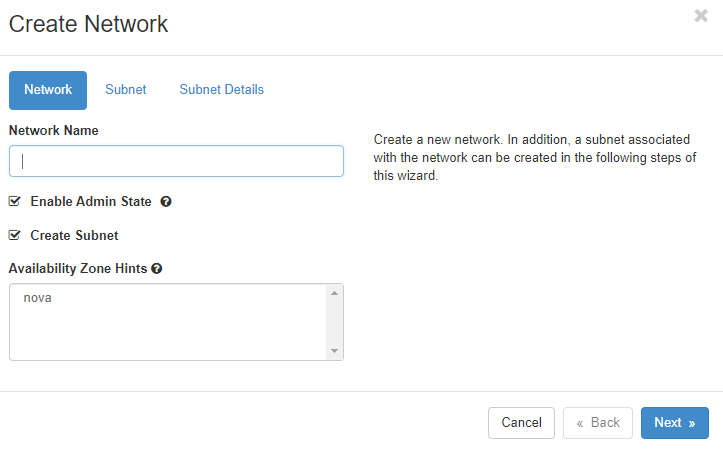
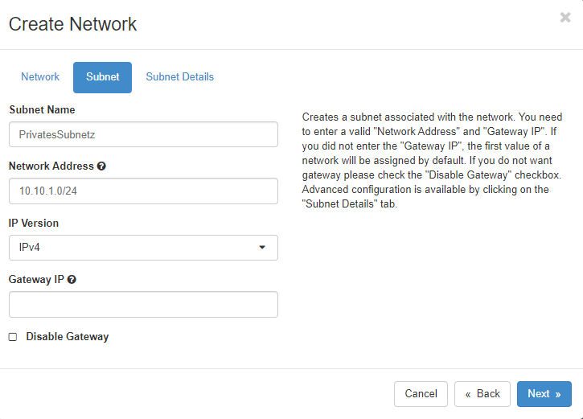
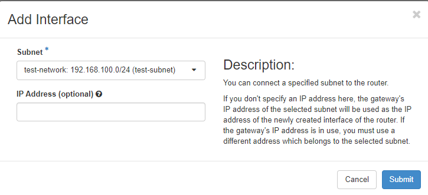
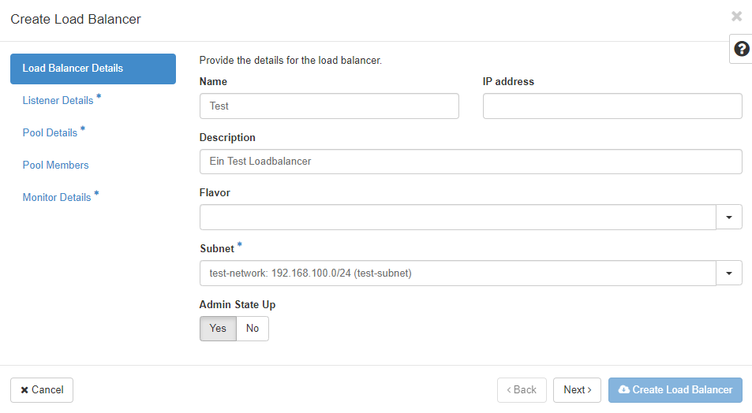
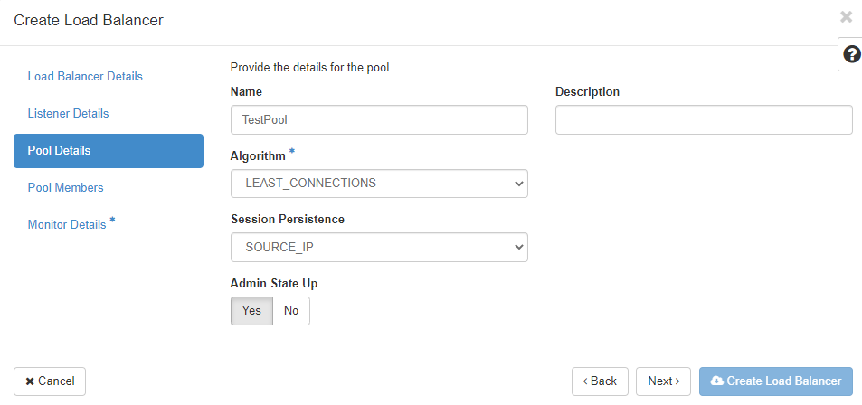
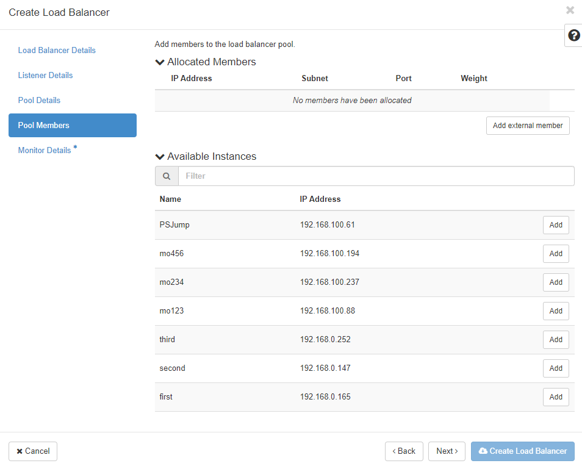

## Vernetzung
Um Ihnen die Arbeit zu erleichtern, werden neue Projekte in pluscloud open mit einem vorkonfigurierten Netzwerk-Setup erstellt, das ein privates Netzwerk und einen Router enthält, der dieses private Netzwerk mit dem Internet verbindet. Die gesamte Netzwerkkonfiguration in Horizon wird über das Menü "Netzwerk" vorgenommen.

"**Netzwerktopologie**" zeigt Ihnen ein Diagramm Ihrer aktuellen Netzwerkumgebung. "**Netzwerke**" listet alle derzeit konfigurierten Netzwerke in Ihrem Projekt auf und ermöglicht es Ihnen, bestehende Netzwerke zu verwalten, zu löschen und neue Netzwerke zu erstellen. "**Router**" listet alle konfigurierten Router in Ihrem Projekt auf und ermöglicht die Verwaltung, Erstellung und Löschung von Routern. "**Sicherheitsgruppen**" sind im Grunde Firewall-Regeln, mit denen Sie den Datenverkehr zu oder von Ihrer Infrastruktur zulassen oder verweigern können. Mit "**Load Balancers**" können Sie Loadbalancer, Mitglieder und Pools in Ihrer Umgebung erstellen, löschen und verwalten. Mit "**Floating IPs**" können Sie öffentliche IP-Adressen für Ihre Instanzen verwalten, anhängen, abhängen und allozieren.

### Netzwerktopologie
Im Menüpunkt "Netzwerktopologie" können Sie sich einen Überblick über das Netzwerk-Setup in Ihrem Projekt verschaffen. Das Diagramm zeigt Ihre aktuelle Konfiguration und wird bei jeder Änderung der Umgebung aktualisiert. 

Das obige Diagramm zeigt zwei private Netzwerke, die über zwei Router mit einem öffentlichen Netzwerk ("Providernetzwerk" in der OpenStack-Sprache) verbunden sind. Wenn Sie mit der Maus über die Elemente des Diagramms fahren, werden weitere Informationen und Verknüpfungen zu anderen Funktionen der Web-GUI angezeigt.

### Netzwerke
Unter "Netzwerke" finden Sie die konfigurierten Netzwerke in Ihrer Umgebung und Sie können Netzwerke verwalten, hinzufügen oder löschen.

Jedes Netzwerk benötigt ein zugehöriges Subnetz, das ebenfalls bei der Erstellung des Netzwerks eingerichtet wird. Das externe Netzwerk - "ext01" im Falle von pluscloud open - wird vom Provider konfiguriert und kann nicht geändert werden.

#### Netzwerke erstellen
Mit einem Klick auf "Netzwerk erstellen" öffnet sich ein Dialog, um ein neues Netzwerk zu definieren. 

 

Sie müssen dem neuen Netzwerk einen Namen geben, entscheiden, ob es Datenverkehr empfangen soll (indem Sie auf "Enable Admin State" klicken) und entscheiden, ob Sie ein neues Subnetz im neuen Netzwerk erstellen oder ein bestehendes verwenden wollen. Die "Availability Zone Hints" beziehen sich derzeit auf die gesamte pluscloud open Umgebung, da es nur eine Availability Zone pro pluscloud open Umgebung gibt.

Wenn Sie "Subnetz erstellen" gewählt haben, müssen Sie im nächsten Schritt das Subnetz definieren. 

  

Hier erstellen Sie ein Subnetz, das mit dem neuen Netzwerk verbunden ist. Sie benötigen eine gültige "Netzwerkadresse" eines [RFC1918](https://www.rfc-editor.org/rfc/rfc1918) Netzwerks in [CIDR](https://en.wikipedia.org/wiki/Classless_Inter-Domain_Routing) Notation. Wenn Sie keine "Gateway-IP" angeben, wird die erste IP-Adresse des Teilnetzes automatisch zur Gateway-IP-Adresse. Wenn Sie kein Gateway in Ihrem Netzwerk haben wollen, klicken Sie auf "Gateway deaktivieren". 

Eine detaillierte Konfiguration des Subnetzes finden Sie im Menü "Subnetzdetails".

Hier können Sie festlegen, ob [DHCP](https://en.wikipedia.org/wiki/Dynamic_Host_Configuration_Protocol) im Subnetz verfügbar sein soll. Wenn Sie möchten, können Sie außerdem den Subnetzpool angeben, aus dem DHCP-Adressen zugewiesen werden sollen. Zuteilungspools sollten mindestens mit der Adresse .5 beginnen, da auf diesen ersten Adressen des Netzes bereits andere Netzwerkdienste laufen könnten.
Wenn Sie bestimmte Nameserver für Ihr Netzwerk verwenden möchten, können Sie diese im Feld "DNS-Nameserver" definieren. Spezifische Host-Routen zu bestimmten Netzwerken können Sie im Feld "Host-Routen" einstellen, wo Sie das Zielnetzwerk in CIDR-Notation definieren, gefolgt von der Gateway-IP-Adresse, über die Sie das Zielnetzwerk erreichen können.
Klicken Sie auf "Erstellen", damit OpenStack das neue Netzwerk und Subnetz bereitstellt.

## Router
Netzwerke müssen durch Router verbunden werden, um kommunizieren zu können. Dies gilt sowohl für externe Netzwerke als auch für interne Netzwerke.

### Router
Das Menü "Router" listet alle konfigurierten Router auf, erlaubt die Verwaltung und das Löschen dieser Router sowie das Anlegen neuer Router.

### Router erstellen
Um einen neuen Router zu erstellen, klicken Sie auf "Create Router", geben Sie ihm einen Namen, erlauben Sie ihm, Pakete zu routen, indem Sie auf "Enable Admin State" klicken und wählen Sie ein "External Network" aus der Liste.

### Schnittstelle hinzufügen
Wenn Sie auf den Namen eines bereits vorhandenen Routers klicken, sehen Sie die aktuellen Schnittstellen und deren Konfiguration

Wenn Sie auf "Schnittstelle hinzufügen" klicken, können Sie auswählen, mit welchem Subnetz die Route verbunden werden soll und welche IP-Adresse die neue Router-Schnittstelle erhalten soll. 

### Statische Route hinzufügen

Mit einem Klick auf den Reiter "Statische Routen" können Sie Ihrem Router statische Routen hinzufügen

Fügen Sie das Zielnetz in CIDR-Notation hinzu und definieren Sie eine erreichbare IP-Adresse für den Router, um eine Verbindung zum Zielnetz herzustellen.

## Sicherheitsgruppen
Ein sehr wichtiger Teil der Netzwerkumgebung Ihres Projekts sind die Sicherheitsgruppen, die wie Firewall-Regelsätze funktionieren, um den Datenverkehr zu Ihren Instanzen zuzulassen oder zu verbieten. Nur erwünschter Datenverkehr sollte Ihre Instanzen erreichen können.

Standardmäßig ist eine "Standard-Sicherheitsgruppe" für Instanzen aktiv, denen keine anderen Sicherheitsgruppen zugewiesen sind. Diese Gruppe enthält eine Reihe von Regeln für ein- und ausgehenden Datenverkehr. Diese Gruppe wird normalerweise neuen Instanzen zugewiesen, um SSH-Anmeldungen zu ermöglichen.

"Egress" ist für ausgehenden Verkehr. Jeder Verkehr (einschließlich ICMP) ist für IPv4 und IPv6 erlaubt. "Ingress" oder eingehender Verkehr ist für ICMP sowie SSH (Port 22) erlaubt. Regeln, die eine "Remote Security Group" "default" definiert haben, werden verwendet, um sicherzustellen, dass jede Quellinstanz jede andere Zielinstanz in dieser "default" Gruppe über IPv4 und IPv6 erreichen kann. 
Denken Sie daran, dass die Sicherheitsgruppen jeder Instanz einzeln zugewiesen werden müssen. Diese gelten nicht für Ihre gesamte Umgebung.

### Sicherheitsgruppe erstellen

Wenn Sie auf "+Sicherheitsgruppe erstellen" klicken, wird eine neue Sicherheitsgruppe erstellt und Sie gelangen zu einem neuen Menü, in dem Sie neue Sicherheitsregeln zu Ihrer neuen Sicherheitsgruppe hinzufügen können. Es gibt eine Reihe von vordefinierten Regeln für verschiedene Protokolle. Sie können "Custom TCP/UDP/ICMP"-Regeln für einzelne Ports definieren.
Sie sollten das Beschreibungsfeld verwenden (um einen einfachen Überblick darüber zu erhalten, was jede Regel tun soll), die Richtung des Datenverkehrs (Ausgang/Eingang) sowie den Netzwerkport, für den die Regel gelten soll, definieren. Sie können einen einzelnen Port, mehrere Ports oder einen Portbereich definieren. 
Für ICMP-Verkehr legen Sie icmp-Typ und -Code fest.

Remote beschreibt Quelle oder Ziel - je nachdem, ob es eine Ingress- oder eine Egress-Regel werden soll. Sie können hier eine IP-Adresse (in CIDR-Notation) oder eine andere Sicherheitsgruppe definieren.

## Loadbalancer

Das Menü "Load Balancers" ermöglicht es Ihnen, Loadbalancing-Dienste zu definieren. Ein Klick auf "Load Balancers" zeigt eine Seite mit allen bereits definierten Loadbalancern. Diese können hier verwaltet oder gelöscht werden. Und Sie können neue hinzufügen, indem Sie auf "+Loadbalancer erstellen" klicken.
Um einen neuen Loadbalancer zu erstellen, müssen Sie verschiedene Parameter festlegen. Sie werden durch einige Menüs geführt und sobald Sie genügend Informationen eingegeben haben, wird die Schaltfläche "Load Balancer erstellen" aktiviert und Sie können den Erstellungsprozess starten. Sternchen kennzeichnen Felder, die ausgefüllt werden müssen, um einen Loadbalancer zu erstellen.

"**Name**" und "**IP-Adresse**" sind die ersten beiden Informationen, die Sie eingeben müssen. Wählen Sie eine IP-Adresse aus Ihrem Subnetz. Wenn Sie dieses Feld leer lassen, wird eine IP-Adresse aus dem von Ihnen gewählten Subnetz zugewiesen (sofern DHCP dort aktiv ist).

"**Beschreibung**" ist optional, sollte aber verwendet werden, um Informationen über das Warum und Was dieser speziellen Loadbalancer-Instanz zu speichern. Sie können keinen "**Flavor**" wählen. Pluscloud open verwendet hier das Amphora Flavor. Wie bereits erwähnt, müssen Sie ein "**Subnet**" auswählen, mit dem der Loadbalancer verbunden werden soll. Mit "**Admin State Up**" kann man den Loadbalancer ausgeschaltet anlegen. Er muss auf "**Admin State Up**" geschaltet werden, um den Datenverkehr auszugleichen.

Das nächste Menü "Listener Details" definiert den Listener für den neuen Loadbalancer

Jeder einzelne Port des neuen Loadbalancers, der Datenverkehr empfangen soll, wird separat konfiguriert und dem Loadbalancer zugewiesen. Sie können mehrere Listener pro Loadbalancer definieren, solange jeder einen anderen Port verwendet. 

"**Protokoll**" definiert das Protokoll, das auf dem "**Port**" erwartet werden soll. Sie können "TERMINATED_HTTPS" nur dann als Protokoll wählen, wenn Sie den Schlüsselmanagerdienst (Barbican) aktiviert und konfiguriert haben. Die "**Port**"-Nummer sollte zwischen 1 und 65535 liegen.

Mit dem "**Client Date Timeout**" konfigurieren Sie, wie lange TCP-Verbindungen zu Clients aufrechterhalten werden dürfen, wenn der Client inaktiv ist. Der "**TCP Inspect Timeout**" ist die Zeit in Millisekunden, die der Loadbalancer auf zusätzliche Inhalte wartet. Zeitüberschreitungen zu den Loadbalancer-Mitgliedern werden im Feld "**Member Connect Timeout**" konfiguriert. Im Feld "**Connection Limit**" können Sie die Anzahl der erlaubten Verbindungen auf den jeweiligen Listener begrenzen - "-1" bedeutet unbegrenzt. Wenn Sie HTTP-Header einfügen möchten, können Sie unter "**Header einfügen**" eine oder beide der unterstützten Optionen auswählen.

Als nächster Schritt müssen Sie die "**Pool Details**" für den neuen Loadbalancer definieren. Ein "Pool" ist eine Gruppe von Mitgliedsinstanzen, die den Verkehr über den Loadbalancer erhalten sollen.

Zuerst definieren Sie den Loadbalancing "**Algorithmus**"
  
    * LEAST_CONNECTIONS: sendet die nächste Anfrage an die Instanz mit der geringsten Anzahl von Verbindungen im Pool
    * ROUND_ROBIN: sendet Anfragen nach dem Zufallsprinzip an die nächste verfügbare Instanz des Pools
    * SOURCE_IP: sendet Anfragen von der gleichen Quell-IP-Adresse immer an die gleiche Instanz im Pool

Wenn Ihre Anwendung "**Session Persistence**" benötigt, können Sie die Methode hier auswählen

    * SOURCE_IP: Die Quell-IP-Adresse wird als Persistenzmerkmal verwendet
    * HTTP_COOKIE: HTTP-Cookies, die von der Compute-Instanz im Pool gesetzt werden, werden als Persistenzmerkmal verwendet
    * APP_COOKIE: Ihre Anwendung verwendet/erzeugt ein benutzerdefiniertes Cookie, das Sie in das Feld "**Cookie Name**" eintragen müssen.

Die "**Pool Members**" für den neuen Loadbalancer-Pool werden im nächsten Menü definiert. Sie können aus den Instanzen in der Liste wählen.

Die Liste "**Verfügbare Instanzen**" enthält die für Ihren Pool in Frage kommenden Instanzen. Klicken Sie auf "Hinzufügen", um sie dem Pool hinzuzufügen. Klicken Sie auf "Externes Mitglied hinzufügen", um Mitglieder hinzuzufügen, die nicht in der Liste angezeigt werden.

Die "**IP-Adresse**" ist die IP-Adresse der Netzwerkschnittstelle der Instanz, die den Verkehr vom Loadbalancer empfangen soll. IPv4 und IPv6 Adressen sind erlaubt. Das "**Subnetz**" sollte das Subnetz sein, das die IP-Adresse des Mitglieds enthält. Der "**Port**" sollte der TCP-Port sein, auf dem das Mitglied den Verkehr vom Loadbalancer empfangen soll. Das "**Gewicht**" definiert die relative Anzahl der Anfragen, die das jeweilige Mitglied im Verhältnis zu den anderen Mitgliedern erhalten soll. Erlaubte Werte liegen zwischen 1 und 256. 
Wenn Sie auf den Pfeil klicken, können Sie noch weitere Pool-Details wie "**Überwachungsadresse**" und "**Überwachungsport**" definieren - wenn Sie eine Überwachungsadresse definieren möchten, die vom Dienst (IP-Adresse und Port) auf Ihrer Instanz getrennt ist. Lassen Sie sie unverändert, um die IP-Adresse und den Port des Mitglieds für die Überwachung zu verwenden. 
Wenn Sie ein "**Backup**" oder Failover-Member in Ihrem neuen Pool definieren wollen, das nur verwendet wird, wenn alle anderen Member nicht erreichbar sind, klicken Sie hier auf "Ja".

Der letzte Schritt ist das Menü "**Monitor Details**". Die Überwachung dient dazu, den Zustand der Poolmitglieder zu ermitteln. Sogenannte "Health Checks" werden für alle Mitglieder des Pools durchgeführt und bestimmen, ob das geprüfte Mitglied Verkehr vom Loadbalancer erhält. Schlägt die Gesundheitsprüfung fehl, erhält das Mitglied keinen Datenverkehr. Jeder Pool kann seine eigene Gesundheitsprüfung haben, die für alle Mitglieder des Pools verwendet wird.

Sie können einen "**Typ**" von Monitor aus der Liste von HTTP, HTTPS, PING, TCP, TLS-HELLO, UDP-CONNECT und SCTP auswählen. Je nach Wahl müssen Sie verschiedene Informationen eingeben.
Die "**Verzögerung (sec)**" bestimmt die Zeit zwischen den Gesundheitsprüfungen. Sie sollte so groß wie "**Timeout**" oder größer sein. Mit "**Max Retries**" können Sie festlegen, wie oft der Loadbalancer die Gesundheitsprüfung versuchen soll, bevor er den Status des Mitglieds auf **inaktiv** setzt (sollte eine Zahl zwischen 1 und 10 sein). "**Max Retries Down**" ist die Anzahl der erlaubten Verbindungsabbrüche, bevor das Poolmitglied als "**faulty**" deklariert wird (wieder eine Zahl zwischen 1 und 10). Der "**Timeout**" beschreibt die Zeit, die ein Healtch-Check dauern kann, um erfolgreich zu sein (sollte eine Zahl größer oder gleich 0 und kleiner oder gleich dem "**Delay (sec)**" sein).
Die "**HTTP-Methode**" kann eine der erlaubten HTTP-Methoden sein (wie GET, HEAD, etc.) und "**Erwartete Codes**" sollte ein HTTP-Code (oder eine Liste von ihnen) sein, der bei einer erfolgreichen Überprüfung zurückkommt. 
Unter "**URL Path**" kann ein benutzerdefinierter Pfad für Ihre Gesundheitsprüfungen angegeben werden. Denken Sie daran, dass dieser vom Monitor alle "**Verzögerung (Sek)**" abgefragt wird.
Wenn alle erforderlichen Informationen in die Formulare eingegeben wurden, kann der Loadbalancer erstellt werden. Wenn Sie möchten, dass der Loadbalancer vom öffentlichen Internet aus erreichbar ist, müssen Sie ihm eine Floating IP-Adresse zuweisen.

## Floating IPs

Über das Menü "**Floating IPs**" können Sie öffentliche IP-Adressen in Ihrem Projekt auflisten und verwalten. Freie IP-Adressen müssen zugewiesen werden, bevor sie mit einem Dienst verknüpft werden können. Sie können auch von einem Dienst getrennt werden, damit dieser nicht mehr aus dem Internet erreichbar ist. 

Sie können Floating-IP-Adressen mit Instanzen und Loadbalancern verknüpfen. Achten Sie auf die Dienste, die aus dem Internet erreichbar sein sollen und konfigurieren Sie Ihre Sicherheitsgruppen entsprechend. Floating-IP-Adressen werden abgerechnet und in Rechnung gestellt, solange sie reserviert sind - unabhängig davon, ob sie einem Dienst zugeordnet sind oder nicht.