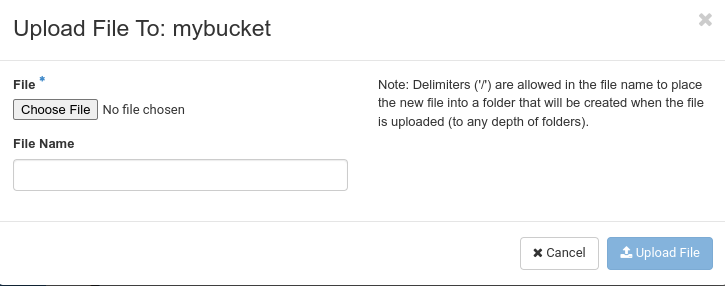
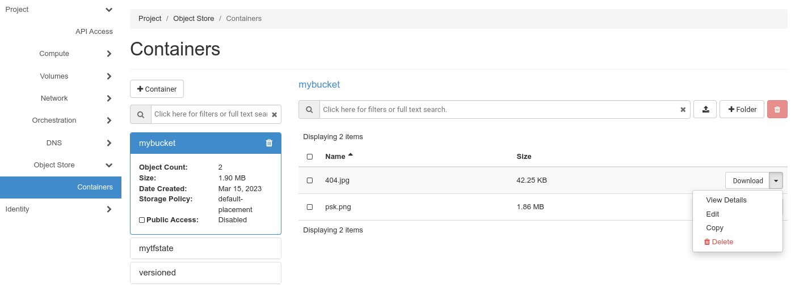

## Überblick

Die pluscloud open bietet [object storage](https://en.wikipedia.org/wiki/Object_storage) kompatibel zu Openstacks [Swift](https://wiki.openstack.org/wiki/Swift) und Amazons [S3](https://docs.aws.amazon.com/AmazonS3/latest/API/Welcome.html) Protokollen.
Er ist grundsätzlich für Cloud-native Anwendungsfälle vorgesehen:

* als Backend für Infrastructure-as-Code-Szenarien, die von einer Gruppe von EntwicklerInnen genutzt werden können (z. B. als Backend-Speicher für Terraform-Statusdateien).
* als Datei-/Inhaltespeicher für Scale-Out-Szenarien, bei denen aus Images erzeugte Cloud-Instanzen aktuelle Inhalte aus dem Object Storage nachladen (anstatt ein NFS-Volume zu mounten, was in Cloud-Kontexten als "schlechtes Design" angesehen wird).

## Object Storage verwalten

Der Object Storage wird entweder über die Web-GUI oder mit einem Commandline-Client verwaltet. Sie finden Ihren Object Storage unter "**Object Storage**" und dann "**Container**" in Ihrem Horizon-Menü. "Containers" ist in Swift das, was "Buckets" in S3 ist.

Sie können sogar Inhalte in Ihre Container/Buckets hoch- und herunterladen. Klicken Sie einfach auf den kleinen "Upload"-Button und wählen Sie eine Datei von Ihrem Computer.

Klicken Sie dann auf "**Datei hochladen**". Objekte können mit der Schaltfläche "**Download**" auf der rechten Seite heruntergeladen werden. Es gibt aber auch noch andere Optionen in diesem Menü.

"**Details anzeigen**" gibt Ihnen einige Informationen über das Objekt (wie Größe, Inhaltstyp usw.). Mit "**Bearbeiten**" können Sie den Inhalt des Objekts ändern. Bei der Objektspeicherung findet jedoch keine In-Place-Bearbeitung statt - der neue Inhalt wird mit dem alten Objektnamen hochgeladen.

Außerdem können Sie ein Objekt in einen anderen Container/Bucket kopieren, indem Sie "**Kopieren**" wählen. Mit "**Löschen**" wird das Objekt natürlich gelöscht.

Sie können einen Ordner in Ihrem Container/Bucket erstellen (anstatt ein Objekt hochzuladen), indem Sie auf "+Ordner" klicken. In diesen Unterordnern können Objekte hochgeladen, kopiert, bearbeitet und gelöscht werden, genau wie in anderen Containern/Buckets. Aber Achtung! Diese Unterordner funktionieren nicht wie Unterordner in einem Dateisystem. Die Ordnerstruktur wird nur durch das Anhängen von "/" an den Ordnernamen simuliert.

### CLI-Clients verwenden

Es gibt mehrere Möglichkeiten, Ihren Object Storage über die Kommandozeile zu verwalten. Wie bereits erwähnt, ist unser Object Storage kompatibel zu OpenStacks Swift und Amazons S3-Protokoll. Sie sollten also in der Lage sein, Kommandozeilen-Tools zu verwenden, die das eine oder das andere unterstützen.

Natürlich unterstützt der OpenStackClient selbst die Verwaltung von Containern bis zu einem gewissen Grad. Wenn Sie Ihren OpenStackClient richtig konfiguriert haben, können Sie die ``openstack container``-Befehle verwenden, um Ihre Object-Storage-Container/-Buckets zu verwalten:

    /configuration # openstack container list
    +--------+
    | Name   |
    +--------+
    | first  |
    | foobar |
    +--------+
    /configuration # openstack container show first
    +----------------+---------------------------------------+
    | Field          | Value                                 |
    +----------------+---------------------------------------+
    | Konto          | AUTH_d474d55f24a3a97e92cc39b7dd469c14 |
    | bytes_used     | 0                                     |
    | container      | first                                 |
    | object_count   | 0                                     |
    | read_acl       | .r:*,.rlistings                       |
    | storage_policy | default-placement                     |
    +----------------+---------------------------------------+

Da der Befehl ``openstack container`` keine Uploads erlaubt, müssen Sie den swiftclient verwenden, um Objekte in Ihren Object Storage hochzuladen:

    /configuration # swift upload --help
    Verwendung: swift upload [--changed] [--skip-identical] [--segment-size <size>]
                        [--segment-container <container>] [--leave-segments]
                        [--object-threads <thread>] [--segment-threads <threads>]
                        [--meta <Name:Wert>] [--header <header>] [--use-slo]
                        [--ignore-checksum] [--object-name <object-name>]
                        <Container> <Datei_oder_Verzeichnis> [<Datei_oder_Verzeichnis>] [...]

    Lädt die angegebenen Dateien und Verzeichnisse in den angegebenen Container hoch.

    Positionale Argumente:
      <container> Name des Containers, in den hochgeladen werden soll.
      <Datei_oder_Verzeichnis> Name der hochzuladenden Datei oder des Verzeichnisses. Geben Sie mehrere
                            für mehrfache Uploads. Wenn "-" angegeben wird, liest
                            Inhalt von der Standardeingabe (--object-name ist in diesem Fall erforderlich
                            in diesem Fall erforderlich).

    Optionale Argumente:
      -c, --changed Nur Dateien hochladen, die seit dem letzten Upload geändert wurden
                            Upload geändert haben.
      --skip-identical Überspringt das Hochladen von Dateien, die auf beiden Seiten identisch sind.
      -S, --segment-size <Größe>
                            Hochladen von Dateien in Segmenten, die nicht größer als <size> (in
                            Bytes) und erstellt dann eine "Manifest"-Datei, die
                            alle Segmente herunterlädt, als wäre es die Originaldatei
                            Datei.
      --Segment-Behälter <Behälter>
                            Hochladen der Segmente in den angegebenen Container. Wenn
                            nicht angegeben, werden die Segmente in einen
                            <container>_segments Container hochgeladen, um nicht die
                            Haupt-<container>-Listen nicht zu verschmutzen.
      --leave-segments Gibt an, dass die älteren Segmente von Manifest
                            Objekte in Ruhe gelassen werden sollen (im Falle von Überschreibungen).
      --object-threads <threads>
                            Anzahl der Threads, die für das Hochladen vollständiger Objekte verwendet werden sollen.
                            Standard ist 10.
      --segment-threads <threads>
                            Anzahl der Threads, die für das Hochladen von Objektsegmenten verwendet werden sollen.
                            Die Vorgabe ist 10.
      -m, --meta <Name:Wert>
                            Legt ein Metadatenelement fest. Diese Option kann wiederholt werden.
                            Beispiel: -m Farbe:Blau -m Größe:Groß
      -H, --header <Kopfzeile:Wert>
                            Fügt einen benutzerdefinierten Anfrage-Header hinzu. Diese Option kann
                            wiederholt werden. Beispiel: -H "content-type:text/plain"
                            -H "Inhalt-Länge: 4000".
      --use-slo Wird in Verbindung mit --segment-size verwendet, wird
                            wird ein Static Large Object anstelle des standardmäßigen
                            Dynamic Large Object.
      --object-name <Objektname>
                            Hochladen der Datei und Benennen des Objekts nach <Objektname> oder Hochladen
                            Verzeichnis und verwenden Sie <Objektname> als Objektpräfix anstelle des
                            Ordnernamen.
      --ignore-checksum Schaltet die Prüfsummenüberprüfung für Uploads aus.

Es gibt auch mehrere Optionen für die Verwaltung Ihres Object Storage über das S3-Protokoll. Eine davon ist [S3cmd](https://s3tools.org/s3cmd), das für verschiedene Plattformen verfügbar ist. Die andere ist [AWS CLI](https://pypi.org/project/awscli/) - eine universelle Befehlszeilenschnittstelle für Amazon Web Services, die wir bereits in unserem Tutorial "[OpenStack Object Storage as a Backend for Terraform Statefiles](https://docs.plusserver.com/de/compute/pluscloudopen/tutorials/tf-backend-s3/)" behandeln.

Für s3cmd benötigen Sie eine Konfigurationsdatei ``.s3cfg``, die Sie mit Hilfe des Befehls ``s3cmd --configure`` erstellen können. Wie bereits erwähnt, können Sie Ihre Zugangsdaten für den Object-Storage-Zugriff mit ``openstack ec2 credentials create`` erstellen, mit ``openstack ec2 credentials list`` auflisten und mit ``openstack ec2 credentials show <accesskey>`` einsehen. Sie müssen diese für die Konfiguration von S3cmd bereithalten.

Nach der Konfiguration sollten Sie eine ``.s3cfg`` Datei ähnlich der folgenden haben:

    [default]
    access_key = <Ihr AccessKey>
    secret_key = <Ihr SecretKey>
    enable_multipart = Wahr
    multipart_chunk_size_mb = 50
    use_https = Wahr
    host_base = https://prod1.api.pco.get-cloud.io:8080
    host_bucket = https://prod1.api.pco.get-cloud.io:8080
    signurl_use_https = Wahr
    socket_timeout = 600

Wenn alles korrekt ist, sollte die Ausführung von ``s3cmd ls s3://`` den Inhalt Ihres Object Storage auflisten.
