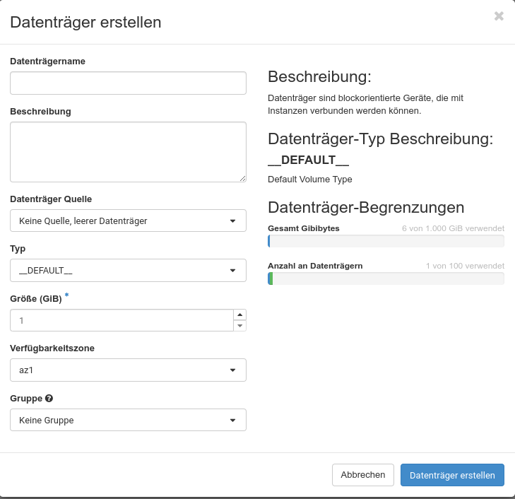
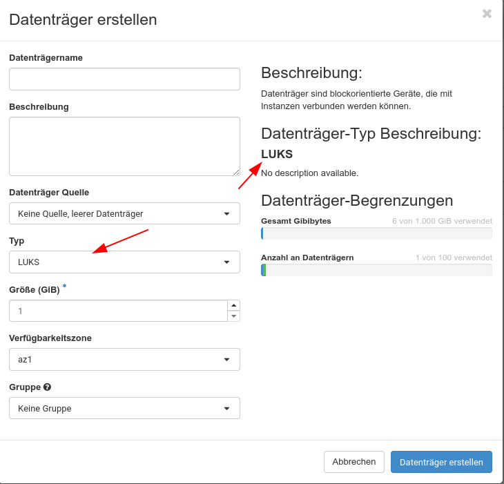
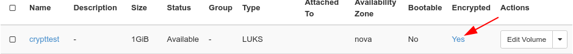

## Volumes

Volumes repräsentieren (Block) Storage in OpenStack. Volumes werden als Festplatten in Instanzen verwendet. Wenn nicht explizit anders erwähnt, befinden sich Volumes auf einem [Ceph](https://ceph.io/en/)-Speichersystem und sind über das [RADOS](https://docs.ceph.com/en/quincy/rbd/index.html)-Protokoll über das Netzwerk an die Instanz angeschlossen.
Über das Menü "**Volumes**" können Sie die Volumes in Ihrem Projekt verwalten.

Sie können neue Volumes, Backups und Snapshots erstellen sowie Ihre Volumes gruppieren (z. B. für gleichzeitige Snapshots). Die Liste zeigt die Volumes mit ihrer eindeutigen ID an, aber Sie können den Namen Ihrer Volumes ändern, wenn Sie möchten. Außerdem können Sie sehen, ob das Volume derzeit an eine Instanz angehängt ist (und wo), wie groß das Volume ist und ob es Mitglied einer Volume-Gruppe ist. Über die Schaltfläche "**Aktionen**" haben Sie Zugriff auf die verschiedenen Verwaltungsoptionen, die Sie für Ihre Volumes haben.

Mit "**Volume bearbeiten**" können Sie den Namen Ihres Volumes ändern und/oder eine Beschreibung für das Volume hinzufügen. Dies kann hilfreich sein, um den Zweck des Volumes sichtbar zu machen. Außerdem können Sie hier das Boot-Flag für ein Volume setzen. Mit "**Anhänge verwalten**" können Sie ein Volume an eine Instanz anhängen oder von ihr abkoppeln. Beachten Sie, dass Sie nach dem Anhängen eines Volumes höchstwahrscheinlich einige Konfigurationseinstellungen auf Ihrer Instanz ändern müssen (z.B. ein Dateisystem auf das neue Volume legen, /etc/fstab bearbeiten und es mounten usw.). Bevor Sie ein Volume von Ihrer Instanz abhängen, sollten Sie es per `umount` trennen.

Mit "**Snapshot erstellen**" können Sie einen Snapshot des betreffenden Volumes erstellen. Zuvor müssen Sie ihm einen Namen (und optional eine Beschreibung) geben. Bitte beachten Sie, dass das Erstellen eines Snapshots von einem Datenträger, der bereits gemountet und verwendet wird, zu einer Beschädigung der Daten führen kann. Der sichere Weg, Snapshots zu erstellen, besteht darin, das betreffende Volume zuerst zu deaktivieren. Snapshots sind keine Backups.

Mit "**Backup erstellen**" erstellen Sie ein Backup Ihres Volumes. Wenn Sie einen Snapshot Ihres Datenträgers auswählen, wird nur der Snapshot gesichert. Wenn Ihr Volume-Backup in Ihr Object-Storage-Kontingent passt, können Sie ein Object-Storage-Bucket auswählen und das Backup dorthin schreiben.

Sie können ein Volume in ein Image konvertieren, das Sie mit "**In Image hochladen**" zur Erstellung einer Instanz verwenden können. Sie müssen ein Festplattenformat für das Image wählen (meist "raw" oder "qcow2"). Wenn der Datenträger in Gebrauch ist, können Sie die Sicherung durch Klick auf "**Erzwingen**" erzwingen.

Mit "**Metadaten aktualisieren**" können Sie die Metadaten des Datenträgers verwalten. Sie finden vordefinierte Metadaten-Definitionen, die Sie verwenden können, oder Sie können mit dem Feld "**Benutzerdefiniert**" eigene Metadaten definieren. Die maximale Länge für einen einzelnen Schlüssel beträgt 255 Zeichen.

### Übertragung akzeptieren

Wenn Sie Datenträger von einem Projekt in ein anderes übertragen, können Sie die Übertragung mit einem Klick auf "**Übertragung übernehmen**" akzeptieren. Übertragungen werden von der Kommandozeile aus mit ``openstack volume transfer request`` eingeleitet. Damit erstellt der Besitzer eines Datenträgers einen Transferauftrag und sendet die Transfer-ID und einen Schlüssel an den Empfänger des Datenträgers. Der Empfänger klickt auf "**Accept Transfer**" und gibt die Transfer-ID und den Schlüssel ein, um das Volume zu erhalten.

### Volume erstellen

Um ein neues Volume zu erstellen, klicken Sie auf "**+Volume erstellen**". Sie werden dann durch einige Menüs geführt, um das neue Volume zu definieren

Neben einem Namen und einer optionalen Beschreibung können Sie eine "**Volumenquelle**" wählen, z. B. ein Image, einen Snapshot oder andere Volumes. Je nach Auswahl ändern sich die Eingabefelder (die aber selbsterklärend sind). Die gewählte Quelle bestimmt die Größe des neuen Volumes. Sie können das Volume einer zuvor definierten Volume-"**Gruppe**" zuordnen.

### Volume-Typen

{}
Demnächst verfügbar! Siehe [Release Notes](../../releasenotes/)
{}

Volume-Typen helfen Ihnen bei der Auswahl des richtigen Speichers für Ihre Workloads je nach Bedarf. Sie können zwischen normalem oder verschlüsseltem Speicher für die Datensicherheit oder Premium-Speicher wählen, der höhere IOPS und Durchsatz für leistungsintensive Anwendungen bietet. Mit diesen Optionen können Sie Ihren Speicher an die Anforderungen Ihrer spezifischen Workloads anpassen und sicherstellen, dass kritische Anwendungen reibungslos laufen, während Sie gleichzeitig ein Gleichgewicht zwischen Leistung, Kosten und Sicherheit in Ihrer Cloud-Umgebung schaffen.

Übersicht der aktuell unterstützten Volume-Typen:
| Volume-Typ | Verschlüsselt | Lesen IOPS | Schreiben IOPS | Lesen MB/s | Schreiben MB/s |
|----------------------|---------- |-----------|------------|-----------|------------|
| ceph-standard | Nein | 2500 | 2500 | 256 | 256 |
| ceph-premium | Nein | 5000 | 5000 | 512 | 512 |
| ceph-standard-luks | Ja | 2500 | 2500 | 256 | 256 |
| ceph-premium-luks | Ja | 5000 | 5000 | 512 | 512 |

Übersicht der veralteten Volume-Typen:
| Volume-Typ | Verschlüsselt | Lesen IOPS | Schreiben IOPS | Lesen MB/s | Schreiben MB/s |
|----------------------|---------- |-----------|------------|-----------|------------|
| Nein | 2500 | 2500 | 256 | 256 |
| LUKS | Ja | 2500 | 2500 | 256 | 256 |

{}
Der tatsächliche Durchsatz ist das Produkt aus IOPS und E/A-Größe. Bei 2500 IOPS und einer Blockgröße von 4K können Sie zum Beispiel 10 MB/s erreichen. Bei einer Blockgröße von 102400 Bytes erhalten Sie 256 MB/s.
{}

#### Volume-Typen ändern

Sie können den Volume-Typ für ein vorhandenes Volume nachträglich ändern. Es muss sich jedoch im
Zustand „verfügbar“ sein. Das bedeutet, dass es zu diesem Zeitpunkt nicht mit einer VM verbunden sein darf.

Wenn Sie zu und von verschlüsselten Volumes migrieren möchten, müssen Sie die Migration zulassen. Abhängig von der
Größe des Volumes kann dies einige Zeit in Anspruch nehmen.

Übersetzt mit DeepL.com (kostenlose Version)

## Backups

Das Menü "**Backups**" listet Ihre aktuellen Backups auf und ermöglicht es Ihnen, diese entweder zu löschen oder für die Wiederherstellung zu verwenden (z. B. indem Sie ein neues Volume aus dem Backup erstellen).

## Snapshots

Hier sehen Sie eine Liste Ihrer aktuellen Snapshots und können diese verwalten. Dazu gehört das Starten einer Instanz aus einem Snapshot mit "**Als Instanz starten**", das Ändern des Namens oder der Beschreibung eines Snapshots, das Erstellen eines Backups aus Ihrem Snapshot mit "**Backup erstellen**", das Löschen des Snapshots oder das Ändern der Metadaten für Ihren Snapshot.
Sie können aus einer Reihe von vordefinierten Metadaten wählen oder "**Benutzerdefinierte**" Metadatenschlüssel hinzufügen. Die maximale Schlüssellänge beträgt 255 Zeichen.

## Gruppen

In Volume-Gruppen können Sie eine Gruppe von Volumes bilden, die Sie als einen einzigen behandeln möchten. Es kann sinnvoll sein, Volumes, die verschiedene Teile einer Anwendung enthalten, gleichzeitig in einem Snapshot zu erfassen, um die Datenkonsistenz zu gewährleisten. Sie können mit "**Gruppe erstellen**" neue Gruppen erstellen oder bestehende bearbeiten.

## Gruppen-Snapshots

Hier können Sie Ihre Gruppen-Snapshots verwalten.

## Verschlüsselte Volumes

Die pluscloud open erlaubt es, verschlüsselte Volumes zu erstellen, die auf "LUKS" ([Linux Unified Key Setup](https://gitlab.com/cryptsetup/cryptsetup)) basieren, welches das Linux-Kernel-Modul dm-crypt verwendet und ideal für die Verschlüsselung von Volumes für Linux-Instanzen ist. Die Schlüssel werden bei der Erstellung des Volumes generiert und im Keystore der pluscloud open gespeichert. Beachten Sie, dass beim Löschen von verschlüsselten Volumes nicht nur das Volume, sondern auch der zugehörige Schlüssel gelöscht wird. **Eine Wiederherstellung der Daten ist nach der Löschung nicht möglich**.

Das Erstellen eines verschlüsselten Volumes ist recht einfach. Sie wählen einfach "LUKS" als "**Typ**" aus.

Je nach Größe des Datenträgers kann die Erstellung ein wenig Zeit in Anspruch nehmen. Sie können das Volume wie jedes andere nicht verschlüsselte Volume verwenden. Die Verschlüsselung wird im Hintergrund durchgeführt. In der Volume-Liste sollte Ihr Volume als verschlüsselt angezeigt werden:

Die Web-GUI erlaubt nicht die Erstellung von verschlüsselten Root-Volumes, die Sie benötigen, wenn Sie alle Volumes Ihrer Instanz verschlüsseln wollen.

### Verschlüsselte Boot-Images

Um das Root-Volume einer Instanz zu verschlüsseln, müssen Sie zunächst ein verschlüsseltes Volume erstellen, um dieses als Root-Volume für eine neue Instanz zu verwenden. Sie erstellen dieses Volume aus einem Image des Betriebssystems, das Sie für Ihre neue Instanz wünschen:

    openstack volume create --type LUKS --image "imagename" --size <Größe in gb> <volume name>

    openstack volume create --type LUKS --image "Ubuntu 20.04" --size 20 ubuntuencrypt
    +---------------------+--------------------------------------+
    | Field               | Value                                |
    +---------------------+--------------------------------------+
    | attachments         | []                                   |
    | availability_zone   | nova                                 |
    | bootable            | false                                |
    | consistencygroup_id | None                                 |
    | created_at          | 2021-12-10T09:06:49.000000           |
    | description         | None                                 |
    | encrypted           | True                                 |
    | id                  | cd4d8c9a-632a-4045-8b09-da57fcbc5848 |
    | multiattach         | False                                |
    | Name                | ubuntuencrypt                        |
    | properties          |                                      |
    | replication_status  | None                                 |
    | size                | 20                                   |
    | snapshot_id         | None                                 |
    | source_volid        | None                                 |
    | status              | creating                             |
    | type                | LUKS                                 |
    | updated_at          | None                                 |
    | user_id             | 824e462845c14ccd84cb091944dfe74b     |
    +---------------------+--------------------------------------+

Mit dem Parameter "**--image**" können Sie ein Volume direkt aus einem Image erstellen (entweder aus dem Repository oder von Ihnen selbst hochgeladen).

Nun können Sie eine Instanz mit dem soeben erstellten Volume erstellen. Sie müssen einen Flavor (Name oder ID) hinzufügen und Sie sollten nicht vergessen, einen SSH-Schlüsselnamen hinzuzufügen, mit dem Sie sich anschließend bei der Instanz anmelden können. Zusätzlich müssen Sie ein bestehendes Netzwerk hinzufügen, in dem die Instanz erzeugt werden soll:

    openstack server create --flavor <Flavor name oder ID> --network <network name oder ID> --key-name <keyname> --volume <volumename oder ID> <instancename>

    openstack server create --flavor 1C-1GB-20GB --network Test --key-name mhamm --volume cd4d8c9a-632a-4045-8b09-da57fcbc5848 bootencubuntu
    +-----------------------------+----------------------------------------------------+
    | Field                       | Value                                              |
    +-----------------------------+----------------------------------------------------+
    | OS-DCF:diskConfig           | MANUAL                                             |
    | OS-EXT-AZ:availability_zone |                                                    |
    | OS-EXT-STS:power_state      | NOSTATE                                            |
    | OS-EXT-STS:task_state       | scheduling                                         |
    | OS-EXT-STS:vm_state         | building                                           |
    | OS-SRV-USG:launched_at      | None                                               |
    | OS-SRV-USG:terminated_at    | None                                               |
    | accessIPv4                  |                                                    |
    | accessIPv6                  |                                                    |
    | addresses                   |                                                    |
    | adminPass                   | jy8CoGki7HL8                                       |
    | config_drive                |                                                    |
    | created                     | 2021-12-10T09:16:50Z                               |
    | flavor                      | 1C-1GB-20GB (cb635210-085e-4659-a10e-d1dcddf897f9) |
    | hostId                      |                                                    |
    | id                          | ca0bba1f-64e7-4678-bf49-bfe9ad71881d               |
    | image                       | N/A (booted from volume)                           |
    | key_name                    | mhamm                                              |
    | name                        | bootencubuntu                                      |
    | progress                    | 0                                                  |
    | project_id                  | 5b6bd2a13a624b5b8b393971cc03324a                   |
    | properties                  |                                                    |
    | security_groups             | name='default'                                     |
    | status                      | BUILD                                              |
    | updated                     | 2021-12-10T09:16:50Z                               |
    | user_id                     | 824e462845c14ccd84cb091944dfe74b                   |
    | volumes_attached            |                                                    |
    +-----------------------------+----------------------------------------------------+

Die Instanz verwendet jetzt verschlüsselten Speicher. Bitte denken Sie daran, das Volume zu löschen, nachdem Sie die Instanz gelöscht haben, da es nicht automatisch gelöscht wird.

### Secrets auflisten

Wie bereits erwähnt, ist für jedes verschlüsselte Volume ein Schlüssel im OpenStack Keystore (Barbican) gespeichert. Sie können alle für Ihr Projekt gespeicherten Schlüssel mit ``openstack secret list`` auflisten.
