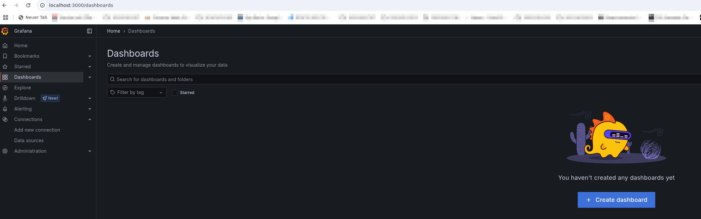
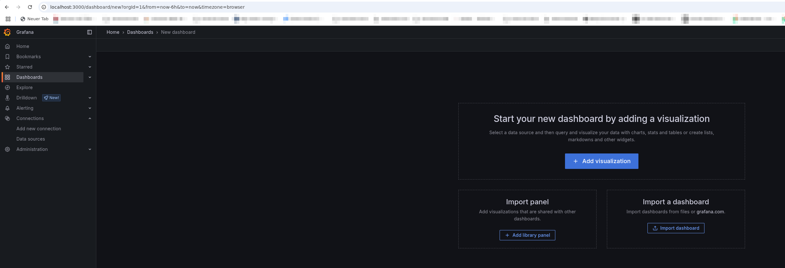
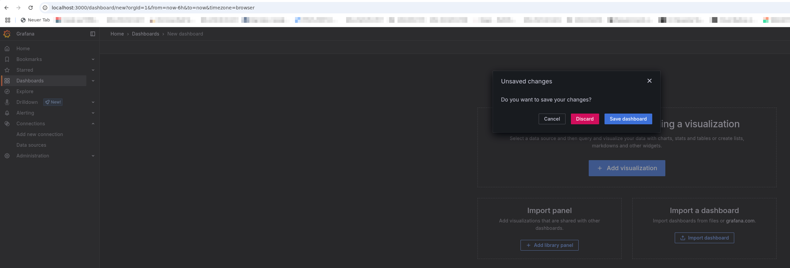
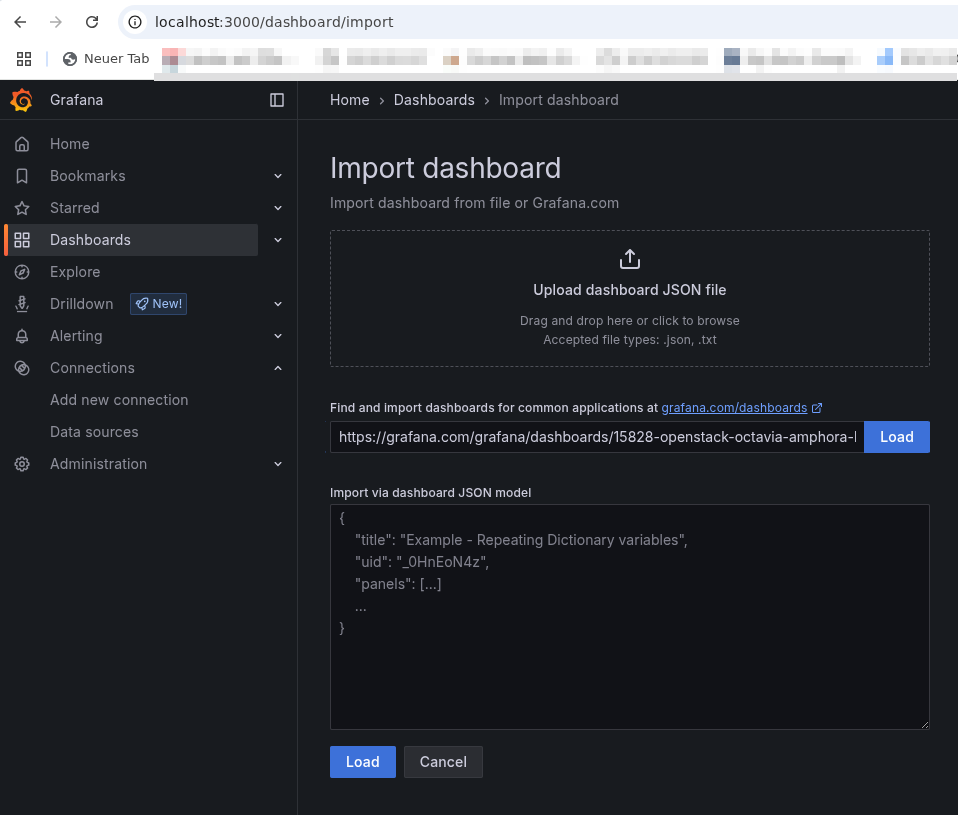
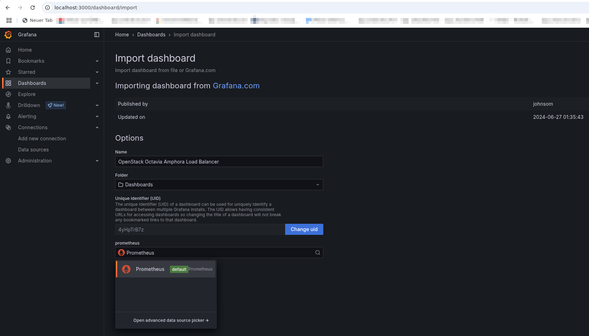
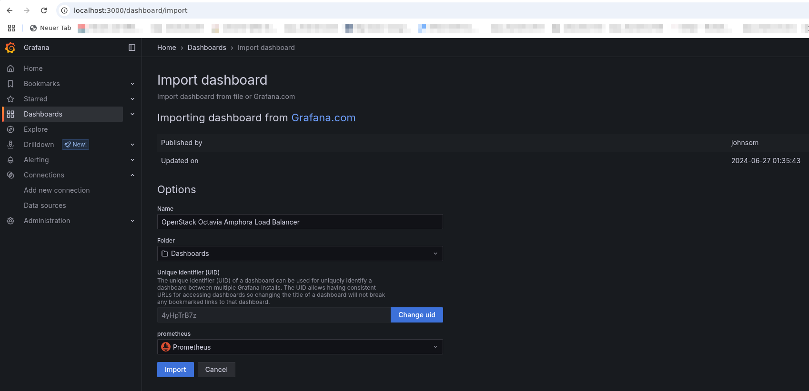
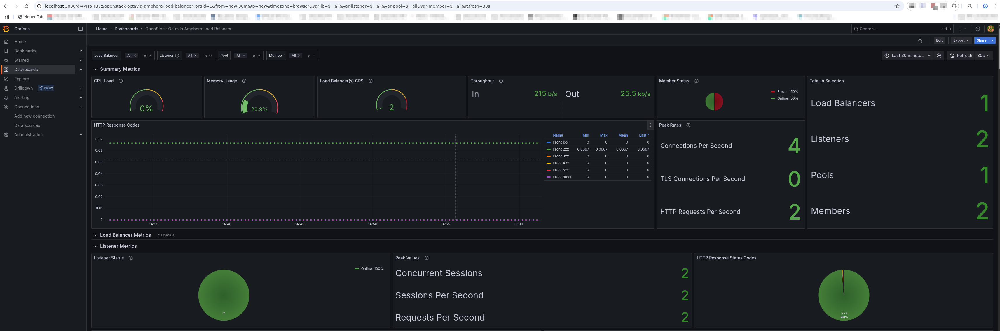

---
#https://gohugo.io/content-management/page-bundles/
title: "Loadbalancermetriken erfassen mit Prometheus"
type: "docs"
weight: 1
date: 2025-05-13
description: >
  Erfassen Sie die Leistungsdaten Ihres Loadbalancers in einer eigenen Prometheus-Instanz
---

## Überblick

Wenn Sie einen oder mehrere Loadbalancer (Octavia) in Ihren Projekten einsetzen, ist es sinnvoll deren Leistungsdaten z. B. mit Prometheus zu erfassen und dann z. B. mit Grafana zu visualisieren.

In diesem Tutorial wird eine Möglichkeit vorgestellt, dies zu realisieren.

## Voraussetzungen

Dieses Tutorial geht davon aus, dass Sie bereits über ein OpenStack Projekt in der pluscloud open verfügen, dass in diesem Projekt mindestens eine Instanz (z. B. mit Ubuntu) läuft, auf der auch bereits Docker installiert ist. Weiterhin sollte die Instanz bereits über eine Floating-IP und via SSH von Ihnen erreichbar sein. Zusätzlich ist es hilfreich, wenn Sie den OpenStack-Client installiert haben, um Ihre Umgebung zu verwalten.

## Loadbalancer erzeugen

Als erstes, wird der Loadbalancer und der Listener für Prometheus erzeugt:

    openstack loadbalancer create --name testlb --vip-subnet-id <Ihr-Subnetz-Name> --wait
    openstack loadbalancer listener create --name stats-listener --protocol PROMETHEUS --protocol-port 8088 testlb

Für "Ihr-Subnetz-Name" müssen Sie Ihr gewünschtes Subnetz einsetzen. Mit dem OpenStack-Client können Sie diese einfach listen:

    openstack subnet list

Nachdem der Loadbalancer erzeugt ist, sollten Sie die `vip_address` mit

    openstack loadbalancer list

ermitteln und für später merken. Das könnte z. B. so aussehen:

    openstack loadbalancer show -c vip_address testlb

Nachdem ein Loadbalancer mit dem entsprechenden Listener erstellt worden ist, werden jetzt noch die Werkzeuge erstellt, um die Metriken einzusammeln und zu visualisieren.

## Prometheus und Grafana via docker-compose bereitstellen

Speichern Sie dazu die folgende Konfigurationsdatei unter dem Namen `docker-compose.yml` auf Ihrer OpenStack-Instanz in einem eigenen Verzeichnis (z. B. `/data/prometheus-grafana/`) ab (die drei Striche gehören dazu!). 

    ---
     
    volumes:
      prometheus_data:
      grafana_data:
    
    services:
      prometheus:
        image: prom/prometheus
        container_name: prometheus
        restart: unless-stopped
        volumes:
          - ./prometheus/:/etc/prometheus/
          - prometheus_data:/prometheus
        ports:
          - 9090:9090
        command:
          - '--config.file=/etc/prometheus/prometheus.yaml'
          - '--storage.tsdb.path=/prometheus'
      grafana:
        image: grafana/grafana
        container_name: grafana
        restart: unless-stopped
        volumes:
          - grafana_data:/var/lib/grafana
        ports:
          - 3000:3000
        environment:
          - GF_SECURITY_ADMIN_USER=admin
          - GF_SECURITY_ADMIN_PASSWORD=S3cure!

Bitte setzen Sie Ihr eigenes Passwort für Grafana!

Erzeugen Sie danach auf der Instanz das Verzeichnis `/etc/prometheus`

    mkdir -p /etc/prometheus

und speichern Sie dort die folgende Konfigurationsdatei unter dem Namen `prometheus.yaml` ab.

    global:
      scrape_interval: 15s
      evaluation_interval: 15s
      scrape_timeout: 10s 

    scrape_configs:
    - job_name: 'Octavia LoadBAlancer'
      static_configs:
      - targets: ['LB_IP:8088']

Setzen Sie statt "LB_IP" dort bitte die IP-Adresse ein, die Sie vorher oben gespeichert hatten.

Danach können Sie Prometheus und Grafana mit dem Kommando

    /data/prometheus-grafana: docker compose up -d

starten. 

## Prometheus als Datasource für Grafana einrichten

Um die vom Loadbalancer erzeugten Metriken zu visualisieren, muß im Grafana zunächst Prometheus als Datenquelle eingetragen werden. Dazu können Sie das folgende Skript verwenden in dem Sie es z. B. unter `/data/prometheus-grafana/setup_grafana_datasource.sh` speichern, mit `chmod +x /data/prometheus-grafana/setup_grafana_datasource.sh` ausführbar machen und dann auch ausführen. Passen Sie vorher auf jeden Fall das Passwort auf das weiter oben ausgewählte an!

    #!/usr/bin/env bash
    
    GRAFANA_URL="http://localhost:3000"
    DASHBOARD_ID="15828"
    DATASOURCE_NAME="Prometheus"
    DATASOURCE_TYPE="prometheus"
    DATASOURCE_URL="http://prometheus:9090"
    ADMIN_USER="admin"
    ADMIN_PASSWORD="S3cure!"

    # install if not da: curl
    which curl &> /dev/null || sudo apt update && sudo apt install -y curl

    # Warte, bis Grafana verfügbar ist
    until $(curl --output /dev/null --silent --head --fail $GRAFANA_URL); do
        echo "Warte auf Grafana..."
        sleep 5
    done

    echo "Grafana verfügbar. Füge Datasource hinzu..."

    # Überprüfe, ob die Datasource bereits existiert
    if ! curl -s -u "$ADMIN_USER:$ADMIN_PASSWORD" "$GRAFANA_URL/api/datasources" | grep -q "\"name\":\"$DATASOURCE_NAME\""; then
        # Füge die Prometheus Datasource hinzu
        curl -s -X POST "$GRAFANA_URL/api/datasources" \
            -H "Content-Type: application/json" \
            -u "$ADMIN_USER:$ADMIN_PASSWORD" \
            -d "{
                \"name\": \"$DATASOURCE_NAME\",
                \"type\": \"$DATASOURCE_TYPE\",
                \"access\": \"proxy\",
                \"url\": \"$DATASOURCE_URL\",
                \"isDefault\": true,
	        \"uid\": \"$DASHBOARD_NAME\",
                \"jsonData\": {
                    \"timeInterval\": \"5s\"
                }
            }"
        echo "Datasource '$DATASOURCE_NAME' hinzugefügt."
    else
        echo "Datasource '$DATASOURCE_NAME' existiert bereits."
    fi
    echo "Datenquelle angelegt."

## Octavia Dashboard in Grafana importieren

Um auf die Grafana Weboberfläche zuzugreifen, müssen Sie zunächst mit ssh ein Port-Forwarding einrichten. Das funktioniert mit dem folgenden Kommando wobei Sie für "Floating-IP" die Floating-IP Adresse verwenden, die Sie der Instanz zugewiesen haben, auf der Sie eben per Docker Prometheus und Grafana gestartet haben.

    ssh <Floating-IP> -l ubuntu -L 3000:localhost:3000 -L 9090:localhost:9090

Danach sollten Sie in Ihrem lokalen Webbrowser unter der URL http://localhost:3000/ die Weboberfläche von Grafana aufrufen und sich mit dem User "admin" und dem von Ihnen vorher vergebenen Passwort dort einloggen können.

Ist das geschehen, sollten Sie das passende Dashboard importieren, um die vom Prometheus gesammelten Daten visualisieren zu können. Klicken Sie dazu links im Menü auf den Menüpunkt "Dashboards". Sie sollten ungefähr folgende Website sehen:

Nach dem Klick auf "Create Dashboard" kommt man zu einem Auswahlmenü, welches auch die Option "Import Dashboard" beinhaltet. Diese Option bitte per Klick auswählen:

Den aufpoppenden Requester bitte mit "Discard" schliessen:

Im Importmenü muss zunächst die URL für das zu importierende Dashboard eingegeben werden. In unserem Fall ist das

    https://grafana.com/grafana/dashboards/15828-openstack-octavia-amphora-load-balancer/

Diese mit Klick auf "Load" laden.

Im Importmenü muss jetzt die Datasource "Prometheus" ausgewählt werden:

Danach bitte mit "Import" das Dashboard importieren:

Danach sollte sich das gerade importierte Dashboard so oder ähnlich öffnen:

## Tipp

Wenn Sie planen diese Funktionen in einer Produktionsumgebung zu nutzen, sollten Sie die Option `--allowed-cidr` gefolgt von einem passenden Netzwerkbereich in CIDR-Notation bei der Erzeugung des Listeners verwenden damit dieser nur von den gewünschten IP-Netzen gepollt werden kann.

