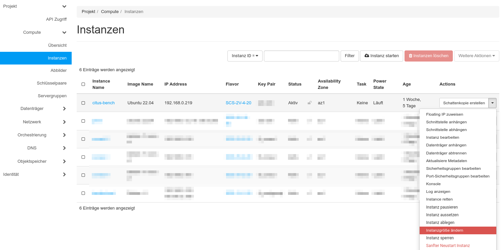
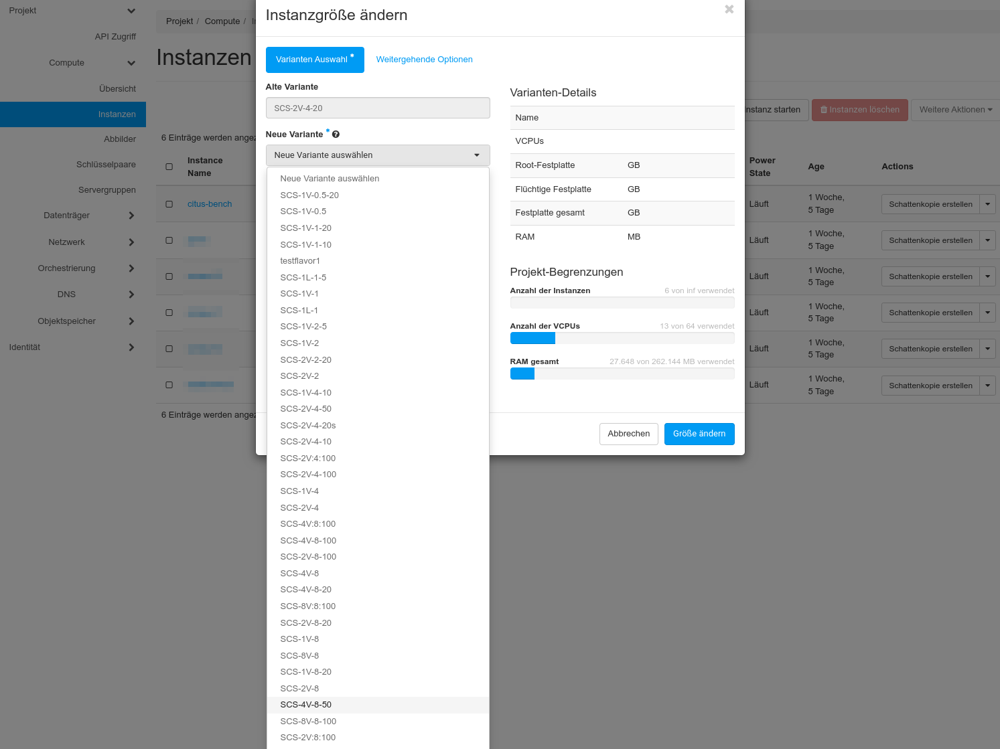
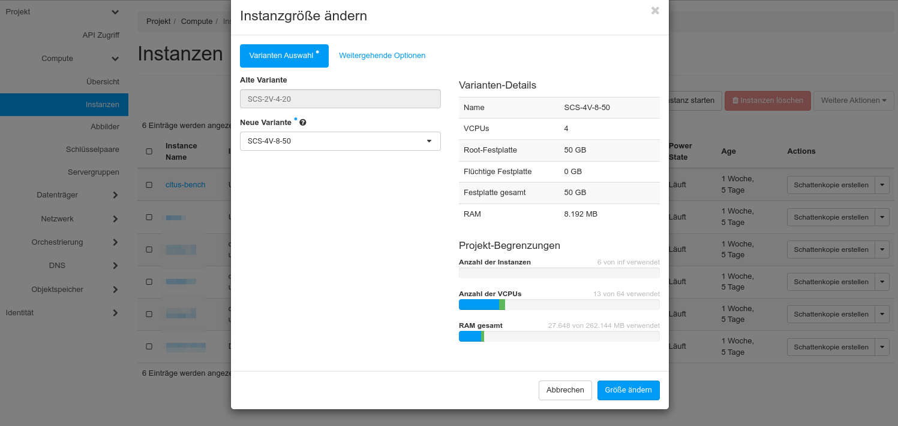
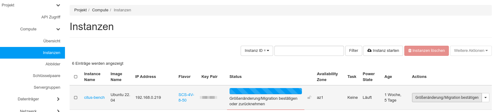

---
#https://gohugo.io/content-management/page-bundles/
title: "Instanzgröße ändern"
type: "docs"
weight: 1
date: 2024-07-30
description: >
  Ändern Sie die Dimensionen Ihrer VMs
---

## Überblick

Es kann vorkommen, dass die Änderung der CPU-, Memory- oder Storage-Ausstattung einer VM notwendig wird. Möglicherweise hat man sich bei der Erstellung der VM verschätzt oder man möchte die Leistung einer Applikation mit verschiedenen CPU- oder RAM-Ausstattungen ermitteln.
Anstatt die VM komplett neu zu erstellen zu müssen, kann stattdessen das Flavor geändert werden. Die Instanz wird gestoppt und mit dem neuen Flavor neu gestartet.
In der [Openstack-Dokumentation](https://docs.openstack.org/nova/latest//user/resize.html) finden sich weitere Hinweise.

## Instanzgröße ändern

Um die Instanzgröße zu ändern, wählen Sie die entsprechende Funktion im "**Actions**" Menü der Instanzübersicht aus:

Im Dialog, der sich danach öffnet, wählen Sie einfach ein neues Flavor für ihre VM aus:

Nach der Auswahl zeigt der Dialog die neu ausgewählten Parameter sowie die Auswirkungen auf das aktuelle Quota des Projektes an:

Mit Klick auf "**Größe ändern**" wird der neue Flavor auf die Instanz angewendet. Dazu wird die Instanz gestoppt und neu gestartet. Weiterhin muß die Größenänderung noch bestätigt werden.

Mit Klick auf "**Größenänderung/Migration bestätigen**" bestätigen Sie die Änderung. Mit "**Größenänderung/Migration zurücknehmen**" könnten Sie die Änderung auch hier wieder zurücknehmen.

Die VM steht Ihnen nach dem Start mit den neuen Parametern zur Verfügung.

---
**Hinweis**

Es ist nicht möglich, durch eine Größenanpassung die Storageklasse einer VM zu wechseln. Es ist also z. B. nicht möglich durch den Wechsel des Flavors von SCS-2V-4-20 auf SCS-2V-4-20s von Ceph-Storage nach Local-SSD Storage zu wechseln.

---