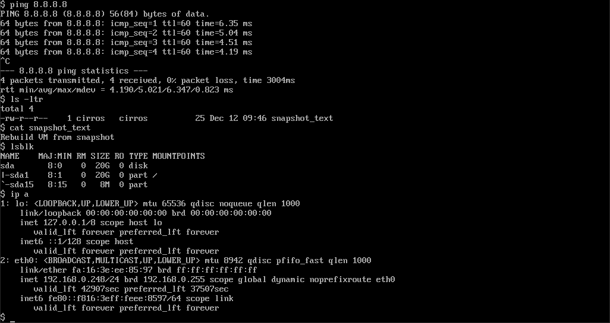
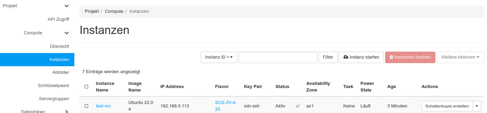
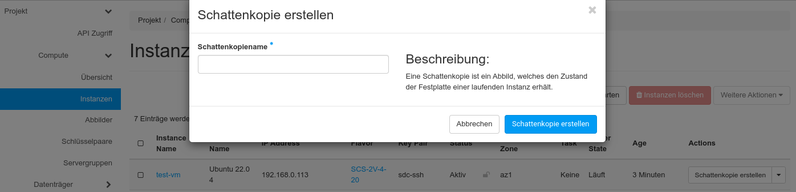
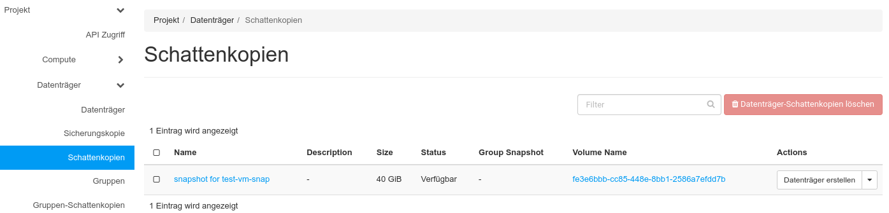
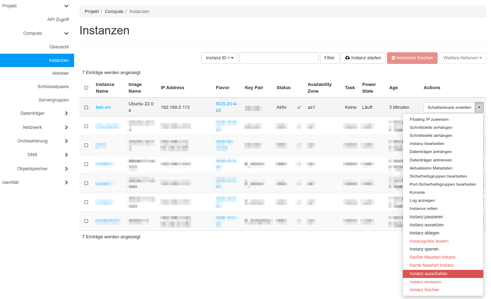
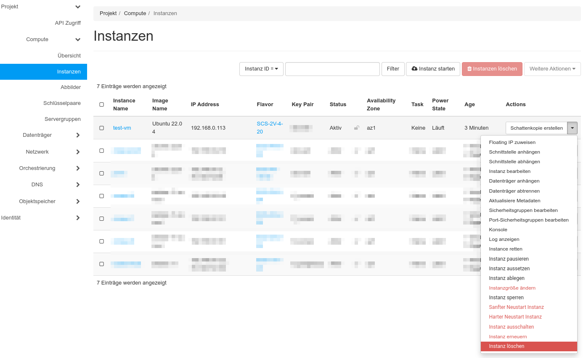
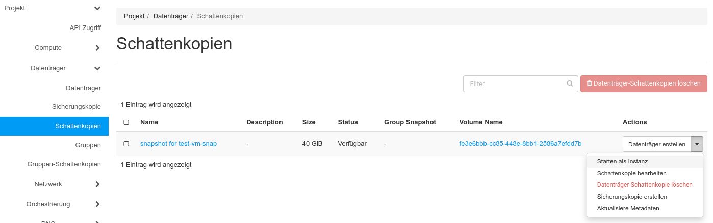
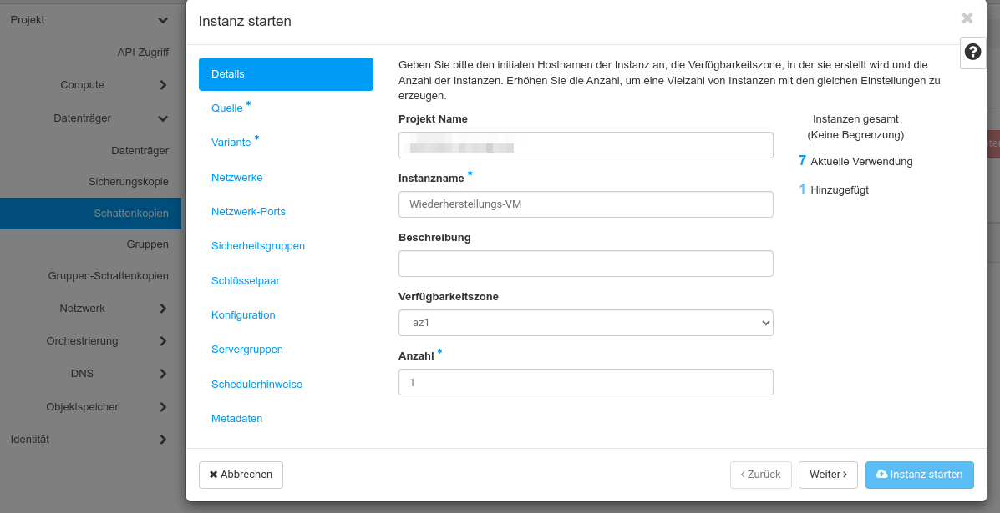
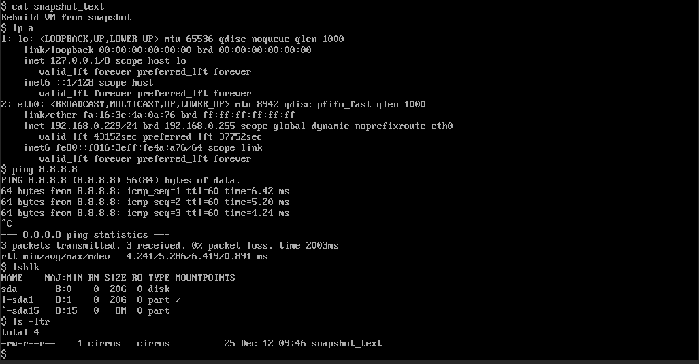

---
#https://gohugo.io/content-management/page-bundles/
title: "Eine Instanz aus einem Snapshot wiederherstellen"
type: "docs"
date: 2023-07-26
description: >
  Erzeugen Sie einen Snapshot Ihrer VM, löschen Sie die VM und stellen Sie sie wieder her
---

## Überblick

In diesem Tutorial erfahren Sie, wie Sie einen Snapshot von einer laufenden VM erzeugen, die VM löschen und sie danach aus dem Snapshot wiederhertellen. Vor und nach der Durchführung sollten Sie ein paar Tests zum Zustand der VM berücksichtigen. 

Hinweis: VMs bekommen nach dem Hochfahren automatisch eine neue IP-Adresse zugewiesen, wenn diese nicht vorher statisch zugewiesen worden ist. Die Floating IPs werden bei der Durchführeung von der VM getrennt, bleiben aber weiterhin dem Projekt zugeordnet und können nach der Wiederherstellung wieder der VM zugewiesen werden.  

## Vorbereitende Tests

Bitte prüfen (und notieren) Sie ggfs. folgende Punkte bevor Sie beginnen. Insbesondere wenn Sie sie für die komplette Wiederherstellung der VM benötigen. Je nach Funktion und Status der VM, könnten auch noch weitere Tests erforderlich sein.

* konfigurierte Netzwerke
* aktive Netzwerke
* angehängte Volumes
* Applikationsstatus

## Snapshot durchführen

Loggen Sie sich in die Weboberfläche der pluscloud open ein und suchen Sie die VM heraus, von der Sie einen Snapshot erzeugen wollen. Klicken Sie im "Actions" Menü auf "Schattenkopie erstellen" um den Snapshot-Dialog zu öffnen (Snapshots werden in den deutschen Menüs "Schattenkopien" genannt):

In dem Dialog, der sich öffnet, geben Sie dem neuen Snapshot einen Namen und klicken Sie auf "Schattenkopie erstellen":

Nachdem der Snapshot erzeugt worden ist, sollte er im Menü **Schattenkopien** sichtbar sein:

## VM löschen

Da Sie nun erfolgreich einen Snapshot Ihrer VM erzeugt haben, können Sie diese nun ausschalten... 

und dann löschen:

## VM aus einem Snapshot wiederherstellen

Um die VM aus einem Snapshot wiederherzustellen, wählen Sie "Starten als Instanz" aus dem **Actions**" Menü unter "**Schattenkopien**":

Dabei gehen Sie - wie beim Erstellen einer Instanz - durch das "Instanz starten" Menü und geben dabei die erforderlichen Informationen ein, um eine neue VM aus Ihrem Snapshot zu erzeugen:

Insbesondere sollten Sie als "Bootquelle" den Snapshot Ihrer VM auswählen.

## Nachbereitende Tests

Bitte überprüfen Sie, ob die Konfiguration Ihrer VM - besonders in den folgenden Punkten - wieder der der ursprünglichen VM entspricht:

* konfigurierte Netzwerke
* aktive Netzwerke
* angehängte Volumes
* Applikationsstatus

