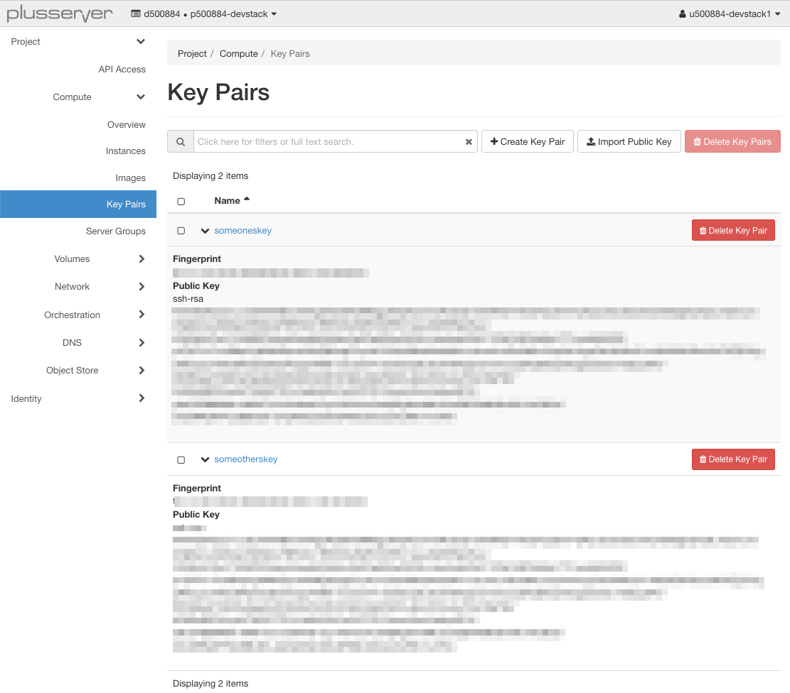

## Was ist Terraform?

Terraform ist ein Infrastruktur-als-Code-Tool, mit dem Sie Infrastrukturen sicher und effizient erstellen, ändern und versionieren können. Dazu gehören Low-Level-Komponenten wie Recheninstanzen, Speicher und Netzwerke sowie High-Level-Komponenten wie DNS-Einträge und SaaS-Funktionen.

[Ausführliche Dokumentation](https://developer.hashicorp.com/terraform/docs)

Terraform hat 2023 sein Lizenzmodell geändert wer unbedingt mit einer Open Source Lizenz arbeiten möchte muss den offiziellen Open Source Fork [OpenTofu](https://opentofu.org/) nutzen. Wir werden dazu in kürze ein gesondertes [OpenTofu Tutorial](../../opentofu/) bereitstellen.

## Basis Terraform Überblick

1. Erstelle eine Beschreibung deiner infrastruktur
Deine Infrastruktur beschreibst du bei Terraform mit der [HCL](https://developer.hashicorp.com/terraform/language/syntax/configuration). Daraus enstehen mehrere Dateien du du am besten wie folgt Organisierst

   * main.tf: In dieser Datei beschreibst du in der HCL syntax die zu installierenden provider und das backend was du benutzen möchtest.
   
      ```go
      terraform {
         required_providers {
            openstack = {
               source = "terraform-provider-openstack/openstack"
               version = ">= 1.54.1"
            }
         }
         backend "s3" {}
      }
      ```

      Hier wird beschrieben das der Openstack Provider in der Version größer, gleich 1.54.1 installiert werden soll.
      Zusätzlich wird definiert das für die Zustandsdateien von Terraform das s3 [Backend](../backend/) genutzt werden soll.

   * provider.tf: In dieser Datei beschreibst du die Konfiguration der einzelnen Provider

      ```go
      provider "openstack" {
         cloud = "openstack"
      }
      ```

      Es wird definiert das die cloud mit dem Namen: *openstack* aus der [clouds.yaml](/de/compute/pluscloudopen/introduction/environments/#anmeldeinformationen-für-cli-tools) benutzt werden soll.

   * resources.tf: In dieser Datei beschreibst du die einzelnen Ressourcen die angelegt werden sollen.

      ```go
      // Push keypairs
      resource "openstack_compute_keypair_v2" "keypairs" {
         for_each = var.ssh_pub_keys
         name = each.key
         public_key = each.value
      }
      ```

      Wir haben hier definiert das im Openstack eine Liste an public ssh keys hinterlegt wird. Diese keys können später zum Zugriff auf die Server/Instanzen benutzt werden

   * variables.tf: In dieser Datei beschreibst du die Variablen die in den anderen Datein verwendung finden.

      ```go
      // Push keypairs
      variable "ssh_pub_keys" {
         description = "key_name = ssh public key"
         type        = map(string)
         default     = {}
      }
      ```

      Hier beschreiben wir eine Variable in der wir festlegen das eine liste aus Key-Value-Paaren unsere ssh keys definiert.

   * terraform.tfvars: In dieser Datei definierst du den Inhalt der in variables.tf beschriebenen Variablen.

      ```go
      ssh_pub_keys = {
         someoneskey = "ssh-rsa AAAAB............JrLR8vT+oTM=",
         someotherskey = "ssh-rsa AAAAC............dfoe03Tfde+2="
      }
      ```

      In diesem Fall setzen wir nun zwei ssh keys in unsere variable.

2. Initialisiere das Terraform Arbeitsverzeichnis

   ```bash
   > terraform init
   ```

3. Plane deine Infrastruktur

   ```bash
   > terraform plan
   ```

4. Wende dein Terraform Code an

   ```bash
   > terraform apply
   ```

   Das Ergebnis sieht im Horizon dann wie folgt aus

   

5. Lösch deine Infrastruktur wieder

   ```bash
   > terraform destroy
   ```