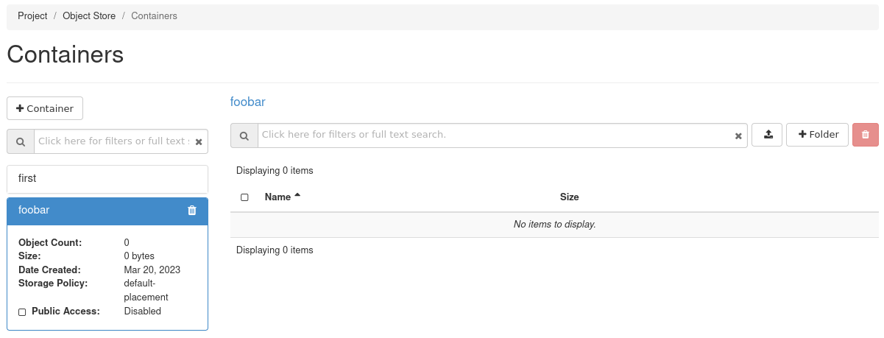

---
#https://gohugo.io/content-management/page-bundles/
title: "OpenStack Object Storage als Backend für Terraform Statefiles"
type: "docs"
date: 2023-03-14
description: >
  Verwalten Sie Ihre Infrastruktur "als Code" (IaC) mit Hashicorp Terraform und nutzen Sie OpenStack Object Storage als Backend
---

## Ihre S3-Zugangsdaten

Um Ihre S3-Zugangsdaten zu erhalten, müssen Sie Ihren OpenStackClient korrekt konfigurieren. Wenn das erledigt ist, können Sie folgenden Befehl eingeben:

``$ openstack ec2 credentials create``

Die Ausgabe dieses Befehls sollte in etwa so aussehen:

    +------------+-----------------------------------------------------------------------------------------------------------------------------------------------------+
    | Field      | Value                                                                                                                                               |
    +------------+-----------------------------------------------------------------------------------------------------------------------------------------------------+
    | access     | 5aen4quuuQu8ci7aoceeyaek8oodohgh                                                                                                                    |
    | links      | {'self': 'https://prod1.api.pco.get-cloud.io:5000/v3/users/poashohhe9eo8EeQuez3ochaeWaeBoiR/credentials/OS-EC2/5aen4quuuQu8ci7aoceeyaek8oodohgh'}   |
    | project_id | Eine8Jai4hohzieShoo1iem0yai7fair                                                                                                                    |
    | secret     | iek1aechaequa8pheitahNgeizai3eig                                                                                                                    |
    | trust_id   | None                                                                                                                                                |
    | user_id    | poashohhe9eo8EeQuez3ochaeWaeBoiR                                                                                                                    |
    +------------+-----------------------------------------------------------------------------------------------------------------------------------------------------+

Ihre Anmeldedaten sehen natürlich anders aus (die oben gezeigten sind verfremdet). Für den S3-Zugang sind nur die Werte "access" und "secret" relevant. 

## Erstellen eines Buckets

Wenn Sie Ihre S3-Zugangsdaten bereit haben, müssen Sie einen Speicherort für Ihre Daten erstellen. In der S3-Sprache wird dieser Ort als "Bucket" bezeichnet. Sie können einen Bucket entweder über die Web-UI (Horizon) oder über die Befehlszeile erstellen.

### Einen Bucket über die Web-UI erstellen

Wenn Sie in der Web-UI (Horizon) eingeloggt sind, können Sie im linken Menü zu "Object Store" navigieren und dann auf "Containers" (so werden die Buckets in Horizon genannt) klicken: . 
Klicken Sie auf die Schaltfläche "+Container" und geben Sie einen Namen für Ihren neuen Container ein. Wählen Sie eine Speicherrichtlinie und legen Sie fest, ob Ihr neuer Bucket öffentlich oder nur privat zugänglich sein soll (in den meisten Fällen privat). Klicken Sie auf "Erstellen", um den neuen Bucket zu erstellen. 

Der Bucket sollte sofort in der Container-Liste erscheinen:

### Einen Bucket mit AWS CLI erstellen 

Um einen Bucket in Ihrem Object Storage von der Kommandozeile aus zu erstellen, können Sie das Tool AWS CLI verwenden, das in einer virtuellen Python-Umgebung installiert sein sollte:

    $ → python3 -m venv awscli
    $ → . ./awscli/bin/activate
    $ → pip3 install awscli
    Collecting awscli
      Using cached awscli-1.27.93-py3-none-any.whl (4.0 MB)
    Collecting botocore==1.29.93
    [...]
    Installing collected packages: urllib3, jmespath, six, python-dateutil, botocore, colorama, docutils, s3transfer, pyasn1, rsa, PyYAML, awscli
    Successfully installed PyYAML-5.4.1 awscli-1.27.93 botocore-1.29.93 colorama-0.4.4 docutils-0.16 jmespath-1.0.1 pyasn1-0.4.8 python-dateutil-2.8.2 rsa-4.7.2 s3transfer-0.6.0 six-1.16.0 urllib3-1.26.15 

Mit dieser Konfiguration können Sie nun Ihren Bucket über die CLI erstellen: 

    (awscli) $ → aws configure --profile=prod1
    AWS Access Key ID [None]: 5aen4quuuQu8ci7aoceeyaek8oodohgh
    AWS Secret Access Key [Keine]: iek1aechaequa8pheitahNgeizai3eig
    Default region name [None]: 
    Default output format [None]: 
    (awscli) → $ 

Mit dieser Konfiguration können Sie nun Ihren Bucket über cli erstellen:

    (awscli) $ → aws --profile=prod1 --endpoint=https://prod1.api.pco.get-cloud.io:8080 s3api create-bucket --bucket mytfstate

Hashicorp empfiehlt, die Versionierung für den Bucket zu aktivieren, um versionierte Kopien Ihrer terraform.tfstate-Datei zu erstellen. Sie können die Versionierung für Ihren Bucket wie folgt aktivieren:

    (awscli) $ → aws --profile=prod1 --endpoint=https://prod1.api.pco.get-cloud.io:8080 s3api put-bucket-versioning --bucket mytfstate --versioning-configuration 
    (awscli) $ → aws --profile=prod1 --endpoint=https://prod1.api.pco.get-cloud.io:8080 s3api get-bucket-versioning --bucket mytfstate 
    {
    "Status": "Enabled",
    "MFADelete": "Disabled"
    }

## Einrichtung Terraform: Bucket als Backend für tfstate

Da sich nun ein Bucket im Object Storage befindet, kann Terraform so konfiguriert werden, dass es diesen als Backend für den Terraform-Status verwendet.
Bitte fügen Sie diesen Teil der Backend-Konfiguration in Ihren terraform-Code ein: 

    terraform {
      required_providers {
        openstack = {
        Quelle = "terraform-provider-openstack/openstack"
        }
      }
      required_version = ">= 0.13"
      
      backend "s3" {
         bucket = "mytfstate"
         key = "terraform.tfstate"
         region = "us-east-1" 
         endpoint = "prod1.api.pco.get-cloud.io:8080"
         skip_credentials_validation = true
         skip_region_validation = true
         force_path_style = true
      }
    
    }
Exportieren Sie nun Ihren Zugangsschlüssel und Ihren geheimen Schlüssel als Umgebungsvariablen (AWS_ACCESS_KEY_ID bzw. AWS_SECRET_ACCESS_KEY), um zu verhindern, dass diese auf Ihrer lokalen Festplatte gespeichert werden.

    export AWS_ACCESS_KEY_ID='5aen4quuuQu8ci7aoceeyaek8oodohgh'
    export AWS_SECRET_ACCESS_KEY='iek1aechaequa8pheitahNgeizai3eig'

Mit den exportierten Anmeldeinformationen können Sie nun Terraform wie folgt initialisieren:

    $ tform → terraform init
    
    Initializing the backend...
    
    Successfully configured the backend "s3"! Terraform will automatically
    use this backend unless the backend configuration changes.
    
    Initializing provider plugins...
    - Finding latest version of hashicorp/template...
    - Finding latest version of terraform-provider-openstack/openstack...
    - Installing terraform-provider-openstack/openstack v1.51.0...
    - Installed terraform-provider-openstack/openstack v1.51.0 (self-signed, key ID 4F80527A391BEFD2)
    - Installing hashicorp/template v2.2.0...
    - Installed hashicorp/template v2.2.0 (signed by HashiCorp)
    
    Partner and community providers are signed by their developers.
    If you'd like to know more about provider signing, you can read about it here:
    https://www.terraform.io/docs/cli/plugins/signing.html
    
    Terraform has created a lock file .terraform.lock.hcl to record the provider
    selections it made above. Include this file in your version control repository
    so that Terraform can guarantee to make the same selections by default when
    you run "terraform init" in the future.
    
    Terraform has been successfully initialized!
    
    Sie können nun mit Terraform arbeiten. Versuchen Sie "terraform plan" auszuführen, um zu sehen, welche Änderungen für Ihre Infrastruktur erforderlich sind. Alle Terraform-Befehle
    sollten jetzt funktionieren.
    
    Wenn Sie jemals Module oder die Backend-Konfiguration für Terraform eingestellt oder geändert haben,
    führen Sie diesen Befehl erneut aus, um Ihr Arbeitsverzeichnis neu zu initialisieren. Wenn Sie das vergessen, werden andere
    Befehle dies erkennen und Sie daran erinnern, dies zu tun, falls nötig.
