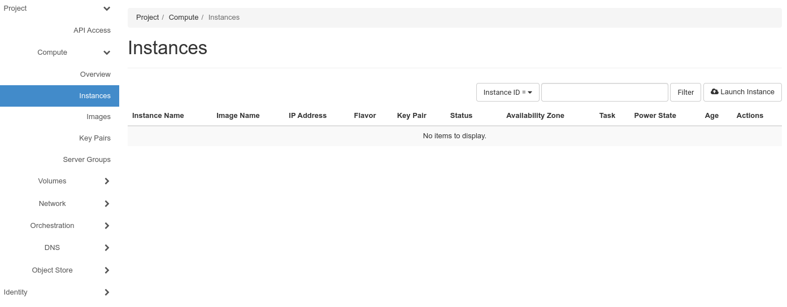
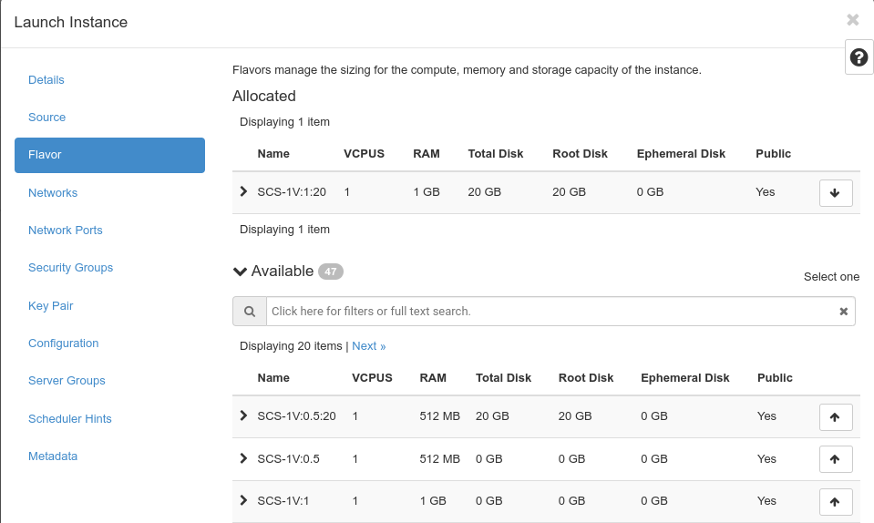
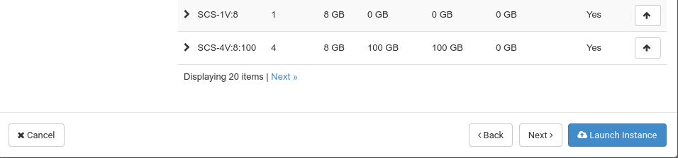
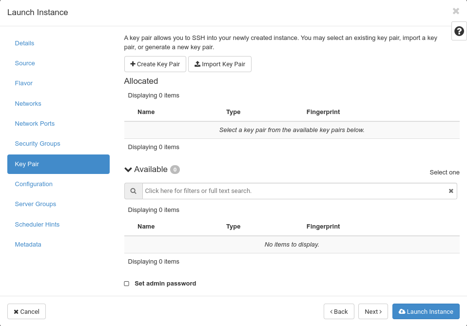
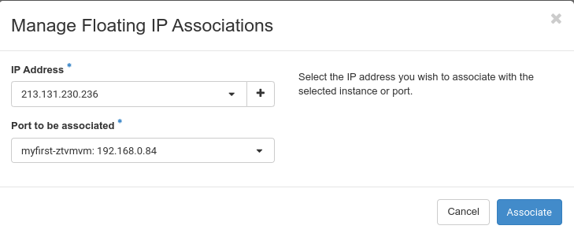

---
#https://gohugo.io/content-management/page-bundles/
title: "Von Null bis zum ersten Login in eine VM mit Horizon"
type: "docs"
date: 2023-03-20
description: >
  Bauen Sie sich Ihre erste VM in Horizon und melden Sie sich an
---

## Sie erhalten Ihre Anmeldedaten per E-Mail

Nachdem Sie eine Cloud in einer unserer Regionen bestellt haben, erhalten Sie eine E-Mail ähnlich der folgenden:

    Liebe Kundin, lieber Kunde,
    
    Ihre pluscloudopen d123456 ist nun verfügbar unter https://prod1.api.pco.get-cloud.io/
    Zugangsdaten:REGION=prod1
    DOMAIN_NAME=d123456
    PROJECT_NAME=p123456-ztvm
    USERNAME=u123456-projectadm
    PWX_LINK=https://pwx.psmanaged.com/link/agp4513256
    Mit freundlichen Grüßen,
    Ihr pluscloudopen Team.

Diese E-Mail enthält alle Informationen, die Sie benötigen, um sich zum ersten Mal mit pluscloud open zu verbinden.

Wenn Sie auf ``https://prod1.api.pco.get-cloud.io/`` klicken, öffnet sich ein neuer Tab in Ihrem Browser und Sie gelangen zum Login-Bildschirm von pluscloud open.

Nun können Sie die Informationen aus der E-Mail nutzen. Sie können Ihr "**Passwort**" erhalten, indem Sie auf den "PWX_LINK" klicken. Dies führt Sie zu einer Webseite mit einem weiteren Link, den Sie anklicken sollten, um das Passwort für den Benutzer zu erhalten. Damit umgehen wir Antiviren-Software, die Links in Ihren E-Mails verfolgt und einen Passwort-Link ungültig machen würde. 

Geben Sie den "USERNAME"-Wert aus der E-Mail in das Feld "**Benutzername**" ein, verwenden Sie das Passwort aus dem "PWX_LINK" für das Feld "**Passwort**" und versuchen Sie es mit dem "DOMAIN_NAME" für das Feld "**Domain**".

Klicken Sie auf "**Anmelden**" und Sie sollten in der Web-GUI von pluscloud angemeldet sein.

## Ihre erste Instanz

Um Ihre erste Instanz auf pluscloud open zu starten, klicken Sie auf "**Instanzen**". Das sollte Sie zum Menü "Instanzen" bringen

Wie Sie sehen können, sind derzeit noch keine Instanzen eingerichtet. Um Ihre erste Instanz zu starten, klicken Sie auf "**Instanz starten**" in der oberen rechten Ecke. 
Daraufhin öffnet sich ein Pop-up, das Sie durch alle erforderlichen Schritte zum Erstellen und Starten einer neuen Instanz führt.

Sternchen (*) markieren erforderliche Informationen, daher müssen Sie Ihrer ersten Instanz einen Namen geben. Geben Sie ihn in das Feld "**Instanzname**" ein und klicken Sie auf "Weiter".

Sie müssen das Bild "**Quelle**" Ihrer neuen Instanz aus der Liste der Bilder auswählen.

Wählen Sie das Image "**Ubuntu 22.04**" aus, indem Sie auf den kleinen Pfeil nach oben am Ende der Zeile klicken. Sobald Sie geklickt haben, wird das Image nun unter "Allocated" aufgelistet

Scrollen Sie bis zum Ende der Liste und klicken Sie erneut auf "Weiter".

Sie befinden sich nun im Menü "**Flavor**", wo Sie einen Flavor für die Größe Ihrer neuen Instanz auswählen müssen. Wählen Sie die Variante "**SCS-1V:1:20**", indem Sie auf den kleinen Pfeil nach oben am Ende der Zeile klicken.

Der gewählte Flavor sollte nun unter "Allocated" aufgelistet sein

Wie Sie sehen können, ist die Schaltfläche "**Instanz starten**" nun aktiviert worden.

Bevor Sie jedoch die Instanz starten, klicken Sie bitte zuerst auf "**Key Pair**", was Sie zum Schlüsselpaar-Menü bringt.

Um sich nach dem Start der neuen Instanz über ssh anmelden zu können, benötigen Sie ein ssh-Schlüsselpaar (öffentlich/privat). Klicken Sie auf "Schlüsselpaar erstellen".

Benennen Sie Ihren neuen Schlüssel, indem Sie einen Namen in "**Schlüsselpaar-Name**" eingeben und "SSH-Schlüssel" als "**Schlüsseltyp**" wählen, dann klicken Sie auf "Schlüsselpaar erstellen"

Es erscheint ein neues Feld, das den "**Privaten Schlüssel**" des neu erzeugten Schlüsselpaares anzeigt. Klicken Sie auf "**Privaten Schlüssel in die Zwischenablage kopieren**", öffnen Sie Ihren bevorzugten Texteditor, fügen Sie den privaten Schlüssel aus der Zwischenablage in diesen ein und speichern Sie ihn auf Ihrer lokalen Festplatte. Auf einem Linux-System würden Sie wahrscheinlich den Vi-Editor öffnen, den Schlüssel in diesen einfügen und die neue Datei in Ihrem Home-Verzeichnis speichern. Auf einem Windows-System würden Sie wahrscheinlich Ultraedit verwenden und die neue Datei ebenfalls in Ihrem Home-Verzeichnis speichern.

Nachdem Sie den privaten Schlüssel auf Ihrer Festplatte gespeichert haben, klicken Sie auf "Done". Der neue Schlüssel sollte nun unter "Allocated" aufgelistet sein

Starten Sie nun die Instanz, indem Sie auf "**Instanz starten**" klicken. Das Menü "**Instanzen**" öffnet sich und zeigt die neu erstellte Instanz an.

Da Sie sich bei Ihrer neuen Instanz anmelden möchten, müssen Sie ihr eine öffentliche IP-Adresse zuweisen. Klicken Sie dazu auf den kleinen Pfeil nach unten unter dem Menü "**Aktionen**".

Wählen Sie "**Associate Floating IP**", wodurch sich der entsprechende Dialog öffnet

Da Sie bisher noch keine freie IP-Adresse zugewiesen haben, müssen Sie auf das kleine "+" im Feld "**IP-Adresse**" klicken, um eine IP-Adresse zuzuweisen.

Lassen Sie das Menü "**Pool**" unangetastet und geben Sie eine "**Beschreibung**" in das entsprechende Feld ein. Klicken Sie dann auf "**IP zuweisen**".

Da Sie eine Floating IP-Adresse alloziert haben, können Sie nun auf "**Zuordnen**" klicken, um sie mit Ihrer neuen Instanz zu verknüpfen.

Im Menü "**Instanzen**" sollte nun Ihre neu erstellte Instanz mit der soeben zugewiesenen, öffentlichen IP-Adresse angezeigt werden. Nun sollten Sie in der Lage sein, sich mit dieser neuen Instanz zu verbinden, indem Sie den privaten ssh-Schlüssel verwenden, den wir zuvor erstellt haben.
Auf einem Linux-System würden Sie wahrscheinlich zuerst die Berechtigungen der privaten Schlüsseldatei anpassen, die Sie zuvor gespeichert haben

    $ chmod 0600 /var/tmp/id.rsa.priv

Andernfalls würden Sie beim Versuch, den Schlüssel zu verwenden, eine Fehlermeldung über `schlechte Berechtigungen` erhalten. Nachdem Sie die Berechtigungen angepasst haben, sollten Sie in der Lage sein, sich einzuloggen

 $ ssh -l ubuntu -i /var/tmp/id.rsa.priv 213.131.230.236
    Welcome to Ubuntu 22.04.2 LTS (GNU/Linux 5.15.0-67-generic x86_64)
    
     * Documentation:  https://help.ubuntu.com
     * Management:     https://landscape.canonical.com
     * Support:        https://ubuntu.com/advantage
    
      System information as of Mon Apr 24 14:56:26 UTC 2023
    
      System load:  0.1357421875      Processes:             92
      Usage of /:   7.5% of 19.20GB   Users logged in:       0
      Memory usage: 19%               IPv4 address for ens3: 192.168.0.84
      Swap usage:   0%
    
     * Introducing Expanded Security Maintenance for Applications.
       Receive updates to over 25,000 software packages with your
       Ubuntu Pro subscription. Free for personal use.
    
         https://ubuntu.com/pro
    
    Expanded Security Maintenance for Applications is not enabled.
    
    0 updates can be applied immediately.
    
    Enable ESM Apps to receive additional future security updates.
    See https://ubuntu.com/esm or run: sudo pro status
       
    
    The list of available updates is more than a week old.
    To check for new updates run: sudo apt update
    
    
    The programs included with the Ubuntu system are free software;
    the exact distribution terms for each program are described in the
    individual files in /usr/share/doc/*/copyright.
    
    Ubuntu comes with ABSOLUTELY NO WARRANTY, to the extent permitted by
    applicable law.
    
    To run a command as administrator (user "root"), use "sudo <command>".
    See "man sudo_root" for details.
    
    ubuntu@myfirst-ztvmvm:~$   

Herzlichen Glückwunsch! Sie haben gerade Ihre erste Instanz auf pluscloud open erstellt und sich über ssh angemeldet.