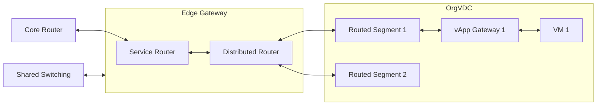

Bei der pluscloud VMware gibt es verschiedene Systeme, welche Routing-Aufgaben übernehmen:

## Core Router

Bei den Core Routern handelt es sich um hochperformante physikalische Routersysteme welche an jedem plusserver RZ-Standort
(vgl. []()) redundant vorhanden sind.
Sie stellen die Verbindung zwischen den Rechenzentren und dem Internet her, wofür diverse Peerings mit Kommunikationsdienstleistern bestehen.

Die Core Router gehören nicht exklusiv zur pluscloud VMware sondern sind Teil der Netzwerkinfrastruktur von plusserver.

## Edge Gateway

Ein Edge Gateway dient zur Verbindung zwischen Org Netzwerken und Externen Netzwerken (vgl. []()).

Je OrgVDC wird ein Edge Gateway provisioniert.
Dieses besteht aus einem Service Router und einem Distributed Router.

### Service Router

Der Service Router beinhaltet alle nicht verteilten Dienste des Edge Gateways.
Hierzu gehören insbesondere:

* eine Gateway Firewall
* eine NAT-Engine für SNAT und DNAT
* eine DHCP Server
* eine VPN Gateway
* eine IPAM für die Verwaltung von IP Adressen

### Distributed Router

Der Distributed Router ist ein auf alle Virtualisierungshosts verteilter Dienst des Edge Gateways.
Er bedient alle statischen und dynamischen Routen innerhalb der pluscloud VMware Umgebung.

{}
**Datenpfad bei Distributed Routing**  
Wenn eine Verbindung bereits über den Distributed Router realisiert werden kann, wird der Datenverkehr nicht über den Service Router geführt.
Die dort laufenden Dienste, ausdrücklich einschließlich der Gateway Firewall, werden also übergangen, da der Datenverkehr diese nicht passiert.

Aus diesem Grund können Sie die Gateway Firewall nicht einsetzen, um verschiedene Segmente voneinander zu trennen.
{}

## vApp Gateway

Ein vApp Gateway dient zur Verbindung zwischen vApp Netzwerken und Org Netzwerken (vgl. []()).

Es kommt nur dann zum Einsatz, wenn ein vApp Netz geroutet mit einem Org Netz verbunden wird.
Bei einem direkt verbundenen vApp Netz wird kein Gateway als Routinginstanz benötigt, da das Netzsegment unverändert durchgereicht wird.
Bei einem isolierten vApp Netz wird kein Gateway benötigt, weil keine Verbindung mit einem anderen Netz zu Stande kommt.

Die Funktionalitäten des vApp Gateways hinsichtlich NAT und Firewall beschränken sich auf ein Minimum.
