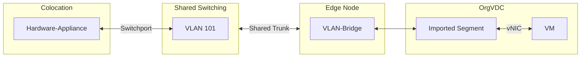

Bei der pluscloud VMware besteht die Möglichkeit ein  in Form eines virtuellen Netzwerksegments einzubinden.
Dies Ermöglicht es, ein Hardware-System in die virtuelle Infrastruktur zu integrieren.
Auf diese Weise können Sie beispielsweise eine Hardware-Appliance oder einen Hardware-Server in eine sonst virtuelle Infrastruktur einbinden und diese nach und nach migrieren oder parallel betreiben.

Wir empfehlen, diese Option restriktiv einzusetzen.
Verwenden Sie bevorzugt eine Konnektivität auf   Schicht 3 (Vermittlungsschicht / -Ebene) anzustreben.

{}
**Kein Self-Service möglich**  
Die Einrichtung von VLAN Bridging kann derzeit nur durch Mitarbeiter von plusserver erfolgen.  
Wenden Sie sich bitte an die Ihnen bekannten Supportkanäle.
{}

## Technische Umsetzung

Die Netzwerkvirtualisierung der pluscloud VMware erfolgt mit NSX-T.
Dieses setzt auf Enkapsulierung der Netzwerkkommunikation.
Beim Übergang von der physikalischen Infrastruktur in die virtualisierte Welt müssen daher die Frames des -Segments ebenfalls enkapsuliert werden.
Hierzu wird auf einer Edge Node eine -Brücke eingerichtet, welche das Ver- und Entpacken der Frames vornimmt.

Die nachfolgende Grafik zeigt -Bridging am Beispiel einer Hardware-Appliance:

Eine Hardware-Appliance im Colocation-Bereich des Rechenzetrums wird über einen Switchport mit der Shared Switching Infrastruktur verbunden.
Für diese Verbindung wird ein  konfiguriert, welches hier beispielsweise die - 101 erhält.

Die Shared Switching Infrastruktur ist mit so genannten Edge Nodes verbunden, welche Teil der pluscloud VMware sind.
Es handelt sich um dedizierte Server, welche die Kommunikation zwischen der Cloudinfrastruktur und den Systemen außerhalb der Cloud handhaben.
Auf diesen Servern wird kein Kundenworkload ausgeführt.
Stattdessen werden hier neben Routing-Instanzen und Gateways auch -Bridges betrieben.

Für jedes einzubindende  wird eine eigene -Bridge konfiguriert.
Diese kann man sich als Switch vorstellen, welcher mit einem Port an das anzubindende  angeschlossen ist und dessen anderer Port mit dem virtuellen Segment verbunden ist.

Das VLAN steht dann innerhalb eines s als Importiertes Segement zur Verfügung. An dieses Segment können nun virtuelle Netzwerkinterfaces (s) angeschlossen werden.

## Performance

Das -Bridging wird auf Best-Effort Basis angeboten.
Das bedeutet, dass es für diesen Dienst keine Zusicherung bestimmter Verfügbarkeiten, Bandbreiten oder Latenzen gibt.
Die hier aufgeführten Werte sind daher lediglich zur Orientierung geeignet und können kurz- oder längerfristig auch über- bzw. unterschritten werden.

| Wert                | Grenze                                                          |
|---------------------|-----------------------------------------------------------------|
| Latenz              | typischerweise 700µs bis 2000µs mit Spitzenwerten bis zu 5000µs |
| RTT VM zu Hardware  | typischerweise 1ms bis 5ms, mit Spitzenwerten bis zu 10ms       |
| Bandbreite          | maximal 1000 Mbit/sec                                           |
