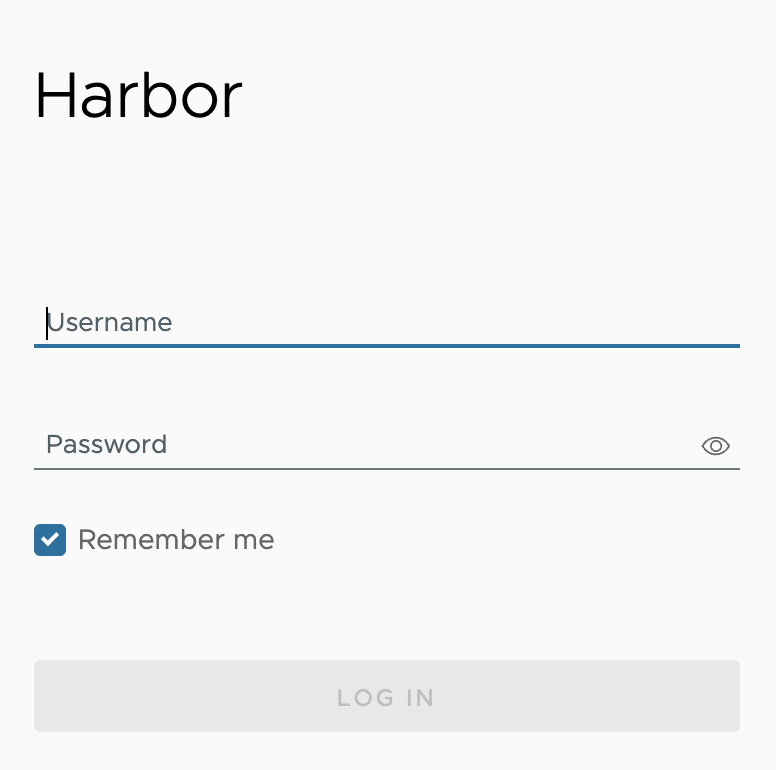

### Hinweis

Im folgenden werden zwei Demo-Instanzen (Nodes) von der Harbor Private Registry verwendet. Für die Replikation von 2 Harbor Private Registry Instanzen, benötigt man zuvor die beiden Registrys mit den entsprechenden Zugängen.

Für dieses Bespiel gehen wir von folgenden Instanzen aus:

- node-6479baa42aa93122c93cb3bc.ps-xaas.io
- node-67077b8f576fd34a91ee556c.ps-xaas.io

### Allgemein

Zur Einrichtung der Replikation unter Harbor hat man zwei Methoden zur Wahl: Pull und Push.

- Pull: Daten werden zur Replikation von einer zweiten Harbor Instanz "gezogen", also eine eingehende Replikation
- Push  Daten werden von einer Harbor Instanz Daten zu einer zweiten Harbor Instanz "geschoben"

Was man von diesen Methoden man wählt, ist Abhänging vom Netzwerk-Design und dem eigentlichen Zweck der Replikation.

In diesem Beispiel gehen wir von "Push-based" und einem Bereits existierenden (und nicht leeren) Repository auf einer Seite aus, von der "gepusht" werden soll, also ein Push von node-6479baa42aa93122c93cb3bc.ps-xaas.io nach node-67077b8f576fd34a91ee556c.ps-xaas.io.

### Einrichtung eines Robot Accounts

Zunächst muss man einen sogenannten Robot-Account einrichten auf der gegenüberliegenden Seite, also auf node-67077b8f576fd34a91ee556c.ps-xaas.io. Dieser dient dazu, das sich die Quell-Instanz, von der die Daten auf die Ziel-Instanz geschoben werden, dort anmelden und Repositories dort "pullen" und "pushen" darf.

Hierzu meldet man sich bei dem Harbor Web-Interface der "Ziel-Instanz" mit dem entsprechenden Admin-Zugang an.

Dazu geht man auf das entsprechende Projekt (neu Anlegen parallel zur Ursprungs-Instanz falls noch nicht vorhanden) unter "Projects" und wählt dort dann den Reiter "Robot Accounts" aus.

Hier wählt man "+ New Robot Account", gibt dem Konto einen Namen, eine kurze Beschreibung und ein Ablaufdatum. Wenn das Konto dauerhaft aktiv sein soll, würde man hier "Never" auswählen. Bei Permissions wählt man unter Repository "Push" und "Pull".

Wenn man die Erstellung des Kontos abschließt, bekommt man folgende Infos genannt: Name und Secret. Beides kopieren und bestenfalls "Export to File" zur Archivierung klicken. Wichtig, diese Informationen werden nur einmal angezeigt. Falls man die Daten verliert, muss dieser gelöscht und neu angelegt werden.

### Einrichtung eines neuen Endpunktes auf der Quell-Seite

Gewappnet mit diesen Informationen, kann man der Harbor Push-Instanz die Ziel Instanz bekannt machen.

Hierzu meldet man sich bei dem Harbor Web-Interface der "Push-Instanz" (die mit dem bereits existierenden Repository) mit dem entsprechenden Admin-Account an.

Dort geht man dann auf "Registries" und klickt auf "+ New Endpoint".

Hier gibt es eine ganze Reihe an Providern, aber für unseren Fall, wo es um die Replikation zwischen zwei Harbor Instanzen geht, wird hier als Provider "harbor" ausgewählt.

Dann gibt man dem Endpoint noch einen Namen, z.b. den eigentlich Node Namen der Ziel-Instanz, in unserem Fall die "node-67077b8f576fd34a91ee556c.ps-xaas.io" und gibt optional noch eine kurze Beschreibung ein. Bei Endpoint URL gibt man dann für unser Beispiel "<https://node-67077b8f576fd34a91ee556c.ps-xaas.io>" an und bei Access ID und Secret die Daten des zuvor auf der anderen Node angelegten Robot-Accounts.

Dann klickt man auf "Test Connection" und wenn die Firewallfreischaltung erfolgt und alle Eingaben korrekt durchgeführt wurden, dann ist dieser Test erfolgreich und man kann mit "OK" das Fenster wieder schließen.

Nun sind alle Voraussetzungen erfüllt die eigentliche Replikation einzurichten.

### Einrichtung der Replikation

Dazu geht man in dem Menü links auf "Administration -> Replications"

Dort geht man auf "New Replication Rule", gibt der Regel unter "Name" einen sinnvollen Namen, der einem direkt zeigt, um was es sich hierbei genau handelt. In diesem Beispiel ist der Name nur "rule", was für den produktiven Einsatz absolut nicht geeignet ist.

Unter "Description" beschreibt man am besten nochmal kurz und bündig, für was diese Replikation gedacht ist und bei "Replication mode" wählt man die entsprechende Methode (siehe oben). In diesem Beispiel ist es "Push-based", also eine ausgehende Replikation zu der anderen Node.

Unter "Source resource filter" kann man gezielt definieren was alles repliziert werden soll. Dies kann man wie folgt:

• Name: Repliziere Ressourcen mit einem bestimmten Image-Namen oder nur eines Teils des Namens.
• Tag: repliziere Ressourcen nur mit einem bestimmten Tag oder nur eines Teils des Tags.
• Label: Repliziere nur Ressourcen mit einem besimmten Label. Diese stehen in einer Dropdown-Liste zur Verfügung, falls diese zuvor gesetzt wurden.
• Resource:  Repliziere nur Images, Charts oder beides

Für eine genaue Beschreibung der möglichen Filter bitte die offizielle Anleitung (siehe unten) befolgen.

Danach wählt man unter "Destination Registry" den zuvor konfigurierten Endpoint aus, in unserem Fall die "node-67077b8f576fd34a91ee556c.ps-xaas.io" und wenn man das möchte/benötigt unter "Destination namespace" einen gesonderten Namespace, wo die Replikation hin erfolgen soll. In unserem Beispiel lassen wir das leer.

Unter "Trigger Mode" hat man die Auswahl zwischen folgenden Optionen:

• Manual: Resourcen nur händisch replizieren. Lösch-Operationen werden hier nicht repliert.
• Scheduled: Periodische Replikation nach einem zuvor definierten Zeitplans. Lösch-Operationen werden hier nicht repliert.
• Event Based: Nur eine Replizierung ausführen, wenn bestimmte zuvor definierte Ereignesse eintreten. Hier erfolgt auch eine Lösch-Operation, wenn entsprechend konfiguriert.

Für eine genaue Beschreibung der möglichen Optionen bitte die offizielle Anleitung (siehe unten) befolgen.

In unserem Beispiel wählen wir "Scheduled" und geben einen Zeitplan an. Dieser wird verwirrenderweise ähnlich wie ein Cron-Job definiert, hat aber indirekt ein paar Optionen mehr. Genauer details findet man hier, wenn man rechts neben dem Eingabefeld auf das (i) mit der Maus geht.

Allgemein macht es nicht viel Sinn das es da nun noch eine Angabe von "Sekunden" sls erstes Feld gibt, denn das erste Feld, also die Sekunden MUSS 0 sein und das zweite, Minuten, darf nicht 0 sein. Daher hätte man das im Grunde auch einfach weglassen können. Aber es ist wie es ist.

Des weiteren hat man noch die Möglichkeit die genutzt Bandbreite zu limitieren und mittels dem "Override" ob man auf der Zielseite gleich heissende Resourcen einfach überschreiben soll/darf. Auch kann man einstellen, ob der Kopier-Job auch "by Chunk" erfolgen soll, also in kleinere Teile "zerhackt", was aber unter Umständen höhere Last auf die API erzeugen kann.

Wenn man die Regel direkt aktiv haben möchte, setzt man einen Haken bei "Enable Rule" und sichert die Einstellung via Save.

Nun kann man entweder warten, bis der Zeitplan ausgeführt wird und dann unter "Replications" die angelegte Replikation anhaken und unten unter "Executions" die Ausführung überprüfen oder, wenn man die Replizierung direkt ausführen will,  ebenfalls selbige auswählen und oben rechts neben "New Replication Rule" auf "Replicate" klicken. Dessen Ausführung kann man dann ebenfalls unter "Executions" beobachten.

Ist die Replizierung erfolgreich verlaufen, sieht man nun auf der Ziel-Seite die replizierten Objekte.

Offizielle Anleitung unter: <https://goharbor.io/docs/1.10/administration/configuring-replication/>
