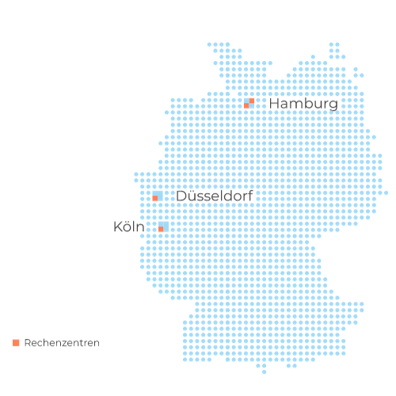

plusserver bietet mehrere Regionen und Availability Zones (AZs) an, um Kunden Hochverfügbarkeits- und Disaster-Recovery-Optionen zu bieten. 

## Was ist eine Region?

Eine Region ist ein geografisches Gebiet, das aus mehreren isolierten und physisch getrennten, also redundanten AZs besteht. Die Entfernung zwischen den Regionen ist >=300km.

## Was ist eine Availability Zone (AZ)?

Eine Availability Zone (AZ) ist ein Standort innerhalb einer Region, der aus einem oder mehreren Rechenzentren besteht, die so konzipiert sind, dass sie voneinander unabhängig sind und im Falle von Ausfällen oder Katastrophen Redundanz bieten.

### Anforderungen

* Rechenzentren mit mindestens einer gemeinsamen Strom-, Netzwerk- und Kühlungsversorgung.
* Ein AZ ist immer unabhängig von einer anderen, insbesondere in den Bereichen Strom (Einspeisung, Verteilung, USV, Notstrom), Netzwerk (Einspeisung, Router, Switches), Kühlung und Gebäude).
* Die Netzwerk Latenzzeit zwischen den AZs innerhalb derselben Region beträgt <=2ms.

## plusserver Regionen und Availability Zonen

In der folgenden Tabelle sind die von plusserver angebotenen Regionen und AZs aufgeführt

| Region   | Availability Zone | Standort            |
|----------|-------------------|---------------------|
| DE-NORTH | DE-NORTH-1        | Hamburg, Deutschland    |
|          | DE-NORTH-2        | Hamburg, Deutschland    |
| DE-WEST  | DE-WEST-1         | Köln, Deutschland    |
|          | DE-WEST-2         | Düsseldorf, Deutschland |

### Standorte und Rechenzentren

