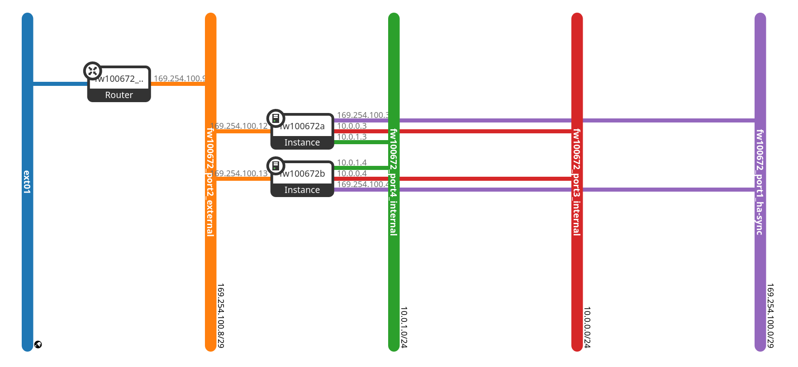
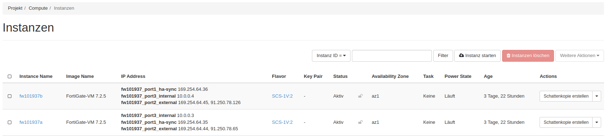
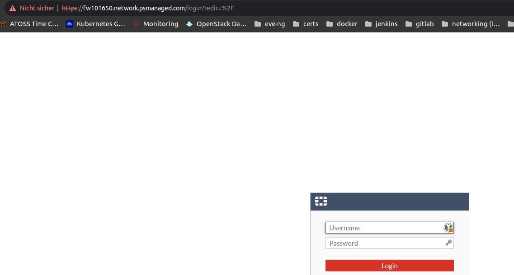
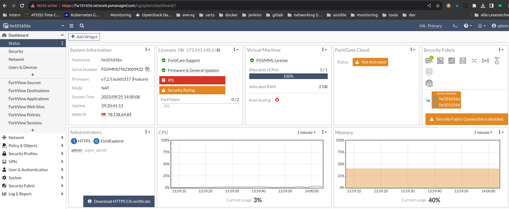
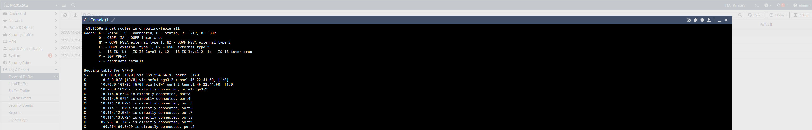
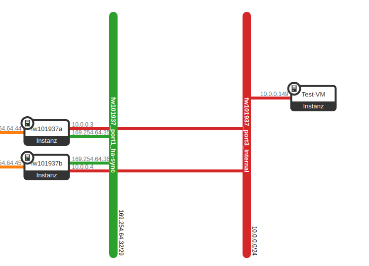

## Erste Schritte mit Ihrer Virtual Cloud Firewall

### Bereitstellung der virtuellen Maschinen (VM)

Der gesamte Bereitstellungsprozess ist automatisiert und Sie bekommen nach erfolgreichem Abschluss, die entsprechenden Zugangsdaten. Damit können Sie dann sofort auf Ihre Virtual Cloud Firewall zugreifen.

Die beiden Firewalls werden in einem parallelen Service Projekt auf der pluscloud open bereitgestellt. In Ihrem Mandanten können Sie nur den Teil mit den "*_internal"-Netzwerken sehen.


Ihr Cluster bzw. die virtuellen Maschinen haben den Präfix **fw** und sind nach dem Bereitstellungprozess über die angegebene öffentliche IP-Adresse von extern erreichbar.

Hier noch einmal die Ansicht der Instanzen, die für Sie bereitgestellt werden. Auch diese sind auf Grund der Bereitstellung im parallelen Service Projekt für Sie nicht einsehbar. Die Grafik dient nur der Übersicht.


Weitere Informationen zum Umgang mit Ihrer pluscloud open-Instanz, finden Sie unter folgendem Link:
[pluscloud open](https://docs.plusserver.com/de/compute/pluscloudopen/)

### Erste Anmeldung

Die Zustellung der Zugangsdaten erfolgt via E-Mail über unser Passwort-Tool: pwx. In der entsprechenden E-Mail finden Sie die notwendigen Information bzw. Anweisungen für die Anmeldung.

Sie können auf Ihre Virtual Cloud Firewall über folgende Protokolle zugreifen:

* HTTPS (TCP/443)
* SSH (TCP/22)

Hier ein entsprechendes Beispiel einer Anmeldemaske:


#### Hinweis zum SSL-Zertifikat

Sie sollten das SSL-Zertifikat gegen ein (gültiges) öffentliches Zertifikat austauschen. Hierzu können Sie ebenso den eingebauten ACME-Mechanismus nutzen, der ein entsprechendes Zertifikat ausstellt.

Weitere Information finden Sie hier:
[ACME certificate support](https://docs.fortinet.com/document/fortigate/7.0.0/new-features/822087/acme-certificate-support)

### Grundkonfiguration

Nach einer erfolgreichen Anmeldung an Ihrer Virtual Cloud Firewall-Instanz, haben Sie je nach gebuchten Managment Level einen ReadOnly Zugriff oder einen vollen Zugriff auf die administrative Web-Oberfläche.


Im Management Level Full Management können Sie hier wie gewohnt die weitere Konfiguration bzw. Anpassungen vornehmen.

#### Management Zugriff auf die Virtual Cloud Firewall-Instanz über eine VPN (Virtual Private Network)-Verbindung

Der administrative Zugang zu Ihrer Virtual Cloud Firewall-Instanz, kann durch einen zusätzlichen VPN-Tunnel abgesichert werden. Hierzu können Sie einen zusätzlichen Tunnel mit den entsprechenden Parameter konfigurieren:


#### Routing-Konfiguration

Es werden diverse Routen bei der Bereitstellung der Virtual Cloud Firewall mit eingerichtet. Diese Routen dienen der grundlegenden Kommunikation innerhalb der pluscloud open-Infrastruktur und der Anbindung an das Internet.

Sie können sich die aktuell gesetzten Routen im Command-line interface (CLI) mit folgendem Befehl ausgeben lassen:

```console
get router info routing-table all
```

Hier ein Beispiel:


#### Überprüfung der Internet-Konnektivität

Für grundlegende Überprüfung der Internet-Konnektivität, können Sie eine Test-VM hinter der Virtual Cloud Firewall bereitstellen. Ebenso können Sie hiermit etwaige NAT-Regeln und  Sicherheitsrichtlinien mit überprüfen.

Hier ein Beispiel mit einer Test-VM:


In der VM können Sie einen ping oder traceroute zu einer bekannten Webseite (z.B. *www.google.com* ) durchführen, um die Internetverbindung zu testen.

#### Leistungsdaten und Protokollierung

Unter der "Log & Report" Sektion, können Sie diverse Parameter zur Leistung, Sicherheit und die entsprechenden Protokolle einsehen (hier ein Beispiel aus den "System Events"):

