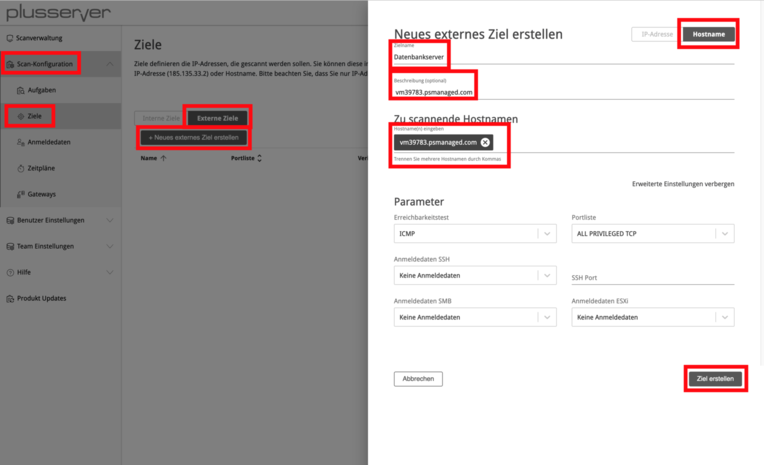
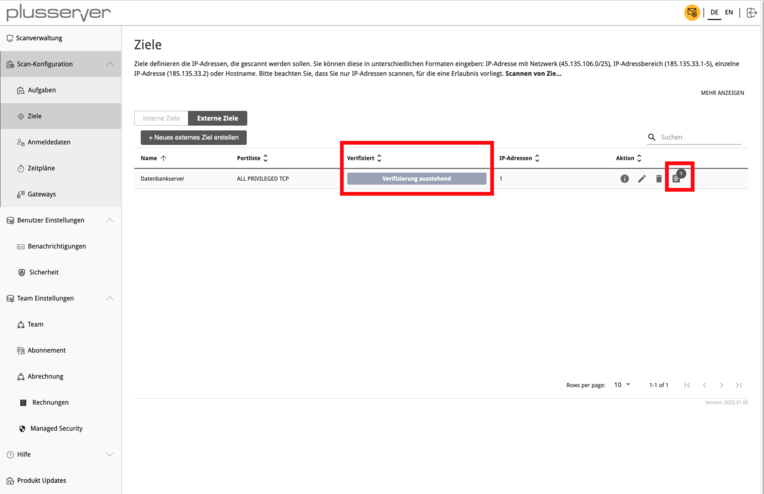
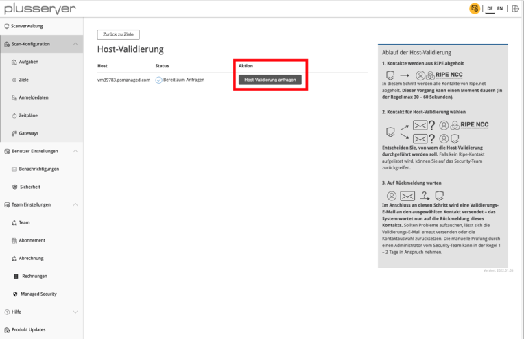
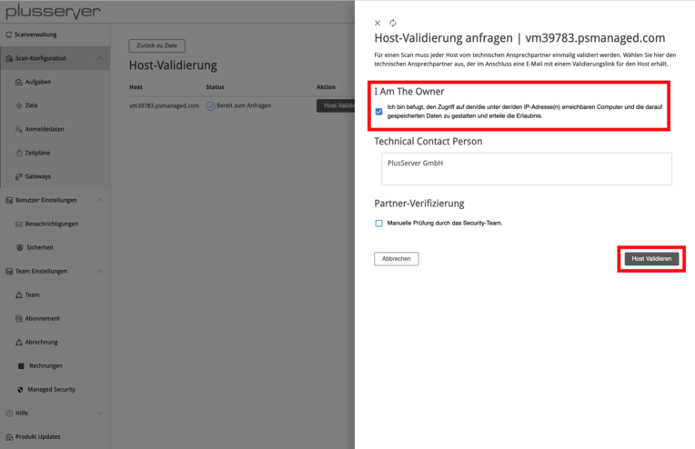
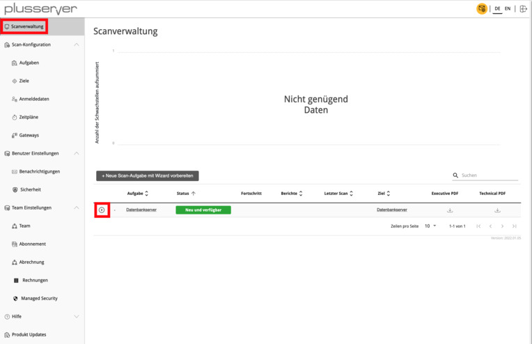
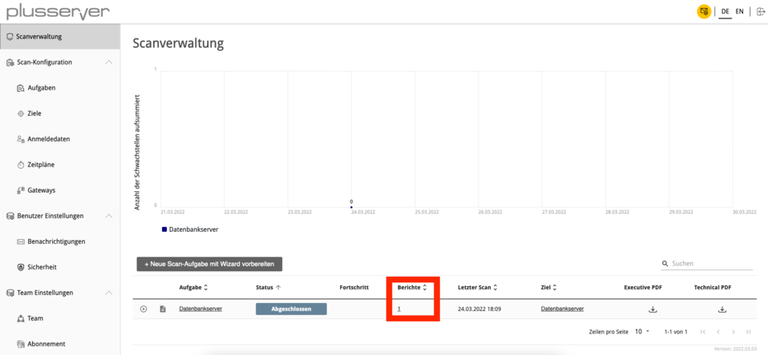
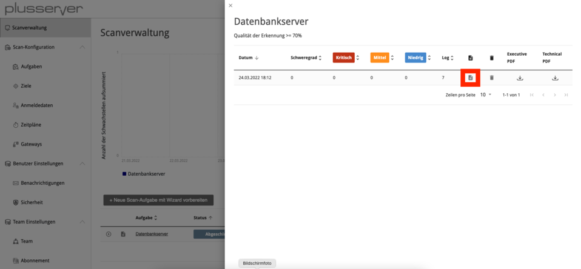
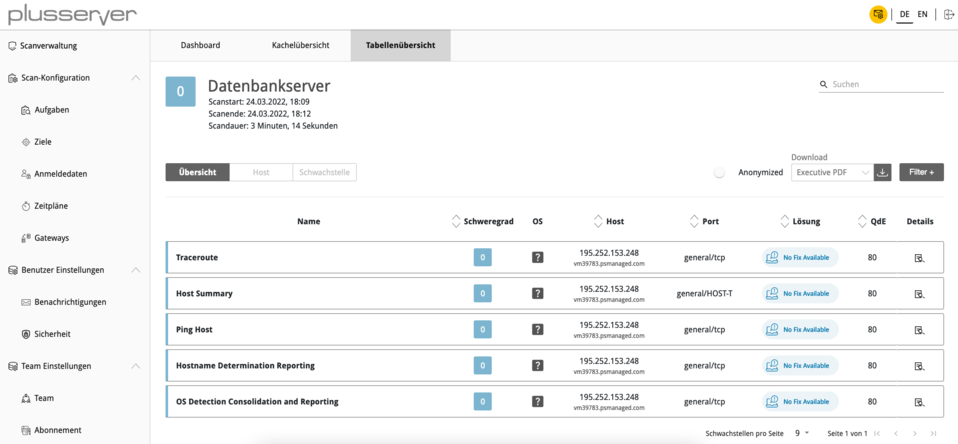

# Security Scanner - Quickstart-Guide

## Inhalt
1. [Schnelleinstieg](#schnelleinstieg)
2. [Ziel erstellen und validieren](#ziel-erstellen-und-validieren)
3. [Scan-Aufgabe erstellen und starten](#scan-aufgabe-erstellen-und-starten)
4. [Schwachstellenberichte anzeigen & auswerten](#schwachstellenberichte-anzeigen--auswerten)

## 1. Schnelleinstieg

Dieses Dokument dient Ihnen zum schnellen Einstieg in den Vulnerability Scanner und die damit verbundenen Selfservice-Funktionen. Dieser Artikel behandelt Schritt für Schritt, wie nach der initialen Anmeldung die Einrichtung einer vollständigen Scan-Aufgabe durchgeführt wird. Dieses Dokument setzt voraus, dass Sie sowohl Ihre Zugangsdaten (Benutzername und Kennwort) als auch Ihre Mandanten-URL bereits vorliegen haben. Mit diesen Daten gelangen Sie direkt in das Mandanten-Portal. Zusätzlich ist es hilfreich, die zu prüfenden IP-Adressen vorliegen zu haben. Diese können Sie auch im plusserver-Kundenportal einsehen.

## 2. Ziel erstellen und validieren

Über den Menüpunkt Scan-Konfiguration gelangen Sie zu dem Unterpunkt Ziele. Die Übersicht unterteilt sich in Interne und Externe Ziele. Bei internen Zielen handelt es sich um abgeschottete Netzwerke (z. B. Klasse-C-Netzwerke wie 10.0.0.0/8), die nicht über das Internet erreicht werden können. Interne Ziele können nur über das Vulnerability Scanner Gateway erreicht werden. Externe Ziele besitzen eine öffentliche IP-Adresse (z. B. 1.1.1.1), welche durch den Vulnerability Scanner direkt über das Internet erreicht werden kann.

Um ein Ziel zu erstellen, klicken Sie auf "Neues externes Ziel erstellen". Danach geben Sie einen Namen und das zu scannende System an. Über "Erweiterte Einstellungen anzeigen" haben Sie die Möglichkeit, die zu prüfenden Ports, den Erreichbarkeitstest sowie Anmeldedaten für authentifizierte Prüfungen einzustellen. Nach dem Speichern des Ziels über "Ziel erstellen" wird Ihnen der Eintrag in der Übersicht angezeigt.

Bevor der Schwachstellenscan gestartet werden kann, ist eine Verifizierung notwendig, um die missbräuchliche Untersuchung von IP-basierten System zu unterbinden. Hierzu klicken Sie auf das letzte Symbol unter der Spalte "Aktion".

Im nächsten Schritt wird die Validierung mithilfe von "Host-Validierung anfragen" initiiert. Hierbei sind drei Optionen aufgeführt:

1. **I am the owner**: Wählen Sie diese Option immer dann, wenn die IP-Adresse Ihrer Organisation zugeordnet ist und Sie dadurch befugt sind, eine Schwachstellenprüfung durchzuführen. Bitte wählen Sie diese Option zwingend, sofern Sie IP-Adressen von Ihren Systemen bei plusserver scannen! Falls Sie die anderen Optionen in diesem Fall wählen, kommt es zu unnötigen Verzögerungen.

2. **Technical Contact Person**: Sie sind nicht der Eigentümer der IP-Adresse, haben aber einen Auftrag zur Schwachstellenprüfung, dann nutzen Sie bitte diese Option. Dabei wird eine E-Mail-Anfrage an die E-Mail-Adresse gesendet, die in dem RIPE-Eintrag hinterlegt ist. Der Eigentümer muss diesen Auftrag bestätigen, bevor die Schwachstellenprüfung ausgeführt werden kann. Dieser Vorgang kann einige Zeit in Anspruch nehmen - halten Sie ggf. Rücksprache mit dem Eigentümer.

3. **Partner-Verifizierung**: Diese Option ist für die Validierung nicht vorgesehen.

## 3. Scan-Aufgabe erstellen und starten

Mit dem zuvor erstellen Ziel kann nun eine Scan-Aufgabe erstellt und dieses dort eingebunden werden. Im Feld "Namen" können Sie ggf. den gleichen Namen wählen, den Sie auch beim Ziel vergeben haben. Unter "Ziel auswählen" geben Sie das gewünschte Ziel an.

Der Schwachstellenscan kann nun gestartet werden. Wechseln Sie hierzu über den Menü-Punkt "Scanverwaltung" auf die Übersicht der Scan-Aufgaben. Klicken Sie auf das Symbol zum Starten der Scan-Aufgabe.

## 4. Schwachstellenberichte anzeigen & auswerten

Sobald der Schwachstellenscan erfolgreich ausgeführt wurde, ändert sich der Status der Scan-Aufgabe in "Abgeschlossen". Um den Schwachstellenbericht anzuzeigen, klicken Sie auf die Zahl innerhalb der Spalte "Berichte".

Nun sehen Sie eine Übersicht aller durchgeführten Schwachstellenscans. Über einen Klick auf das Symbol gelangen Sie zum Schwachstellenbericht.

Sie haben diverse Möglichkeiten, um die Liste der Schwachstellen anzuzeigen und weiterzuverarbeiten. Hierzu zählt die Kachel- und Tabellenübersicht ebenso wie ein Export als PDF- oder XML-Dokument.

**Wichtiger Hinweis für plusserver IP-Adressen**: 
Wählen Sie zwingend die Option "I am the owner" bei der Host-Validierung, um unnötige Verzögerungen zu vermeiden.
