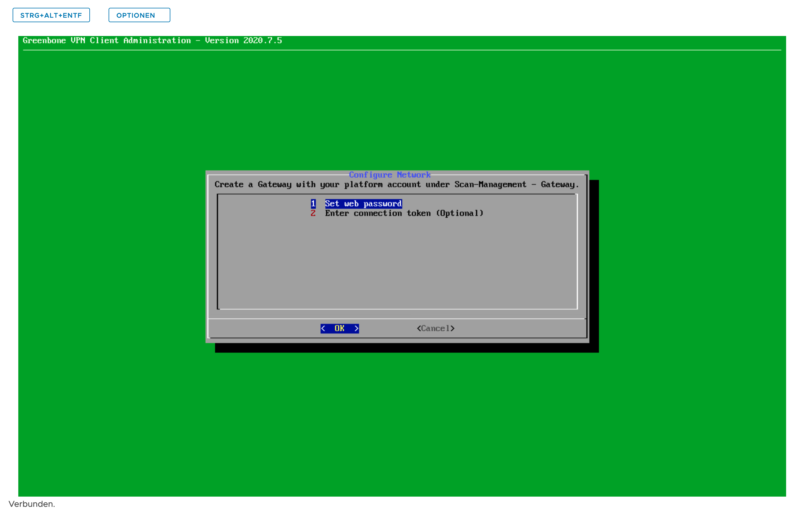

# Security Scanner - Scan von internen IP-Adressen mit dem Gateway

## Einleitung

Da nicht alle IP-Adressen Ihrer Infrastruktur von extern geprüft werden können, haben Sie die Möglichkeit ein Gateway einzurichten. Mithilfe dessen können auch isolierte Netzwerke (z. B. RfC-1918) auf Schwachstellen hin überprüft werden.

# Gateway installieren

## Gateway Image herunterladen

Navigieren Sie auf https://sec-scan.psmanaged.com/ui/gsp/entities/gateway/list/. Dort wählen Sie die vorhandene Plattform aus und laden das Image runter.

## Image in den Katalog der vAPP-Vorlagen Ihrer PlusCloud hochladen

## Neue virtuelle Maschine anlegen

## Hostnamen der VM angeben und Template auswählen

## Netzwerk & IP-Adresse einstellen

## Firewall einstellen

Um in Schritt (2.3) Web-UI des Gateways öffnen das Gateway via Web-GUI konfigurieren zu können, muss die interne IP-Adresse des Gateways mithilfe von SNAT-, DNAT- und Firewall-Regeln über eine öffentlich erreichbare IP-Adresse Ihres Edge-Gateways verfügbar gemacht werden.

## Mit der VM-Konsole verbinden

Nachdem der Login-Prompt angezeigt wird, muss als Benutzername und Passwort admin angegeben werden.

## Network configuration auswählen

## Informationen der Netzwerkkonfiguration einstellen

## Netzwerkverbindung zum Security Scanner testen

## Gateway configuration auswählen

## Set web password auswählen & Passwort vergeben

# Gateway konfigurieren

## Neues Gateway erstellen

Bitte geben Sie eine weitere freie IP-Adresse aus dem Netzwerk an, in dem Sie das Gateway installiert haben.

## Token kopieren

Um das Gateway mit dem Security-Scanner zu verbinden, ist eine Authentifizierung und Verschlüsselung notwendig. Hierzu kopieren Sie den API-Schlüssel aus den Einstellungen des Gateways heraus.

## Web-UI des Gateways öffnen

Sie haben in Schritt (1.6) Firewall einstellen das Gateway über eine öffentlich erreichbare IP-Adresse verfügbar gemacht. Geben Sie die IP-Adresse des Gateways nun im Browser ein und melden sich mithilfe des vergebenen Web-Passworts an (z. B. https://195.252.XXX.XXX).

## Status des Gateways überprüfen

Das Gateway ist nun eingerichtet. Sie können beim Anlegen einer Scan-Aufgabe das Gateway für die Prüfung auswählen.
