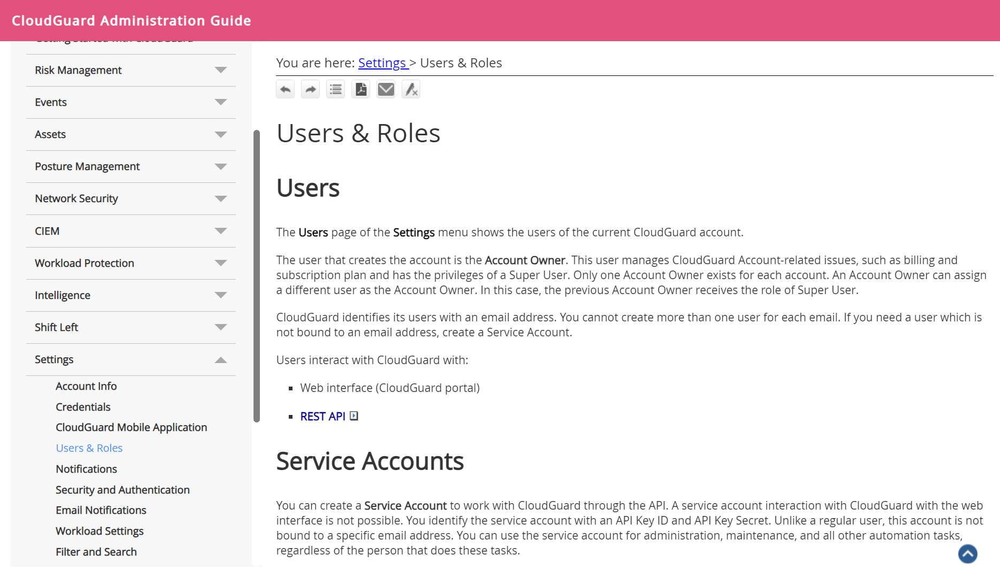

# Workload Protection

## URL der Administrationsoberfläche und die Zugangsdaten

Die Administrationsoberfläche ist unter dem folgenden Link zu finden: <https://secure.eu1.dome9.com/>

Nach der Einrichtung Ihres Kundenaccounts, werden Sie eine Bestätigungsmail bekommen. Dort sind Sie in der Lage das Passwort einzurichten.

Mehr Infos zum "Berechtigung Management" sind in der Herstellerdokumentation unter "Users & Roles" zu finden(Siehe Screenshot): <https://sc1.checkpoint.com/documents/CloudGuard_Dome9/Documentation/Settings/Users-Roles.htm?tocpath=Settings%20%7C_____4>
Hinweis: Es besteht die Möglichkeit Zwei-Faktor-Authentisierung zu nutzen. Die Dokumentation dazu finden Sie gerne hier: <https://sc1.checkpoint.com/documents/CloudGuard_Dome9/Documentation/Integrations/Single-Sign-On/SSO.htm?tocpath=Single%20Sign-On%20%7C_____0>

## Herstellerdokumentation

Unter dem folgendem Link ist eine ausführliche Dokumentation von Checkpoint zu finden (Siehe Screenshot):
<https://sc1.checkpoint.com/documents/CloudGuard_Dome9/Documentation/Overview/CloudGuard-CSPM-Introduction.htm>

## Dokumentation zur Einbindung der PSKE

Um die PSKE einzubinden, bitte die folgende Dokumentation nutzen: <https://sc1.checkpoint.com/documents/CloudGuard_Dome9/Documentation/Assets/Kubernetes.htm>

In unserem Fall wird der Punkt "Onboarding a Cluster Manually" benötigt, die Schritte 1-4 sind in diesem Fall relevant! (Siehe Screenshot)

