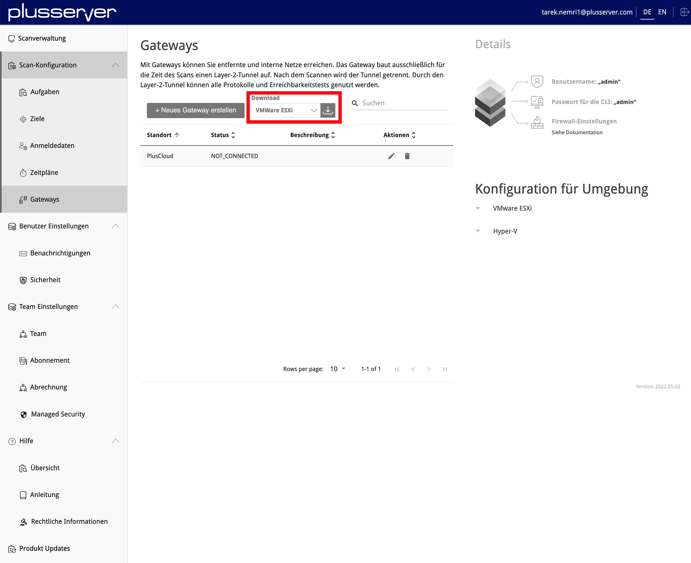
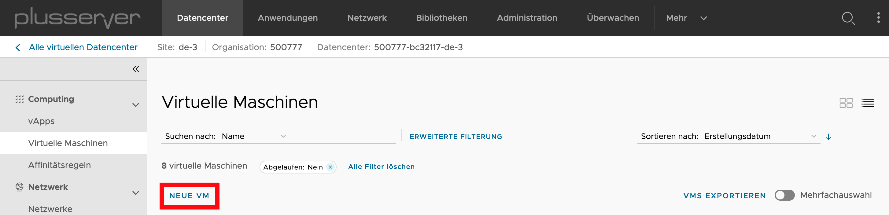
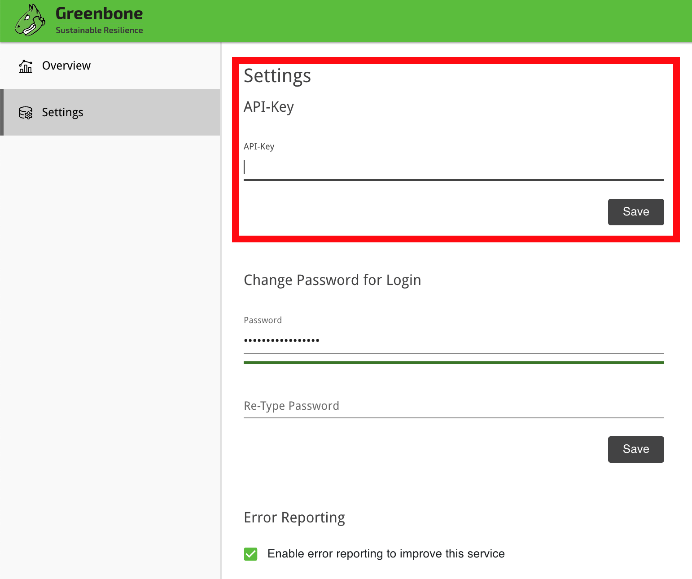

# Security Scanner - Scan von internen IP-Adressen mit dem Gateway

## Inhalt
* Einleitung
* (1) Gateway installieren
    * (1.1) Gateway Image herunterladen
    * (1.2) Image in den Katalog der vAPP-Vorlagen Ihrer PlusCloud hochladen
    * (1.3) Neue virtuelle Maschine anlegen
    * (1.4) Hostnamen der VM angeben und Template auswählen
    * (1.5) Netzwerk & IP-Adresse einstellen
    * (1.6) Firewall einstellen
    * (1.7) Mit der VM-Konsole verbinden
    * (1.8) Network configuration auswählen
    * (1.9) Informationen der Netzwerkkonfiguration einstellen
    * (1.10) Netzwerkverbindung zum Security Scanner testen
    * (1.11) Gateway configuration auswählen
    * (1.12) Set web password auswählen & Passwort vergeben
* (2) Gateway konfigurieren
    * (2.1) Neues Gateway erstellen
    * (2.2) Token kopieren
    * (2.3) Web-UI des Gateways öffnen
    * (2.4) Status des Gateways überprüfen

## Einleitung

Da nicht alle IP-Adressen Ihrer Infrastruktur von extern geprüft werden können, haben Sie die Möglichkeit ein Gateway einzurichten. Mithilfe dessen können auch isolierte Netzwerke (z. B. RfC-1918) auf Schwachstellen hin überprüft werden.

## (1) Gateway installieren

### (1.1) Gateway Image herunterladen

Navigieren Sie auf https://sec-scan.psmanaged.com/ui/gsp/entities/gateway/list/. Dort wählen Sie die vorhandene Plattform aus und laden das Image runter.

### (1.2) Image in den Katalog der vAPP-Vorlagen Ihrer PlusCloud hochladen

### (1.3) Neue virtuelle Maschine anlegen

### (1.4) Hostnamen der VM angeben und Template auswählen

### (1.5) Netzwerk & IP-Adresse einstellen

### (1.6) Firewall einstellen

Um in Schritt (2.3) Web-UI des Gateways öffnen das Gateway via Web-GUI konfigurieren zu können, muss die interne IP-Adresse des Gateways mithilfe von SNAT-, DNAT- und Firewall-Regeln über eine öffentlich erreichbare IP-Adresse Ihres Edge-Gateways verfügbar gemacht werden.

### (1.7) Mit der VM-Konsole verbinden

Nachdem der Login-Prompt angezeigt wird, muss als Benutzername und Passwort admin angegeben werden.

### (1.8) Network configuration auswählen

### (1.9) Informationen der Netzwerkkonfiguration einstellen

### (1.10) Netzwerkverbindung zum Security Scanner testen

### (1.11) Gateway configuration auswählen

### (1.12) Set web password auswählen & Passwort vergeben

## (2) Gateway konfigurieren

### (2.1) Neues Gateway erstellen

Bitte geben Sie eine weitere freie IP-Adresse aus dem Netzwerk an, in dem Sie das Gateway installiert haben.

### (2.2) Token kopieren

Um das Gateway mit dem Security-Scanner zu verbinden, ist eine Authentifizierung und Verschlüsselung notwendig. Hierzu kopieren Sie den API-Schlüssel aus den Einstellungen des Gateways heraus.

### (2.3) Web-UI des Gateways öffnen

Sie haben in Schritt (1.6) Firewall einstellen das Gateway über eine öffentlich erreichbare IP-Adresse verfügbar gemacht. Geben Sie die IP-Adresse des Gateways nun im Browser ein und melden sich mithilfe des vergebenen Web-Passworts an (z. B. https://195.252.XXX.XXX).

### (2.4) Status des Gateways überprüfen

Das Gateway ist nun eingerichtet. Sie können beim Anlegen einer Scan-Aufgabe das Gateway für die Prüfung auswählen.
