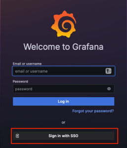
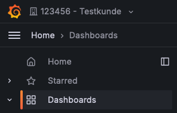
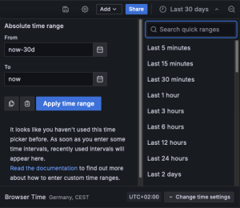

# Reporting Guide

## Deutsch

Sie finden Ihre Reporting Dashboards unter https://reporting.plussecurity.io - klicken Sie dort auf „Mit SSO anmelden", um sich mit Ihren bekannten IDM-Anmeldedaten anzumelden.

Nach der Anmeldung stehen Ihnen standardmäßig nur Berechtigungen für die „Main Org" zur Verfügung. Die Berechtigungen für weitere Organisationen oder Bereiche müssen manuell für jeden Benutzer eingerichtet werden.

Um die Benutzer freizuschalten, eröffnen Sie bitte einen Service Request über unseren Help Desk und geben Sie dabei den Benutzernamen sowie die zugehörige E-Mail-Adresse an.

Nachdem Ihre Freischaltung erfolgt ist, können Sie oben links Ihre Organisation auswählen. Keine Sorge – die „Main Org" ist die Standardorganisation und enthält keine Inhalte.

Unter dem Burger-Menü finden Sie die folgenden Dashboards:

Verwenden Sie die Zeitauswahl oben rechts, um den gewünschten Zeitbereich für die Datenanzeige festzulegen (siehe Bild unten):

### EDR-Computer-Übersicht

Dieses Dashboard zeigt einen Überblick über die Computer im EDR.

- Ergebnis der aktuellen Computeranzahl in der EDR Platform
  - Zeigt den täglichen Bericht der Computer im EDR
- Ergebnis der Computeranzahl im letzten Monat
  - Zeigt den Bericht vom 01. des Monats als Referenz
- Aktuelle Endpoints mit Problemen
  - Computer, deren Status nicht OK ist
- Liste der Endpoints

### EDR-Übersicht

Dieses Dashboard zeigt Einblicke in die EDR-Plattform, aktuelle Alarme und Regeln, die ausgelöst wurden.

- Übersicht über Offenses
  - Tortendiagramm der Offenses
- Anzahl der Ereignisse
  - Gesamtanzahl der Ereignisse in SIEM
- Top 10 Computer
  - Top 10 der Computer, die in Ereignissen und Verstößen auftauchen
- Top 10 der Regeln, die eine Offense ausgelöst haben
- Top 10 der EDR-Ereignisse
  - Top 10 der Ereignisse innerhalb des EDRs
- Übersicht der Offenses

Die Schwere eines Vorfalls wird basierend auf Relevanz, Glaubwürdigkeit und Schweregrad berechnet:

**Relevanz**: Gibt an, wie stark der Vorfall Ihr Netzwerk beeinflussen könnte. Beispielsweise hat ein offener Port eine hohe Relevanz, da er ein potenzielles Einfallstor für Angriffe darstellt.

**Glaubwürdigkeit**: Beschreibt die Verlässlichkeit des Vorfalls, basierend auf der Glaubwürdigkeitsbewertung der Protokollquelle. Die Glaubwürdigkeit steigt, wenn mehrere Quellen denselben Vorfall melden.

**Schweregrad**: Bewertet das Bedrohungsniveau, das die Quelle in Bezug auf die Verteidigungsbereitschaft des Ziels darstellt. Ein schlecht geschütztes Ziel führt zu einem höheren Schweregrad.

Diese Faktoren werden kombiniert, um die Gesamtschwere des Vorfalls zu bewerten und geeignete Gegenmaßnahmen zu priorisieren.

### SOC-Übersicht

Dieses Dashboard zeigt Einblicke in das SOC, aktuelle Verstöße und einen Überblick über die Daten, die sich derzeit im SOC befinden.

- Übersicht der Offenses im Zeitverlauf
  - Zeigt an, wann die gefundenen Offenses stattgefunden haben
- Status der Angriffe
  - Zeigt Details zu Offenses
- Top-Benutzer
  - Zeigt Top-Benutzer
