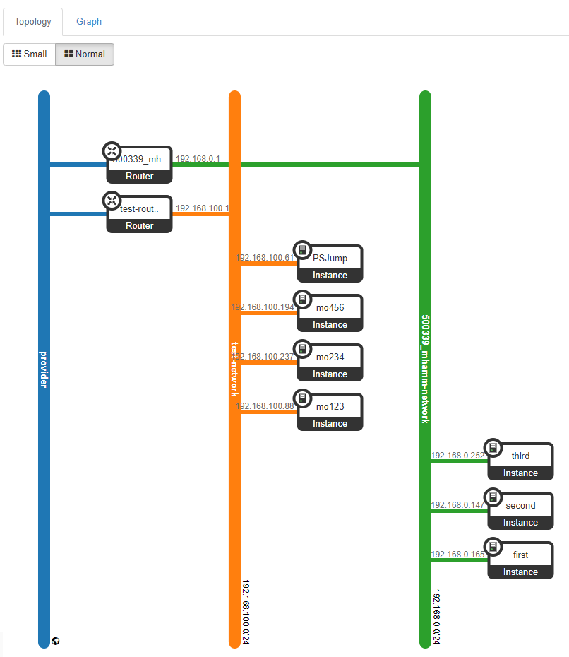
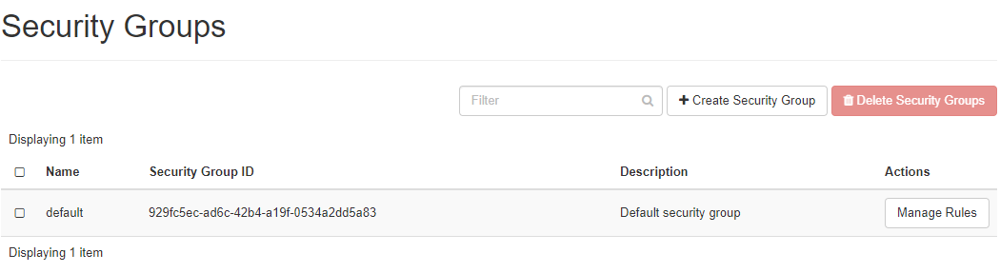
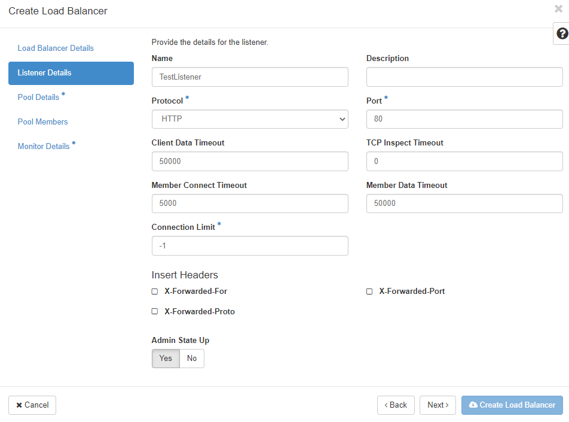

## Networking
For your convenience new projects in pluscloud open are created with a preconfigured network setup, which contains a private network and a router, which connects that private network to the internet. All networking configuration in Horizon is done in the "Network" menu.

"**Network Topology**" gives you a diagram of your current network setup. "**Networks**" lists all currently configured networks in your project and allows you to manage existing, delete existing and create new networks. "**Routers**" lists all configured routers in your project and allow management, creation and deletion of routers. "**Security Groups**" are basically firewall rules which are used to allow or deny traffic to or from your infrastructure. "**Load Balancers**" lets you create, delete and manage loadbalancers, members, pools in your environment. "**Floating IPs" lets you manage, attach, detach, acquire public IP addresses for your instances.

### Network Topology
In the network topology menu entry you can get an overview about the networking setup inside your project. The diagram shows your current setup and is updated with every change of the environment. 

The above diagram shows two private networks which are connected to a public network ("provider network" in OpenStack language) with two routers. Hovering with your mouse over the elements of the diagram shows more information and shortcuts to other functions of the web gui.

### Networks
Under "Networks" you find the configured networks in your environment and you can manage, add or delete networks.

Each network needs an associated subnet - which is set up during network creation, too. The external network - "ext01" in case of pluscloud open - is configured by the provider and cannot be changed.

#### Create networks
Klicking on "Create network" brings up a dialogue to define a new network. 

 

You need to give the new network a name, decide if it should receive traffic (by klicking "Enable Admin State") and decide if you want to create a new subnet in the new network or use an existing one. The "Availability Zone Hints" currently refers to all of the respective pluscloud open environment as there is only one availability zone per pluscloud open environment.

If you chose "Create Subnet" you have to define the subnet as the next step. 

  

Here you create a subnet which is associated with the new network. You need a valid "Network Address" of a [RFC1918](https://www.rfc-editor.org/rfc/rfc1918) network in [CIDR](https://en.wikipedia.org/wiki/Classless_Inter-Domain_Routing) notation. If you don't specify a "Gateway IP" the first IP address of the subnet will automatically become the gateway IP address. If you don't want a gateway in your network, klick on "Disable Gateway". 

A detailed configuration of the subnet is available in the "Subnet Details" menu.

Here you can define, whether [DHCP](https://en.wikipedia.org/wiki/Dynamic_Host_Configuration_Protocol) should be available in the subnet. If you want, you can further specify the subnet pool from where DHCP addresses should be allocated. Allocation pools should at least start with the .5 address because there could be other network services already running on those first addresses of the network.
If you want to use specific nameservers for your network, you can define them in the "DNS Name Servers" field. Specific host routes to specific networks can be set in the "Host Routes" field, where you define the destination network in CIDR notation followed by the gateway IP address over which you can reach the destination network.
Click on "Create" to let OpenStack provision the new network and subnetwork.

## Router
Networks need to be connected by routers in order to be able to communicate. This is true for external networks as well as internal networks.

### Routers
The "Routers" menu lists all configured routers, allows the management and deletion of those routers and the creation of new ones.

### Create Router
To create a new router click on "Create Router", give it a name, allow it to route packets by clicking on "Enable Admin State" and select an "External Network" from the list.

### Add Interface
Cicking on the name of an already existing router, you see the current interfaces and their configuration

If you click on "Add Interface" you can choose which subnet you want the route to be connected to and which ip address the new router interface should get. 

### Add Static Route

Clicking on the "Static Routes" tab, you can add static routes to your router

Add the destination network in CIDR notation and define a reachable IP address for the router to connect to the destination network.

## Security Groups
A very important part of the network environment of your project are the security groups, which work as firewall rule sets to allow or disallow traffic to your instances. Only wanted traffic should allowed to reach your instances.

As a default there is a "Default Security Group" active for instances which have no other security groups assigned. This includes a set of rules for incoming and outgoing traffic. This group is normally associated to new instances in order to allow ssh logins.

"Egress" is for outgoing traffic. Any traffic (including ICMP) is allowed for IPv4 and IPv6. "Ingress" or incoming traffic is allowed for ICMP as well as SSH (port 22). Rules, that have a "Remote Security Group" "default" defined are used to assure, that any source instance can reach any other destination instance in that "default" group via IPv4 and IPv6. 
Remember, that security groups have to be assigned to each instance individually. These do not apply for all of your environment.

### Create Security Group

Clicking on "+Create Security Group" will create a new security group and lead you to a new menu, that allows you to add new security rules to your new security group. There is a set of pre-defined rules for various protocols you can define "Custom TCP/UDP/ICMP" rules for individual ports.
You should use the description field (in order to have an easy overview of what each rule is intended to do), define the direction of traffic (egress/ingress) as well as the network port the rule should apply to. You can define a single port, some ports or a port range. 
For ICMP traffic you define icmp type and code.

Remote describes source or destination - depending whether it should become an ingress- or an egress-rule. You can here define an IP address (in CIDR notation) or another security group.

## Loadbalancer

The "Load Balancers" menu allows you to define loadbalancing services. Clicking on "Load Balancers" shows a page listing all already defined loadbalancers. These can here be managed or deleted. And you can add new ones by clicking on "+Create Load Balancer".
In order to create a new loadbalancer you have to define various parameters. You are guided through a few menus and as soon as you have entered enough information the button "Create Load Balancer" is activated and you can start the creation process. Asterisks indicate fields, which need to be filled in in order to create a loadbalancer.

"**Name**" and "**IP address**" are the first two bits of information you have to enter. Choose an IP address from your subnet. If you leave that field blank an IP address will be assigned from the subnet you choose (as long as DHCP is active, there).

"**Description**" is optional but should be used in order to store information about the why and what of this particular loadbalancer instance. You cannot choose a "**Flavor**". Pluscloud open is using the amphora flavor here. As already mentioned you have to choose a "**Subnet**" which the loadbalancer should be connected to. "**Admin State Up**" allows you to create the loadbalancer switched off. It needs to be switched to "**Admin State Up**" in order to balance traffic.

The next menu "Listener Details" defines the listener for the new loadbalancer

Each and every port on the new loadbalancer, that should receive traffic, will be configured seperately and assigned to the loadbalancer. You can define many listeners per loadbalancer as long as each one uses a different port. 

"**Protocol**" defines the protocol that should be expected on the "**Port**". You can only choose "TERMINATED_HTTPS" as protocol, if you have activated and configured the key manager service (Barbican). The "**Port**" number should be between 1 and 65535.

With the "**Client Date Timeout**" you configure how long TCP connections to clients should be allowed to be kept alive if the client is inactive. The "**TCP Inspect Timeout**" is the time in milliseconds the loadbalancer will wait for additional content. Timouts to the loadbalancer members are configured in the "**Member Connect Timeout**" field. You can limit the number of allowed connections on the respective listener in the "**Connection Limit**" field - "-1" means unlimited. If you want to insert HTTP headers you can choose one or both of the supported options at "**Insert Headers**".

As the next step you have to define the "**Pool Details**" for the new loadbalancer. A "Pool" is a group of member instances which should receive traffic via the loadbalancer.

First you define the loadbalancing "**Algorithm**"
  
    * LEAST_CONNECTIONS: sends the next request to the instance with the smallest number of connections in the pool
    * ROUND_ROBIN: sends reqeusts randomly to the next available instance in the pool
    * SOURCE_IP: sends requests from the same source IP address always to the same instance in the pool

If your application needs "**Session Persistence**" you can choose the method here

    * SOURCE_IP: The source IP address is used as a persistence characteristic
    * HTTP_COOKIE: HTTP cookies, that are set from the compute instance in the pool are used as a persistence characteristic
    * APP_COOKIE: Your application uses/creates a custom cookie which you have to fill in the "**Cookie Name**" field.

The "**Pool Members**" for the new loadbalancer pool are defined in the next menu. You can choose from the instances in the list.

The list "**Available Instances**" contains candidate instances for your pool. Click "Add" to add them to the pool. Click "Add external member" to add members that are not displayed in the list.

The "**IP Adress**" is the IP address of the network interface of the instance, that should receive the traffic from the loadbalancer. IPv4 and IPv6 addresses are allowed. The "**Subnet**" should be the subnet which contains the IP address of the member. The "**Port**" would be the TCP port on which the member should receive traffic from the loadbalancer. The "**Weight**" defines the relative number of requests the respective member should receive in relation to the other members. Allowed numbers are between 1 and 256. 
If you click on the arrow you can define even more pool details like "**Monitor Address**" and "**Monitor Port**" - if you want to define a monitoring address that is seperate from the service (IP address and port) on your instance. Leave it unchanged in order to use member IP address and port for monitoring. 
If you want to define a "**Backup**" or failover member in your new pool, which is only used, if all other members are not reachable, click on "Yes" here.

The last step is the "**Monitor Details** menu. Monitoring is used to determine the state of the pool members. So called "health checks" are used for all members in the pool and determine whether the checked member will receive traffic from the loadbalancer. If the health check fails, the member will receive no traffic. Each pool can have its own health check, which will be used for all members in the pool.

You can choose a "**Type**" of monitor from the list of HTTP, HTTPS, PING, TCP, TLS-HELLO, UDP-CONNECT and SCTP. Depending on your choice you will have to enter different bits of information.
The "**Delay (sec)**" determines the time between the health checks. It should be as big as "**Timeout**" or bigger. The "**Max Retries**" lets you choose how often the loadbalancer should try the health check before setting the state of the member to **inactive** (should be a number between 1 and 10). "**Max Retries Down**" is the number of allowed connection failures before the pool member will be declared "**faulty**" (again a number beteween 1 and 10). The "**Timeout**" describes the time a healtch check can take in order to succeed (should be a number bigger or equals 0 and smaller or equal to the "**Delay (sec)**").
The "**HTTP Method**" can be one of the allowed HTTP methods (like GET, HEAD, etc.) and "**Expected Codes**" should be one HTTP code (or a list of them) which come back for a successful health check. 
The "**URL Path**" can be used to define a custom path for your health checks. Remember that this is requested by the monitor every "**Delay (sec)**".
If all the required information has been entered in the forms, the loadbalancer can be created. If you want the loadbalancer to be accessible from the public internet, you have to assign a floating IP address to it.

## Floating IPs

The menu "**Floating IPs**" allows you to list and manage public IP addresses in your project. Floating IP addresses have to be allocated before they can be associated to a service. They can be disassociated from a service, too - in order to let it no longer be reachable from the internet. 

You can associate floating IP addresses to instances and loadbalancers. Be aware of the services you want to be reachable from the internet and configure your security groups accordingly. Floating IP addresses are accounted and billed as long as they are reserved - whether they are associated to a service or not.
