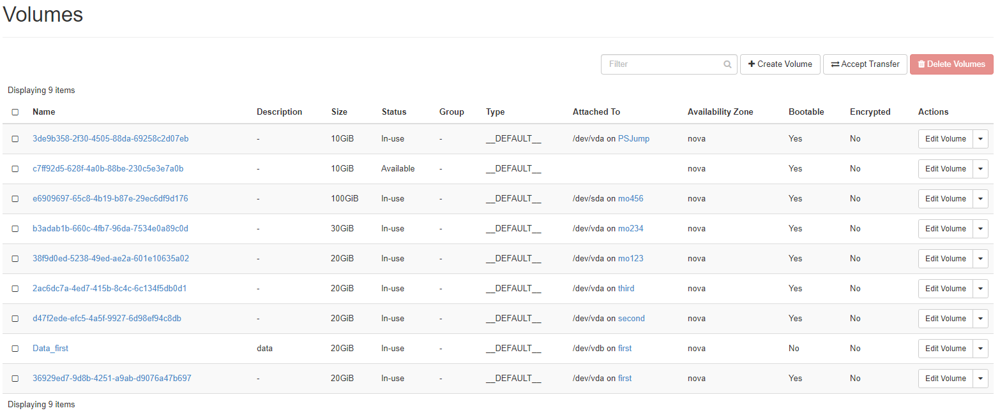

## Volumes

Volumes represent (Block)storage in OpenStack. Volumes are used as disks in instances. If not explicitly mentioned otherwise, volumes reside on a [ceph](https://ceph.io/en/) storage system and are attached to the instance via network using the [RADOS](https://docs.ceph.com/en/quincy/rbd/index.html) protocol.
The "**Volumes**" menu allows you to manage volumes in your project. 

You can create new volumes, backups and snapshots as well as group your volumes (e. g. for snapshotting them at the same time). The list shows the volumes with their unique ID but you can change the name of your volumes, if you like. Furthermore you can see, whether the volume is currently attached to an instance (and where), the size of the volume and whether it is member of a volume group. The "**Actions**" button gives you access to the various management options you have for your volumes.

With "**Edit Volume**" you can change the name of your volume and/or add a description for it. This can be helpful in making the purpose of the volume visible. Furthermore you can set the boot flag for a volume here. Using "**Manage Attachments**" you can attach a volume to an instance or detach it from it. Be aware, that after attaching a volume you most probably have to change some configuration bits on your instance (like put a filesystem on the new volume, edit /etc/fstab and mount it, etc.). Before detaching a volume from your instance, you should umount it.

"**Create Snapshot**" allows you to snapshot the respective volume. You have to give it a name (and an optional description) first. Please be aware, that snapshotting a volume which is mounted and used can lead to data corruption. The safe way to take snapshots is to unmount the respective volume first. Snapshots are not backups.

Using "**Create Backup**" creates a backup of your volume. If you choose a snapshot of your volume, only the snapshot will be backed up. If your volume backup fits into your object store quota, you can choose an object store bucket and write the backup there.

You can convert a volume into an image which you can use to create an instance with "**Upload to Image**". You have to choose a disk format for the image (mostly "raw" or "qcow2"). If the volume is in use you can "force" the backup by clicking on "**Force**".

With "**Update Metadata**" you can manage the volume metadata. You find pre-defined metadata definitions which you can use or you can define custom metadata with the "**Custom**" field. The max length for a single key is 255 characters.

### Accept Transfer

When you are transferring volumes from one project to another you can accept a transfer with clicking on "Accept Transfer". Transfers are initiated from the command line with ``openstack volume transfer request``. With that the owner of a volume creates a transfer request and sends the transfer ID and a key to the receiver of the volume. The receiver clicks on "Accept Transfer" and enters the transfer ID and key to receive the volume.

### Create Volume

In order to create a new volume you click on "+Create Volume" and then you are stepped through a few menus to define the new volume

Apart from a name and an optional description you can choose a "**Volume Source**" e. g. an image, a snapshot or other volumes. Depending on your choice the input fields change (but those are selfexplaining). The chosen source determines the size of the new volume. You can assign the volume to a volume "**Group**", that you have defined beforehand.

## Backups

The "**Backups**" menu lists your current backups and lets you either delete them or use them for restore (e. g. by creating a new volume from the backup).

## Snapshots

Here you see a list of your current snapshots and you can manage them. This includes launching an instance from a snapshot with "**Launch as Instance**", changing a snapshots name or description, creating a backup from your snapshot with "**Create Backup**", delete the snapshot or change the metadata for your snapshot. 
You can choose from a set of pre-defined metadata or you can add "**Custom**" metadata keys. Max key length is 255 characters.

## Groups

In volume groups you can form a group of volumes which you want to treat as one. It might be sensible to snapshot volumes, that hold various parts of an application, at the same time in order to assure data consistency. You can create new groups with "**Create Group**" or edit existing ones.

## Group Snapshots

Here you can manage your group snapshots.

## Crypted Volumes

Pluscloud open allows to create crypted volumes, which are based on "LUKS" ([Linux Unified Key Setup](https://gitlab.com/cryptsetup/cryptsetup)), which uses the Linux kernel module dm-crypt and should be ideal for crypting volumes for Linux instances. Keys are generated during creation of the volume and saved into the keystore on pluscloud open. Beware, that deleting crypted volumes not only deletes the volume but also the associated key. **A recovery of the data is not possible** after deletion. 

Creating a crypted volume is pretty easy. You just choose "LUKS" as "**Type**" 

Depending on the size of the volume, it can take a little time to create it. You can use the volume as any other non-encrypted volume. The encryption is handled in the background. The volume listing should show your volume as encrypted:

The web gui does not allow the creation of encrypted root volumes, which you need if you want all the volumes of your instance to be crypted.

### Crypted boot images

To crypt the root volume of an instance, you have to create a crypted volume first in order to use that as a root volume for a new instance. You create that volume from an image of the operating system you want for your new instance:
    
    openstack volume create --type LUKS --image "imagename" --size <size in gb> <volume name>
     
    openstack volume create --type LUKS --image "Ubuntu 20.04" --size 20 ubuntuencrypt
    +---------------------+--------------------------------------+
    | Field               | Value                                |
    +---------------------+--------------------------------------+
    | attachments         | []                                   |
    | availability_zone   | nova                                 |
    | bootable            | false                                |
    | consistencygroup_id | None                                 |
    | created_at          | 2021-12-10T09:06:49.000000           |
    | description         | None                                 |
    | encrypted           | True                                 |
    | id                  | cd4d8c9a-632a-4045-8b09-da57fcbc5848 |
    | multiattach         | False                                |
    | name                | ubuntuencrypt                        |
    | properties          |                                      |
    | replication_status  | None                                 |
    | size                | 20                                   |
    | snapshot_id         | None                                 |
    | source_volid        | None                                 |
    | status              | creating                             |
    | type                | LUKS                                 |
    | updated_at          | None                                 |
    | user_id             | 824e462845c14ccd84cb091944dfe74b     |
    +---------------------+--------------------------------------+

The parameter "**--image**" allows you to create a volume directly from an image (either from the repository or uploaded by yourself).

Now you can create an instance using the volume you just created. You have to add a flavor (name or ID) and you should not forget to add a ssh key name, which allows you to login to the instance afterwards. Aditionally you have to add an existing network, where the instance will be spawned in:

    openstack server create --flavor <Flavor name or ID> --network <network name or ID> --key-name <keyname> --volume <volumename or ID> <instancename>
 
    openstack server create --flavor 1C-1GB-20GB --network Test --key-name mhamm --volume cd4d8c9a-632a-4045-8b09-da57fcbc5848 bootencubuntu
    +-----------------------------+----------------------------------------------------+
    | Field                       | Value                                              |
    +-----------------------------+----------------------------------------------------+
    | OS-DCF:diskConfig           | MANUAL                                             |
    | OS-EXT-AZ:availability_zone |                                                    |
    | OS-EXT-STS:power_state      | NOSTATE                                            |
    | OS-EXT-STS:task_state       | scheduling                                         |
    | OS-EXT-STS:vm_state         | building                                           |
    | OS-SRV-USG:launched_at      | None                                               |
    | OS-SRV-USG:terminated_at    | None                                               |
    | accessIPv4                  |                                                    |
    | accessIPv6                  |                                                    |
    | addresses                   |                                                    |
    | adminPass                   | jy8CoGki7HL8                                       |
    | config_drive                |                                                    |
    | created                     | 2021-12-10T09:16:50Z                               |
    | flavor                      | 1C-1GB-20GB (cb635210-085e-4659-a10e-d1dcddf897f9) |
    | hostId                      |                                                    |
    | id                          | ca0bba1f-64e7-4678-bf49-bfe9ad71881d               |
    | image                       | N/A (booted from volume)                           |
    | key_name                    | mhamm                                              |
    | name                        | bootencubuntu                                      |
    | progress                    | 0                                                  |
    | project_id                  | 5b6bd2a13a624b5b8b393971cc03324a                   |
    | properties                  |                                                    |
    | security_groups             | name='default'                                     |
    | status                      | BUILD                                              |
    | updated                     | 2021-12-10T09:16:50Z                               |
    | user_id                     | 824e462845c14ccd84cb091944dfe74b                   |
    | volumes_attached            |                                                    |
    +-----------------------------+----------------------------------------------------+

The instance is now using encrypted storage. Please keep in mind to delete the volume after deleting the instance as it is not deleted automatically.

### List secrets

As mentioned earlier there is a key saved to the OpenStack keystore (Barbican) for each encrypted volume. You can list all keys saved for your project with ``openstack secret list``.
