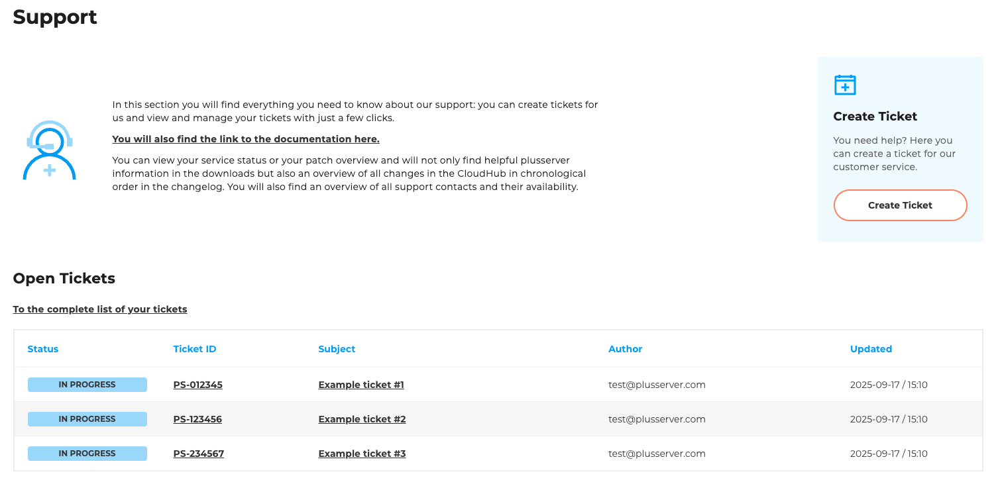
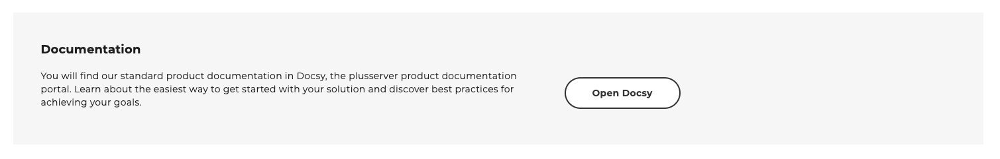
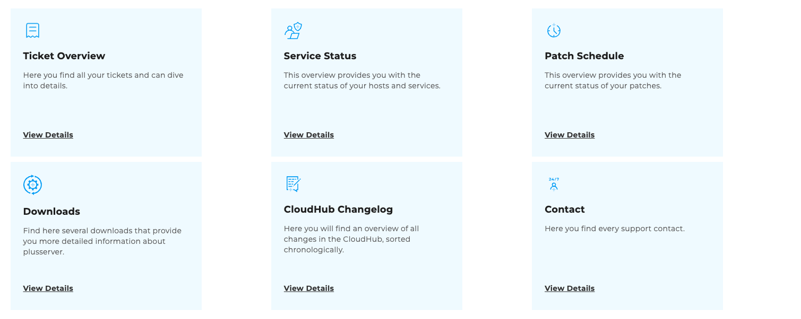

## Support

The [Support](https://cloudhub.plusserver.com/support) page is your central point of contact for support requests and technical information. The page is divided into different sections, giving you a quick overview and direct access to the most important functions.

### Open tickets

In the upper section, you will see an overview of **all open tickets** for your account.
There are also two direct links available:

- **Ticket overview** – takes you to the complete list of all open and closed tickets.
- **Create ticket** – opens the form for creating a new support ticket.

### Documentation banner

Below the ticket overview is a banner that takes you directly to the customer portal documentation.
There you will find detailed instructions and explanations of all functions.

### Tiles for support areas

At the bottom of the page, there are tiles with quick access options to the subpages shown below:

