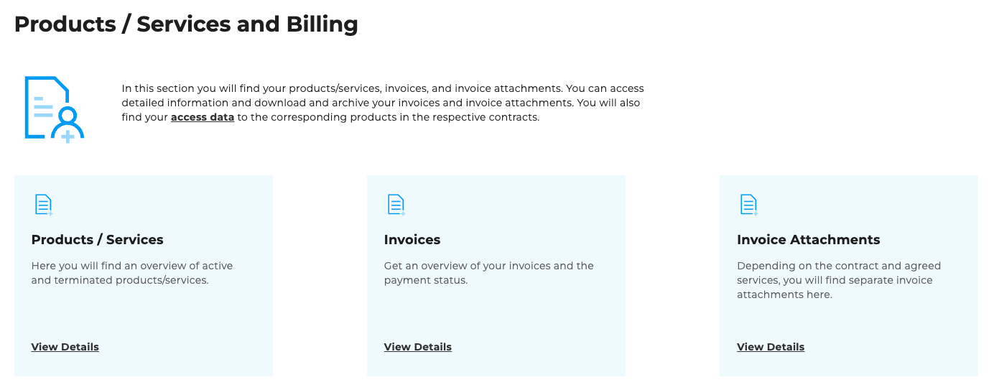

## Products/Services and Billing

On the ["Products/Services and Billing"](https://cloudhub.plusserver.com/billing) page, you will find central access points to your booked services and all billing documents. The content is clearly arranged in tiles and supplemented with a help section.

### Main area

The upper area of the page contains three tiles with direct links to:

- **Products/Services** – Overview of all products and services you have booked
- **Invoices** – Access to all invoices in the customer portal
- **Invoice attachments** – Direct access to the *Invoice attachments* tab within the invoice page

### Help area

Below the main tiles is a **Help area** with further support options:

- **Create ticket** – takes you directly to ticket creation for support requests
- **Ticket overview** – shows an overview of all tickets you have created
- **FAQ** – quick answers to frequently asked questions

Next to this is a separate **contact tile** for **Contract & Billing Management**, which you can use to contact someone for questions about contracts and billing.

