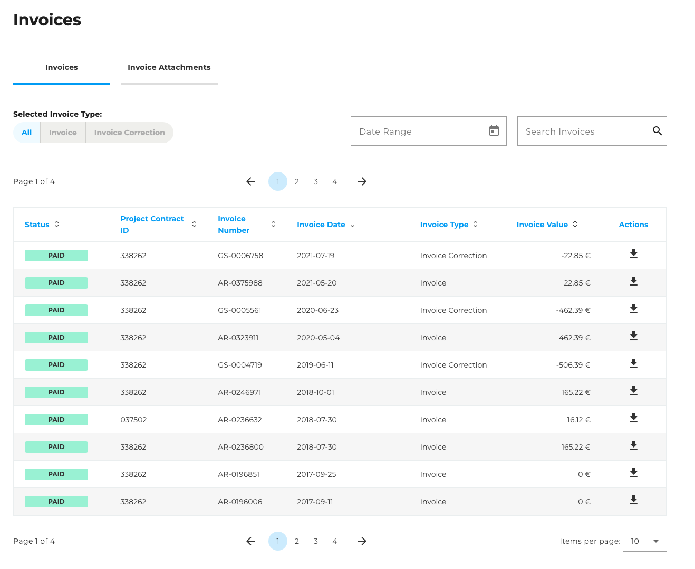
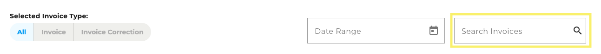
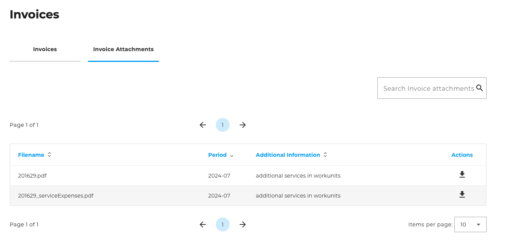

## Invoices

On the ["Invoices"](https://cloudhub.plusserver.com/billing/invoices) page, you will find all billing-related documents for your booked products and services, as well as the option to download them. The content is divided into two tabs: **Invoices** and **Invoice Attachments**.

### Invoices

The **"Invoices"** tab provides you with a tabular overview of all invoices issued for you. The table offers various options for filtering and searching in order to find specific documents.\

#### Funktionen

- **Filter by invoice type:**\

- **Period filter:**
  You can display invoices within a specific time period.\
  

- **Search function:**
  You can use the search bar to search for specific invoices (e.g. by invoice number, subject, etc.).\
  

- **Download option:**
  Each invoice in the table can be downloaded individually in PDF format.\
  

### Invoice Attachments

The **"Invoice attachments"** tab contains an overview of all associated invoice attachments.

#### Funktionen

- **Search function:**
  A simple search bar allows you to find individual attachments using keywords or file names.\
  

- **Download option:**
  Each invoice attachment can be downloaded individually directly from the table.\
  

*There are no filter functions or a period selection for this tab.*
