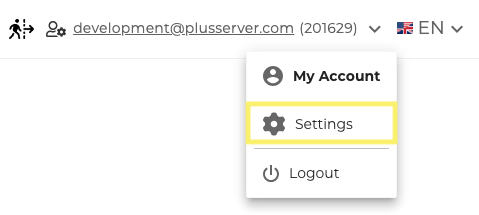
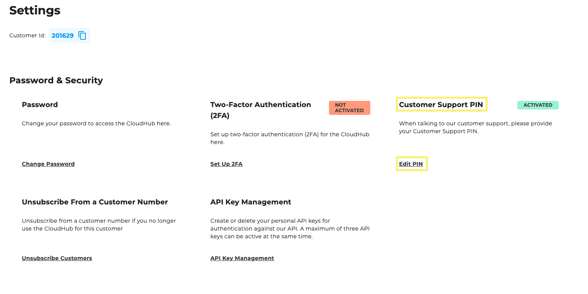

## Change Pin

Under “Settings” you will find an interface where you can change the PIN. You can access the settings by clicking on your email address in the top right-hand corner of the top bar and then selecting the "Settings" menu item.

You can then enter and save the PIN:

