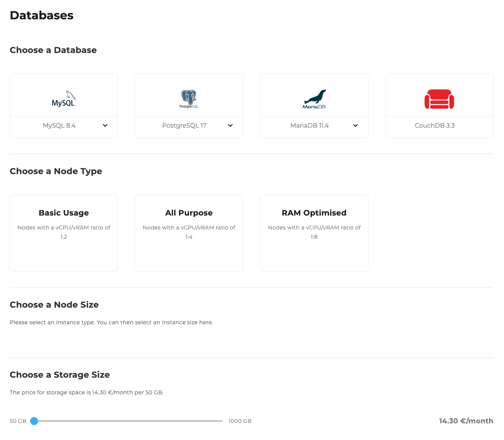
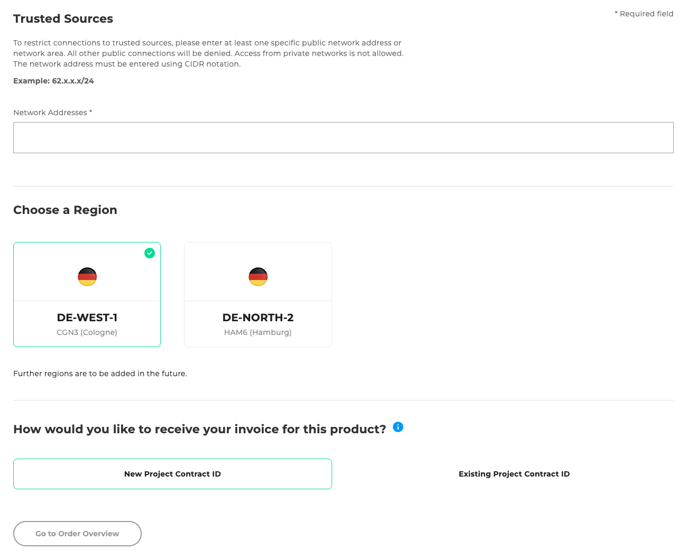
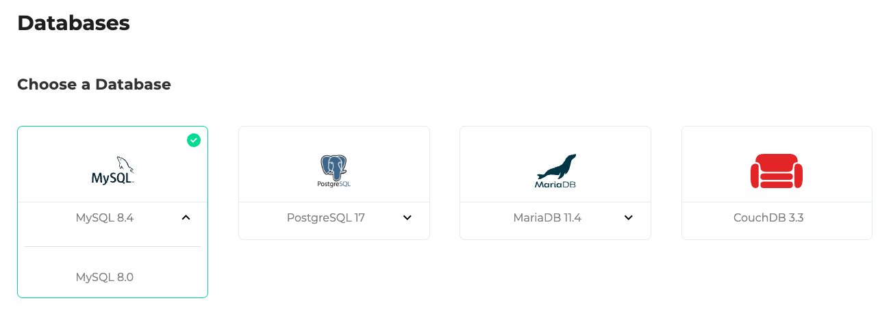
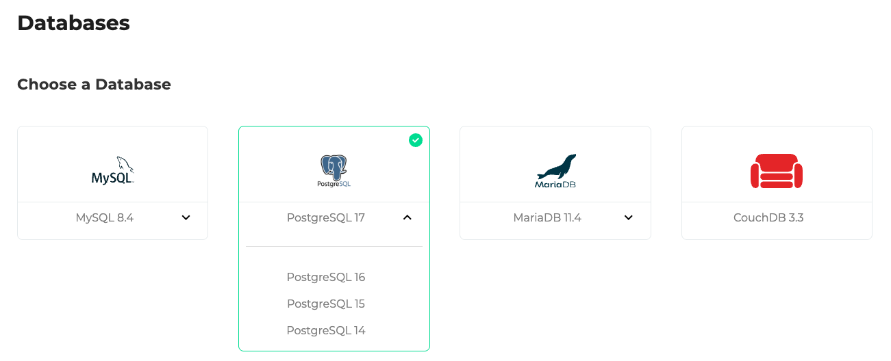
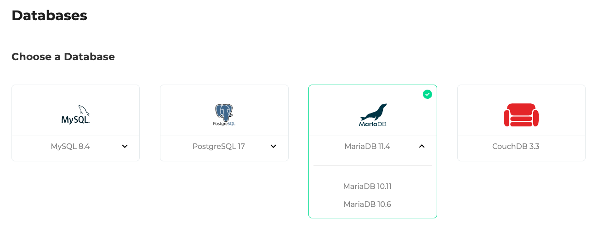
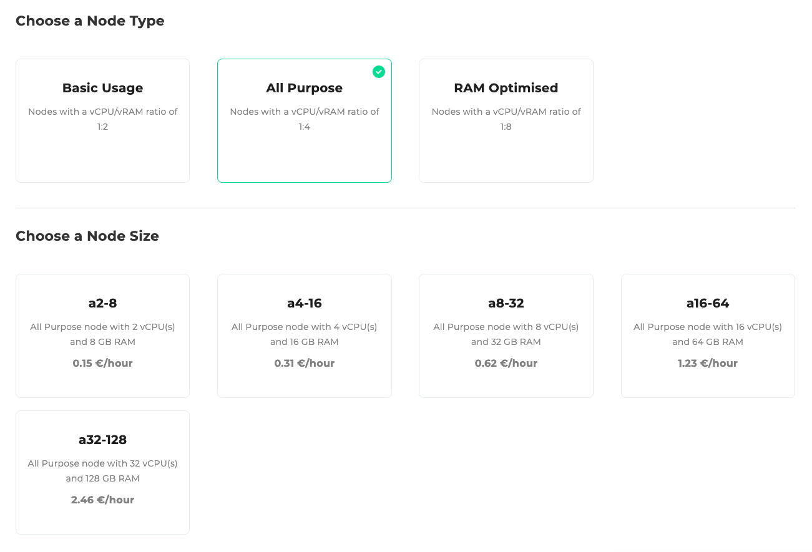
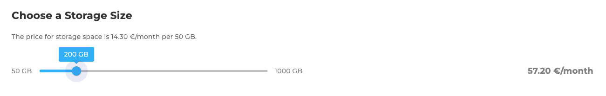
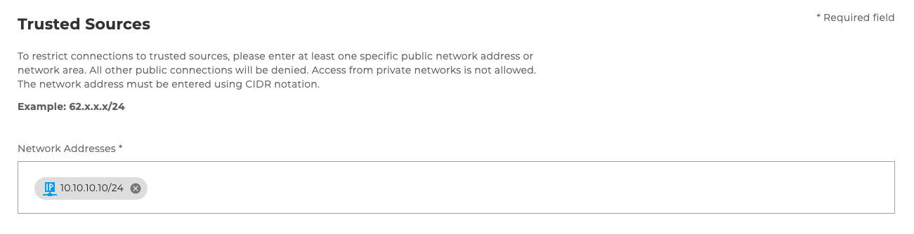
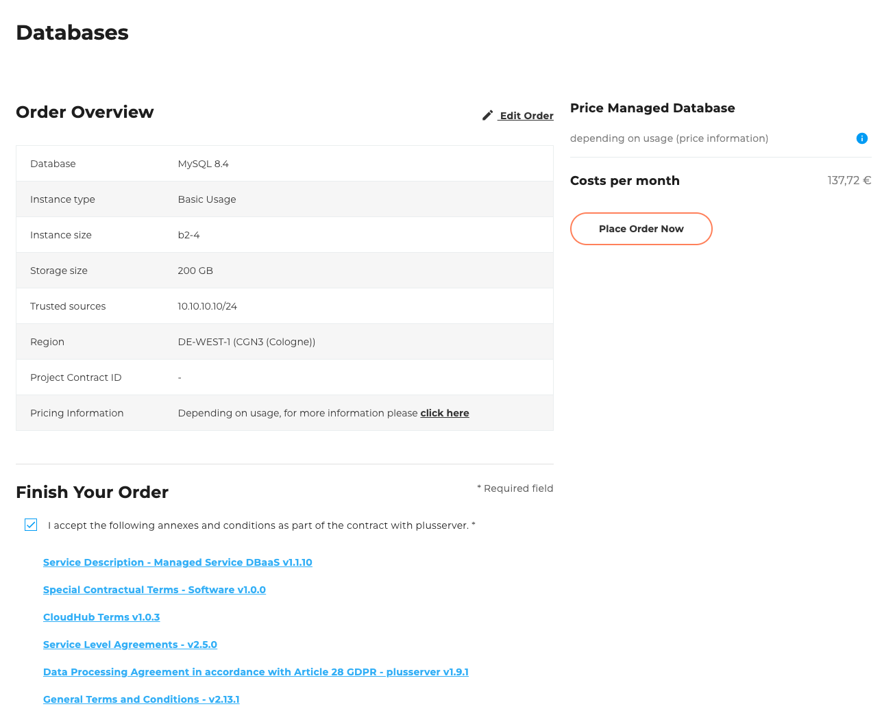

## Introduction

Welcome to the [database order wizard](https://cloudhub.plusserver.com/cloud-services/databases/order). Here it is described which configuration options are available and how a new database can be ordered.

In the following we guide you step by step through the ordering process and explain the individual selection options and input fields.

## Step 1: Database selection

Select the desired database system and the appropriate version:

### Available databases and versions:

- MySQL: 8.4, 8.0
- PostgreSQL: 17, 16, 15, 14
- MariaDB: 11.4, 10.11, 10.6
- CouchDB: 3.3

## Step 2: Select instance type

Select the desired ratio of vCPU to vRAM:

### Basic Usage

- Nodes with a vCPU/vRAM ratio of 1:2

### All Purpose

- Nodes with a vCPU/vRAM ratio of 1:4

### RAM Optimised

- Nodes with a vCPU/vRAM ratio of 1:8

## Step 3: Select instance size

Depending on the instance type you select, there are different sizes to choose from:

### Basic Usage:

Instance sizes:

- b2-4 – 2 vCPU, 4 GB RAM – 0,11 €/Stunde
- b4-8 – 4 vCPU, 8 GB RAM – 0,22 €/Stunde
- b8-16 – 8 vCPU, 16 GB RAM – 0,44 €/Stunde
- b16-32 – 16 vCPU, 32 GB RAM – 0,88 €/Stunde
- b32-64 – 32 vCPU, 64 GB RAM – 1,76 €/Stunde

### All Purpose:

Instance sizes:

- a2-8 – 2 vCPU, 8 GB RAM – 0,15 €/Stunde
- a4-16 – 4 vCPU, 16 GB RAM – 0,31 €/Stunde
- a8-32 – 8 vCPU, 32 GB RAM – 0,62 €/Stunde
- a16-64 – 16 vCPU, 64 GB RAM – 1,23 €/Stunde
- a32-128 – 32 vCPU, 128 GB RAM – 2,46 €/Stunde

### RAM Optimised:

Instance sizes:

- r2-16 – 2 vCPU, 16 GB RAM – 0,24 €/Stunde
- r4-32 – 4 vCPU, 32 GB RAM – 0,48 €/Stunde
- r8-64 – 8 vCPU, 64 GB RAM – 0,97 €/Stunde
- r16-128 – 16 vCPU, 128 GB RAM – 1,94 €/Stunde

## Step 4: Storage size

Select the desired storage size using a slider:

- Min.: 50 GB
- Max.: 1000 GB
- Cost: 14,30 €/month per 50 GB

## Step 5: Trusted sources

Enter the permitted network addresses in CIDR format.
This is a mandatory field.

Example:
`10.10.10.10/24`

## Step 6: Select region

Select the desired region for your database deployment:

- DE-WEST-1 CGN3 (Cologne)
- DE-NORTH-2 HAM6 (Hamburg)

## Step 7: Project Contract ID

Select whether a project contract ID already exists:

- New project contract ID
- Existing project contract ID (select from a list)

## Step 8: Order Overview

The order overview displays a table with all configurations you have selected.
Below the table, there is a checkbox that allows you to accept the following attachments and terms.
The attachments include various downloadable PDF documents, such as the **General Terms and Conditions** and **other relevant contractual documents**.
To the right of the table, the total price and the Order button are displayed.
This button is disabled by default and will only be activated once the attachments and terms have been accepted.

