## Introduction

Welcome to the [Dedicated Server order wizard](https://cloudhub.plusserver.com/cloud-services/dedicated-server/order). Here it is described which configuration options are available and how a new Dedicated Server can be ordered.

Below, we will guide you step by step through the ordering process and explain the individual options and input fields.

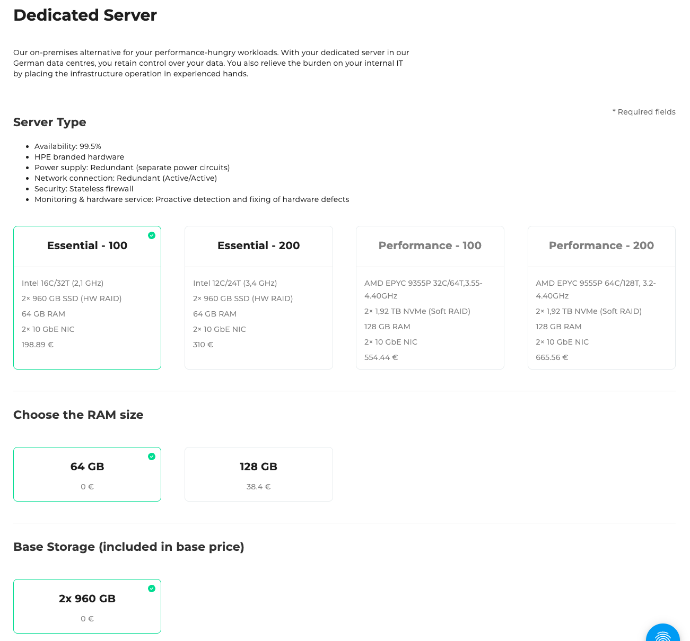

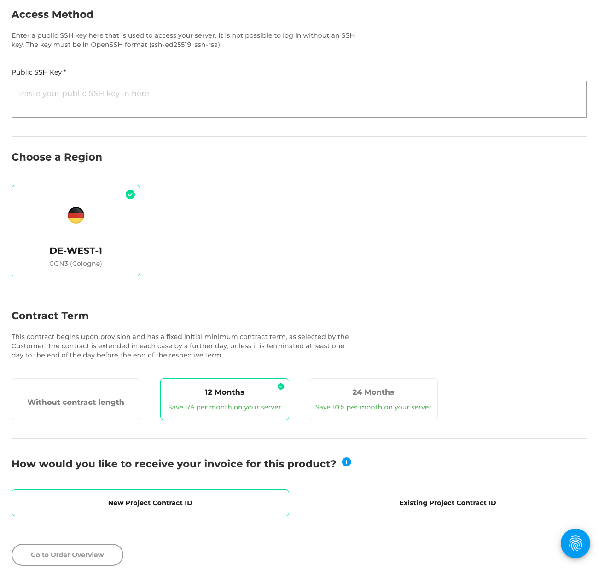

## Step 1: Server Type

In the first step, you can choose from four different server types:

### Essential - 100

- Intel 16C/32T (2,1 GHz)
- 2× 960 GB SSD (HW RAID)
- 64 GB RAM
- 2× 10 GbE NIC
- 198,89 €

### Essential - 200

- Intel 12C/24T (3,4 GHz)
- 2× 960 GB SSD (HW RAID)
- 64 GB RAM
- 2× 10 GbE NIC
- 310 €

### Performance - 100 (aktuell nicht verfügbar)

- AMD EPYC 9355P 32C/64T, 3.55-4.40GHz
- 2× 1,92 TB NVMe (Soft RAID)
- 128 GB RAM
- 2× 10 GbE NIC
- 554,44 €

### Performance - 200 (aktuell nicht verfügbar)

- AMD EPYC 9555P 64C/128T, 3.2-4.40GHz
- 2× 1,92 TB NVMe (Soft RAID)
- 128 GB RAM
- 2× 10 GbE NIC
- 665,56 €

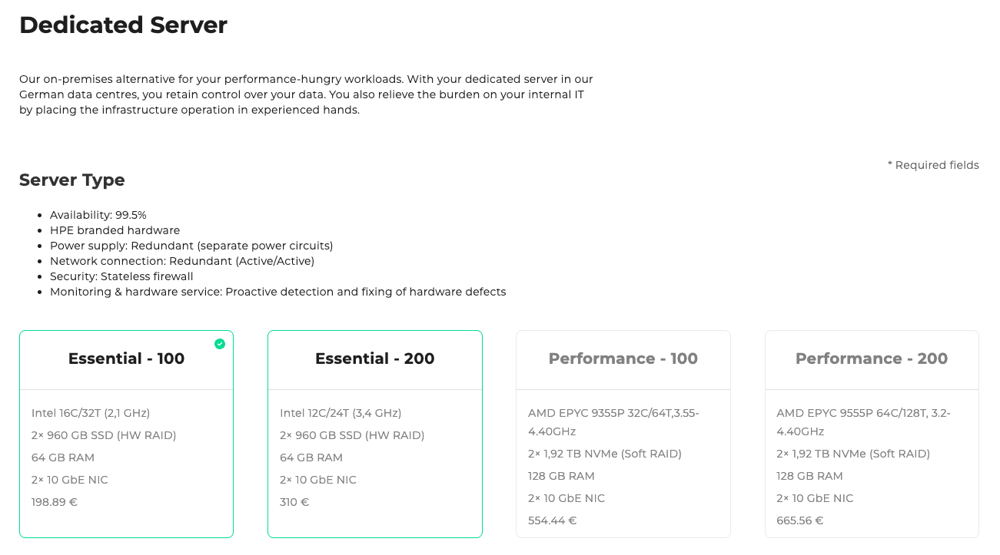

## Step 2: RAM memory size

In this step, select the desired size of the RAM (RAM) for your server.
By default, 64 GB RAM are included. Alternatively, you can increase the performance of your server by selecting 128 GB RAM.

### Options:

- 64 GB: 0 € (included in the basic price)
- 128 GB: 38,40 € additionally

The selection of the right RAM value depends on the planned use of your server-for example, the higher variant is recommended for memory-intensive applications or large databases.

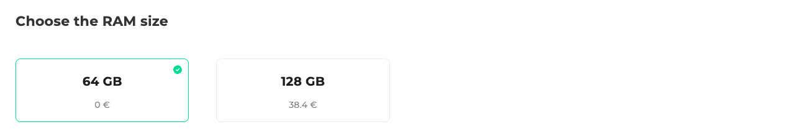

## Step 3: System memory (included in the basic price)

In the third step, the system memory is defined, on which the operating system and important system components are installed.

By default, the following configuration is included in the price and already predicted:

- 2× 960 GB SSD (In the hardware raid network)

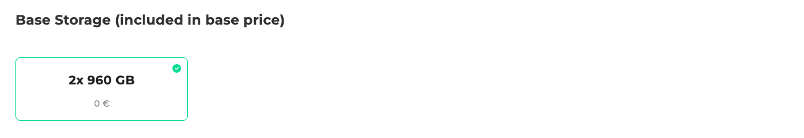

## Step 4: Additional memory

If you need more storage space than the 2× 960GB contained in the basic price, you can add additional memory here.

- \+ 2× 960 GB: 31,29 €
- \+ 4× 960 GB: 62,58 €
- \+ 6× 960 GB: 93,87 €

### Note on provision

- Standard configuration: provision within approx. 1 hour
- Individual configuration: provision within approx. 1 working day

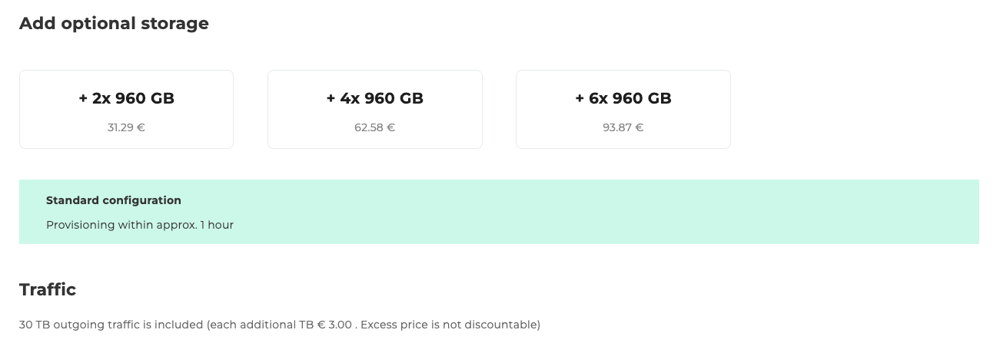

## Step 5: Trusted Sources

Enter the permitted network addresses in CIDR format.

Example:
`10.10.10.10/24`

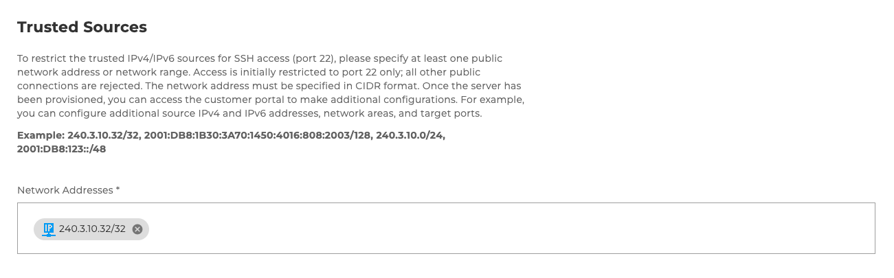

## Schritt 6: Operating system

In this step, select the desired operating system for your server.
There are two popular Linux distributions to choose from, each in the current stable version:

### Ubuntu

- Ubuntu 24.04 LTS: 0 €

### Debian

- Debian 12: 0 €

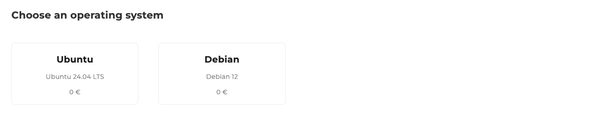

## Step 7: Access restrictions

In this step, put a public SSH key with which you can access the server.
A login without SSH-key is not possible.

The key must be available in the OpenSSH format (e.g. `SSH-ED25519` or`SSH-RSA`) and is inserted via an input field.

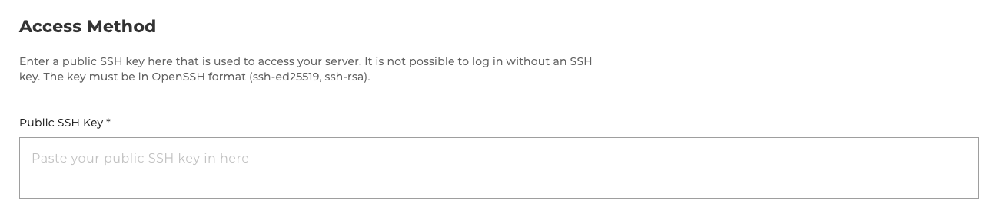

## Step 8: Choose region

A region is currently available for providing your database:

- DE-WEST-1 CGN3 (Cologne)

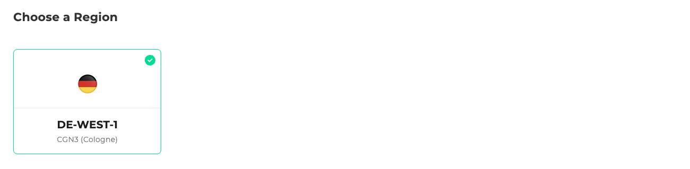

## Step 9: Contract Term

Select the desired contract term for your server.

- without a contract term - full flexibility
- 12 months - 5% discount per month
- 24 months - 10% discount per month

The contract is automatically extended by another day if it is not terminated in time.

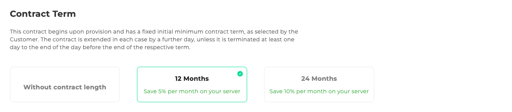

## Step 10: Project Contract ID

Choose whether there is already a project contract detection:

- New project contract recognition
- Existing project contract detection (selection from a list)

## Step 11: Order Overview

The order overview displays a table with all configurations you have selected.
Below the table, there is a checkbox that allows you to accept the following attachments and terms.
The attachments include various downloadable PDF documents, such as the **General Terms and Conditions** and **other relevant contractual documents**.
To the right of the table, the total price and the Order button are displayed.
This button is disabled by default and will only be activated once the attachments and terms have been accepted.

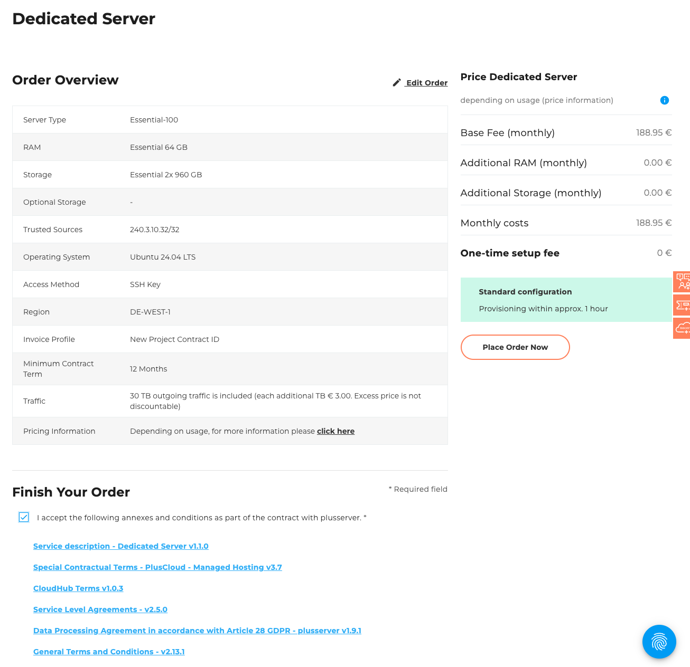
