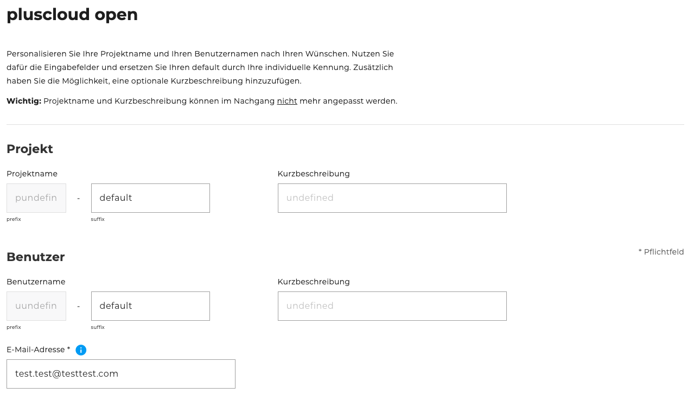
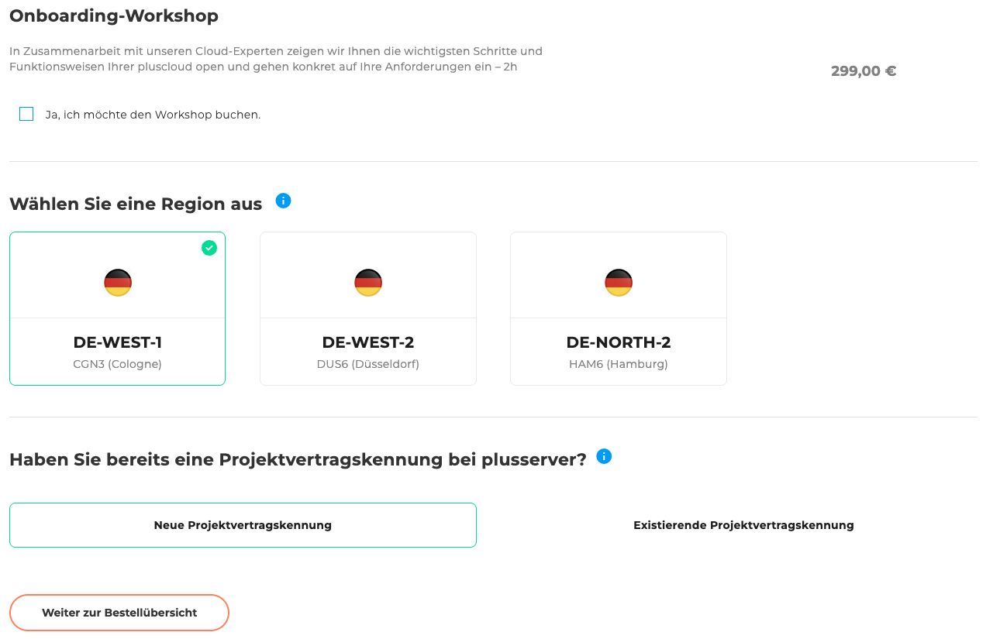
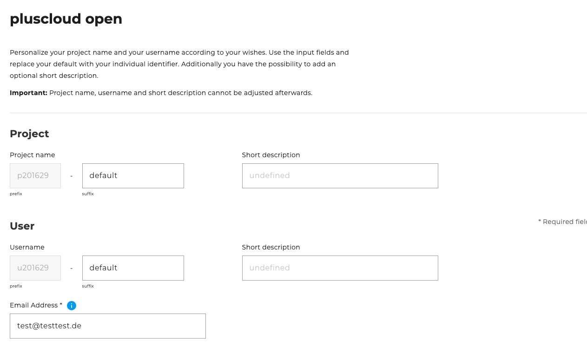
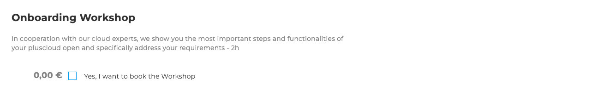
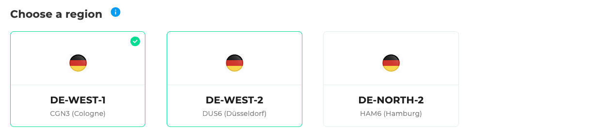

## Introduction

Welcome to the pluscloud Open order wizard. Here it is described which configuration options are available and how a new pluscloud Open can be ordered.

In the following we guide you step by step through the ordering process and explain the individual selection options and input fields.

## Step 1: Project and user information

In the first step, you provide information about the project and the user.There are several input fields:

- Project:
    - Project name - Prefix *(not changeable)*: already contains a fixed identifier
    - Project name - Suffix: Standard value is `default`, but can be adjusted
    - short description (optional)

- User:
    - Username - Prefix *(not changeable)*
    - Username - suffix: default value is `default`, can be changed
    - short description (optional)

- Email address *(Required field)*:
    This field has already been prefilled with the email address with which you are currently registered. However, the email address can be adjusted if necessary.

## Step 2: Onboarding workshop

Optionally, an onboarding workshop can be booked for 299€.
He supports you in setting up and using your PlusCloud Open environment.

## Step 3: Select region

Select the desired region in which your PlusCloud Open environment is to be provided.
Please note: Only a PlusCloud Open Instance per region can be created.

Available regions:

- DE-WEST-1 CGN3 (Cologne)
- DE-WEST-2 DUS6 (Düsseldorf)
- DE-NORTH-2 HAM6 (Hamburg)

## Step 4: Project Contract ID

Select whether a project contract ID already exists:

- New project contract ID
- Existing project contract ID (select from a list)

## Step 5: Order Overview

The order overview displays a table with all configurations you have selected.
Below the table, there is a checkbox that allows you to accept the following attachments and terms.
The attachments include various downloadable PDF documents, such as the General Terms and Conditions and other relevant contractual documents.
To the right of the table, the total price and the Order button are displayed.
This button is disabled by default and will only be activated once the attachments and terms have been accepted.

