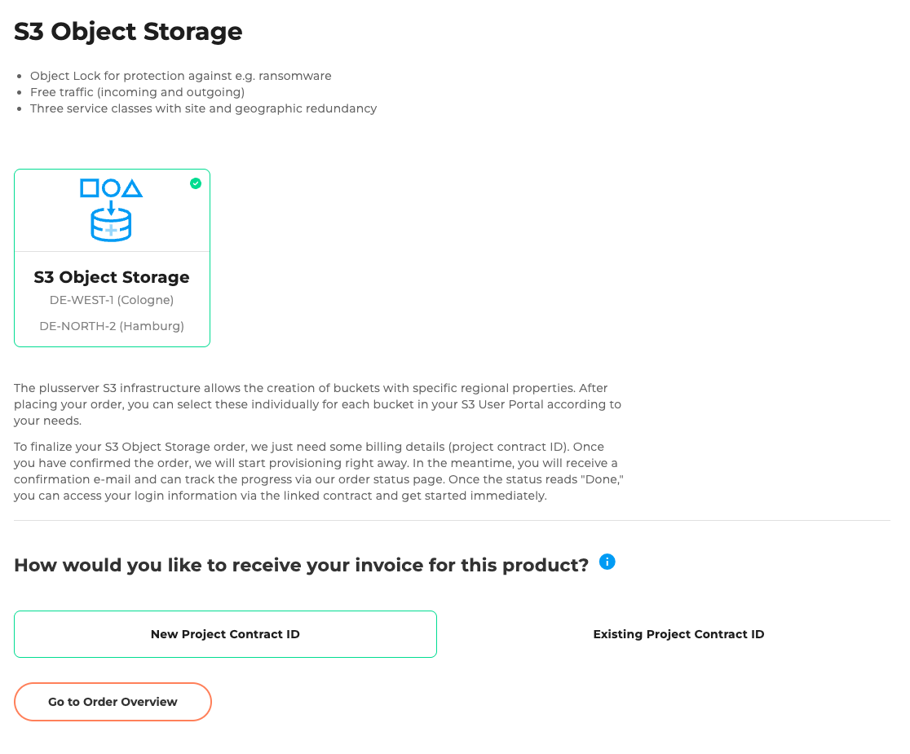
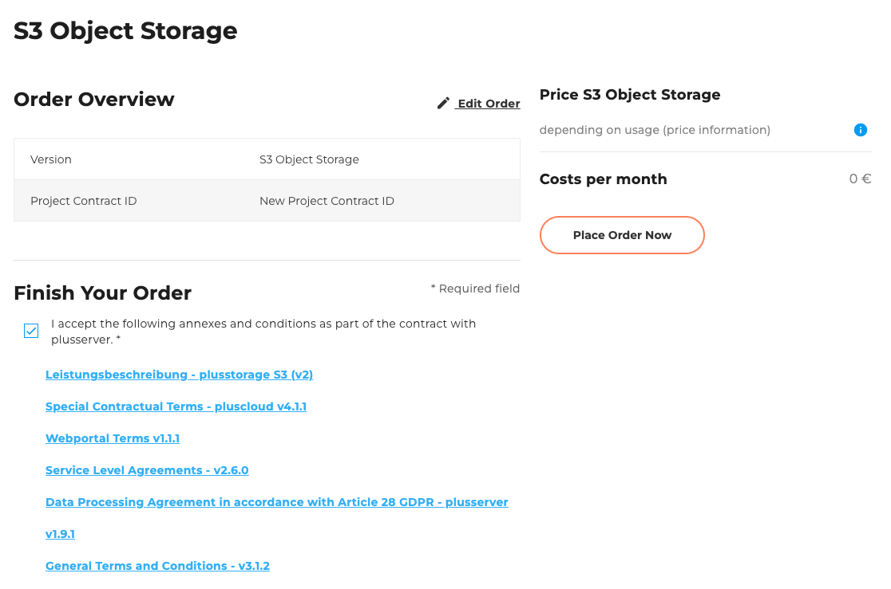

## Introduction

Welcome to the [S3 order wizard](https://cloudhub.plusserver.com/cloud-services/plusstorage-s3/order). Here it is described which configuration options are available and how a new S3 can be ordered.

Below, we will guide you step by step through the ordering process and explain the individual options and input fields.

Currently, S3 Object Storage offers secure, geo-redundant storage with optional Object Lock for protection against ransomware, as well as free data transfer.

## Step 1: Project Contract ID

Choose whether there is already a project contract detection:

- New project contract recognition
- Existing project contract detection (selection from a list)

## Step 2: Order Overview

The order overview displays a table with all configurations you have selected.
Below the table, there is a checkbox that allows you to accept the following attachments and terms.
The attachments include various downloadable PDF documents, such as the **General Terms and Conditions** and **other relevant contractual documents**.
To the right of the table, the total price and the Order button are displayed.
This button is disabled by default and will only be activated once the attachments and terms have been accepted.

