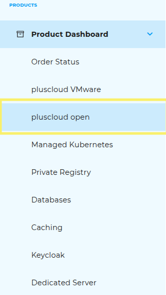
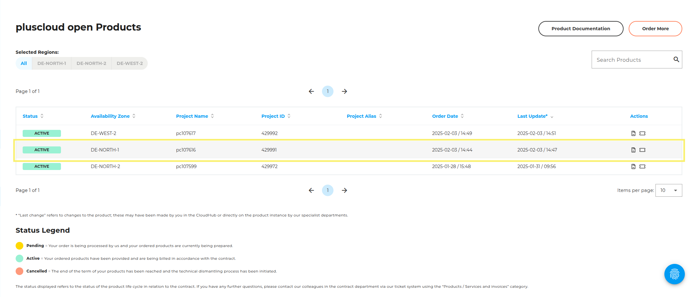

## Step-by-step guide to canceling products

### Step 1: Open the Product Dashboard

Select the **“Product Dashboard”** button in the left sidebar.

### Step 2: Select product type

Choose the product type you want to cancel (e.g., Pluscloud Open, Databases, etc.).

### Step 3: Select contract

### Step 4: Initiate cancellation

Click the “Cancel Product” button.

### Step 5: Confirm cancellation

A pop-up window will appear — validate the cancellation to complete the process.

